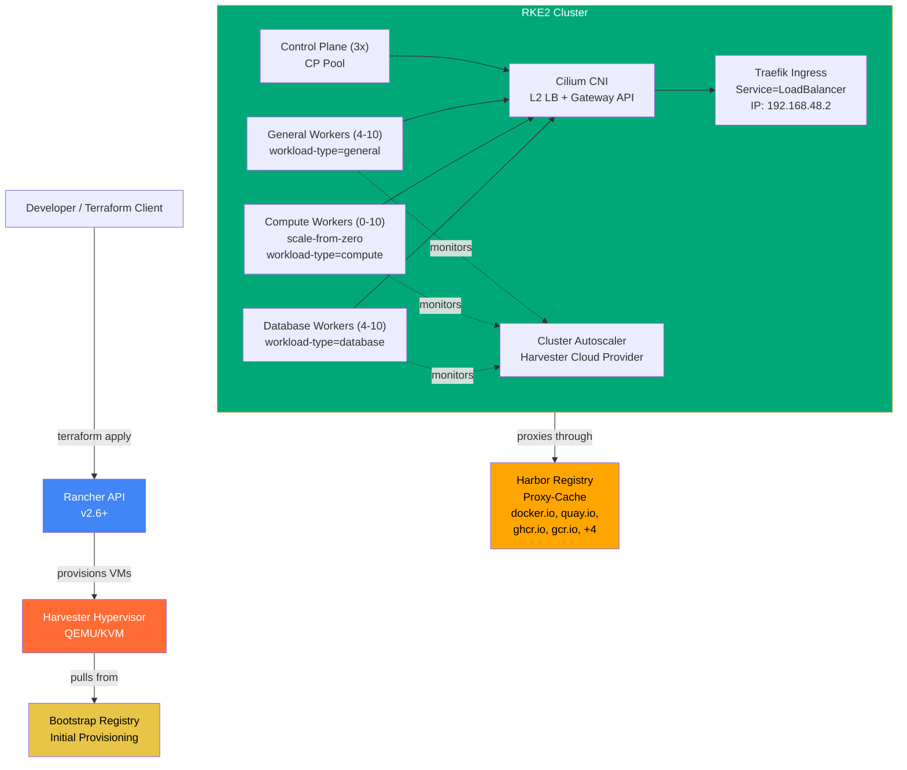
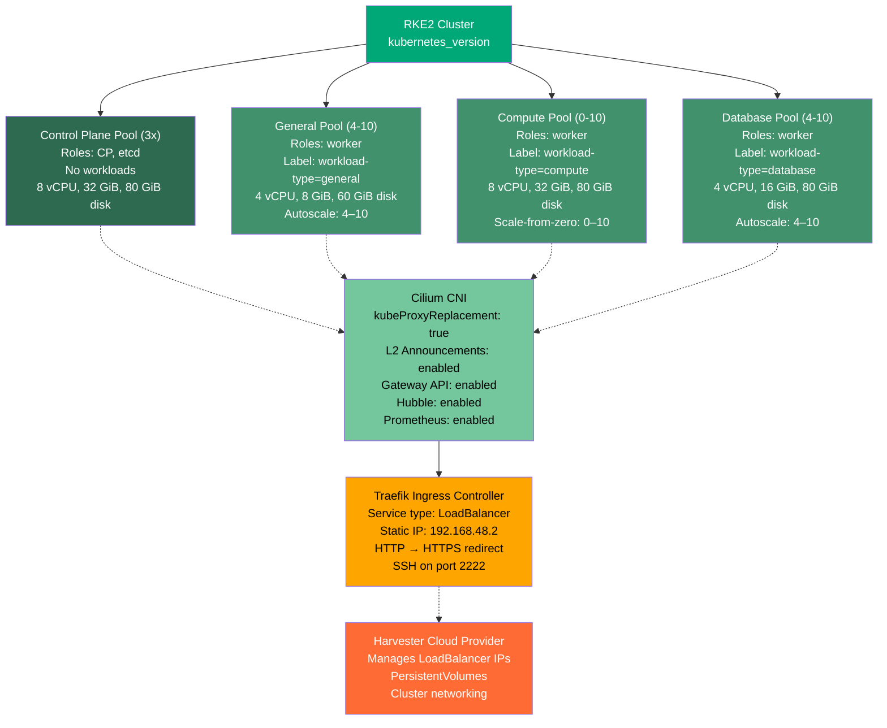
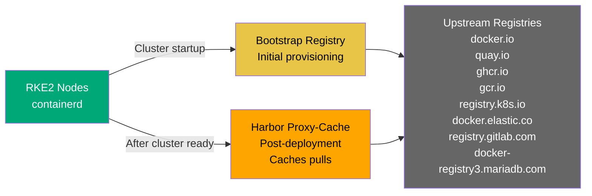

# RKE2 Cluster on Harvester via Rancher

[](https://github.com/derhornspieler/harvester-rke2-cluster/actions/workflows/ci.yml) [](https://www.terraform.io/) [](LICENSE)

Provisions a production-ready RKE2 Kubernetes cluster on Harvester via the Rancher API. Supports two deployment modes: **Terraform** (IaC, state-managed) or **rancher-api-deploy.sh** (imperative API calls, no state). Airgap-first architecture with golden image deployment, Harbor proxy-cache registry, Cilium CNI, and autoscaling worker pools.

## Overview

This project orchestrates the creation of a fully managed RKE2 cluster across Harvester hypervisor resources. Both deployment modes provide:

- Provisions a 3-node control plane pool (dedicated, no workloads)
- Deploys autoscaling worker pools (general, compute, database) with scale-from-zero support
- Configures Cilium CNI with L2 load balancing for ingress
- Sets up Traefik as the ingress controller with static LoadBalancer IP
- Integrates Harbor as a pull-through registry cache (8 upstream registries)
- Deploys custom operators: node-labeler and storage-autoscaler
- Optionally deploys database operators: CloudNativePG (PostgreSQL), MariaDB, OpsTree Redis

### Deployment Mode Comparison

| Aspect | Terraform | rancher-api-deploy.sh |
|--------|-----------|----------------------|
| **State Management** | Kubernetes backend (shared) | None (API-based, repeatable) |
| **Idempotency** | Full (safe to re-apply) | Partial (skips existing resources) |
| **Modes** | apply / destroy | create / --dry-run / --update / --delete |
| **Use Case** | Team environments, CI/CD | One-off provisioning, scripting |
| **Learning** | Longer (HCL, providers) | Shorter (just Bash + curl) |

## Architecture



## Prerequisites

### Infrastructure

- **Rancher Management Cluster**: v2.6+, with Internet connectivity to Harvester API
- **Harvester Hypervisor**: Registered in Rancher with proper network connectivity
- **Golden Image**: Pre-built RKE2 VM image must exist on Harvester (e.g., `rke2-rocky9-golden-20260227`)
- **Harbor Registry**: Pre-running instance with admin credentials available
- **Bootstrap Registry**: Pre-existing container registry (can be same as Harbor) for initial node provisioning
- **Networks**: Harvester VM networks configured (at minimum: one for nodes, optionally one for services/ingress)

### Tools

Install locally on the machine running Terraform:
- `terraform` >= 1.5.0
- `kubectl`
- `curl`, `jq`, `python3`
- `crane` (for operator image push, optional if not deploying operators)

### Credentials

- Rancher API token (generate at `/p/account` in Rancher UI)
- Harvester kubeconfig (service account or user with VM creation permissions)
- Harbor admin credentials (if deploying operators)
- Private CA certificate PEM (for registry and internal service TLS trust)

## Quick Start

### Step 1: Prepare Credentials and Kubeconfigs

Both deployment modes require the same credential setup:

```bash
./prepare.sh
```

This generates:
- `kubeconfig-harvester.yaml` — Harvester cluster access
- `kubeconfig-harvester-cloud-cred.yaml` — Rancher cloud credential
- `harvester-cloud-provider-kubeconfig` — Harvester cloud provider
- `terraform.tfvars` — Pre-filled with discovered values

### Step 2: Configure terraform.tfvars

Edit `terraform.tfvars` and fill in the required values (examples in `terraform.tfvars.example`):

```bash
# Critical settings (used by both Terraform and rancher-api-deploy.sh)
rancher_url                                = "https://rancher.example.com"
rancher_token                              = "token-xxxxx:yyyyyy"
harvester_kubeconfig_path                  = "./kubeconfig-harvester.yaml"
harvester_cluster_id                       = "c-xxxxx"
cluster_name                               = "rke2-prod"
golden_image_name                          = "rke2-rocky9-golden-20260227"
bootstrap_registry                         = "harbor.example.com"
harbor_fqdn                                = "harbor.example.com"
private_ca_pem                             = "-----BEGIN CERTIFICATE-----\n..."
```

### Step 3: Choose Your Deployment Mode

#### Option A: Terraform (recommended for team environments)

```bash
cd terraform
terraform init      # Initializes Kubernetes backend for state storage
terraform plan
terraform apply
```

Monitor provisioning:
```bash
terraform output -raw kubeconfig_rke2 > ~/.kube/config-rke2
kubectl --kubeconfig ~/.kube/config-rke2 get nodes -w
```

#### Option B: rancher-api-deploy.sh (recommended for scripting, one-off deployments)

```bash
# Review what will be created (no API calls)
./rancher-api-deploy.sh --dry-run

# Create the cluster
./rancher-api-deploy.sh

# Update existing cluster (e.g., Kubernetes version)
./rancher-api-deploy.sh --update

# Delete cluster
./rancher-api-deploy.sh --delete
```

Cluster provisioning typically takes 20–40 minutes. Monitor via Rancher UI or kubectl with the returned kubeconfig.

## Documentation

For deeper technical understanding of the system architecture and design decisions, refer to:

- **[Architecture Guide](./docs/architecture.md)**: Comprehensive technical deep-dive covering:
  - System architecture overview (Rancher, Harvester, RKE2 integration)
  - Terraform resource dependency graph (all 10 resource types)
  - Network architecture (dual NICs, policy routing, Cilium L2 announcement)
  - Node pool design (CP, general, compute, database pools with autoscaling)
  - Container registry flow (bootstrap registry → Harbor proxy-cache)
  - Cloud provider integration (LoadBalancer, CSI, node lifecycle)
  - Cluster autoscaler behavior (including scale-from-zero)
  - TLS/CA trust chain implementation
  - EFI firmware patching mechanism

- **[Operations Guide](./docs/operations.md)**: Runbooks and procedures for cluster operations

- **[Troubleshooting Guide](./docs/troubleshooting.md)**: Common issues and diagnostic procedures

## Configuration Reference

All configuration is managed via `terraform.tfvars`. See `terraform.tfvars.example` for commented examples.

| Variable | Type | Required | Default | Description |
|----------|------|----------|---------|-------------|
| `rancher_url` | string | Yes | — | Rancher API URL (e.g., `https://rancher.example.com`) |
| `rancher_token` | string | Yes | — | Rancher API token (format: `token-xxxxx:yyyyy`) |
| `harvester_kubeconfig_path` | string | Yes | — | Path to Harvester kubeconfig |
| `harvester_cluster_id` | string | Yes | — | Harvester cluster ID in Rancher (e.g., `c-bdrxb`) |
| `cluster_name` | string | Yes | — | RKE2 cluster name |
| `kubernetes_version` | string | No | `v1.34.2+rke2r1` | RKE2 version |
| `cni` | string | No | `cilium` | CNI plugin (Cilium recommended) |
| `golden_image_name` | string | Yes | — | Pre-baked golden image on Harvester (must exist) |
| `bootstrap_registry` | string | Yes | — | Container registry for initial provisioning |
| `harbor_fqdn` | string | Yes | — | Harbor registry FQDN for proxy-cache |
| `private_ca_pem` | string | Yes | — | PEM certificate chain for registry/service TLS trust |
| `bootstrap_registry_ca_pem` | string | No | — | Alternative CA for bootstrap registry (if different from `private_ca_pem`) |
| `harbor_registry_mirrors` | list | No | `[docker.io, quay.io, ghcr.io, gcr.io, registry.k8s.io, docker.elastic.co, registry.gitlab.com, docker-registry3.mariadb.com]` | Upstream registries to cache |
| `traefik_lb_ip` | string | No | `192.168.48.2` | Static LoadBalancer IP for Traefik ingress |
| `cilium_lb_pool_start` | string | No | `192.168.48.2` | Start of Cilium L2 LB IP pool |
| `cilium_lb_pool_stop` | string | No | `192.168.48.20` | End of Cilium L2 LB IP pool |
| `vm_namespace` | string | Yes | — | Harvester namespace for VM creation |
| `harvester_network_name` | string | Yes | — | Harvester VM network name (primary NIC) |
| `harvester_network_namespace` | string | Yes | — | Harvester network namespace |
| `harvester_services_network_name` | string | No | `services-network` | Harvester services/ingress network (eth1, VLAN 5) |
| `harvester_services_network_namespace` | string | No | `default` | Harvester services network namespace |
| `controlplane_count` | number | No | `3` | Number of control plane nodes (must be odd) |
| `controlplane_cpu` | string | No | `8` | vCPUs per control plane node |
| `controlplane_memory` | string | No | `32` | Memory (GiB) per control plane node |
| `controlplane_disk_size` | number | No | `80` | Disk size (GiB) per control plane node |
| `general_cpu` | string | No | `4` | vCPUs per general worker |
| `general_memory` | string | No | `8` | Memory (GiB) per general worker |
| `general_disk_size` | number | No | `60` | Disk size (GiB) per general worker |
| `general_min_count` | number | No | `4` | Min general workers (autoscaler) |
| `general_max_count` | number | No | `10` | Max general workers |
| `compute_cpu` | string | No | `8` | vCPUs per compute worker |
| `compute_memory` | string | No | `32` | Memory (GiB) per compute worker |
| `compute_disk_size` | number | No | `80` | Disk size (GiB) per compute worker |
| `compute_min_count` | number | No | `0` | Min compute workers (**0 = scale-from-zero**) |
| `compute_max_count` | number | No | `10` | Max compute workers |
| `database_cpu` | string | No | `4` | vCPUs per database worker |
| `database_memory` | string | No | `16` | Memory (GiB) per database worker |
| `database_disk_size` | number | No | `80` | Disk size (GiB) per database worker |
| `database_min_count` | number | No | `4` | Min database workers |
| `database_max_count` | number | No | `10` | Max database workers |
| `autoscaler_scale_down_unneeded_time` | string | No | `30m0s` | How long before removing an idle node |
| `autoscaler_scale_down_delay_after_add` | string | No | `15m0s` | Cooldown after adding a node |
| `autoscaler_scale_down_delay_after_delete` | string | No | `30m0s` | Cooldown after removing a node |
| `autoscaler_scale_down_utilization_threshold` | string | No | `0.5` | Node utilization threshold for scale-down (0.0–1.0) |
| `dockerhub_username` | string | No | — | Docker Hub user (optional, avoids rate limits) |
| `dockerhub_token` | string | No | — | Docker Hub PAT token |
| `harvester_cloud_credential_name` | string | Yes | — | Name of Harvester cloud credential in Rancher |
| `harvester_cloud_provider_kubeconfig_path` | string | Yes | — | Path to Harvester cloud provider kubeconfig |
| `ssh_user` | string | No | `rocky` | SSH user for cloud image access |
| `ssh_authorized_keys` | list(string) | Yes | — | SSH public keys for node access |
| `deploy_operators` | bool | No | `true` | Deploy node-labeler, storage-autoscaler, and optionally DB operators |
| `deploy_cnpg` | bool | No | `true` | Deploy CloudNativePG operator (requires `deploy_operators = true`) |
| `deploy_mariadb_operator` | bool | No | `false` | Deploy MariaDB Operator (requires `deploy_operators = true`) |
| `deploy_redis_operator` | bool | No | `true` | Deploy OpsTree Redis Operator (requires `deploy_operators = true`) |
| `harbor_admin_user` | string | No | `admin` | Harbor username for pushing operator images |
| `harbor_admin_password` | string | No | — | Harbor admin password (required if `deploy_operators = true`) |

## Cluster Architecture

The RKE2 cluster is organized into specialized worker pools:



### Node Pool Details

**Control Plane (dedicated, 3x)**
- No user workloads
- Runs etcd, kube-apiserver, kube-controller-manager, kube-scheduler
- No autoscaling (fixed at 3 nodes for quorum)

**General Workers (autoscale 4–10, default)**
- Default workload destination (`workload-type=general` label)
- Runs system services, web apps, ingress backends
- Scales based on CPU/memory requests

**Compute Workers (scale-from-zero, 0–10)**
- High-resource workers for batch jobs, GPU workloads
- Minimum = 0 (cluster autoscaler can remove all if unused)
- Resource annotations for scale-from-zero: CPU, memory, disk
- Scales up when pods with compute affinity are created

**Database Workers (autoscale 4–10)**
- Reserved for stateful workloads (CNPG clusters, caches)
- Label: `workload-type=database`
- Guaranteed minimum of 4 nodes

## Registry Mirrors and Harbor Proxy-Cache

The cluster uses Harbor as a pull-through registry cache for 8 upstream registries:



### Configuration Details

- **Bootstrap Registry** (`var.bootstrap_registry`): Used during VMs' first boot when they don't yet know Harbor's address
- **Harbor FQDN** (`var.harbor_fqdn`): Target proxy-cache endpoint; images are rewritten to `harbor.<domain>/<upstream>/<image>`
- **Mirrors**: Configured as containerd `registries.yaml` mirrors with endpoint rewriting
- **Private CA**: Harbor TLS is trusted via `var.private_ca_pem` on every node
- **No Direct Pulls**: All pulls route through Harbor or bootstrap registry — never direct from Docker Hub or public registries

Registry mirrors are initialized with the bootstrap registry and patched to Harbor in external deployment pipelines (not by Terraform).

## Operator Deployment

Terraform optionally deploys cluster infrastructure operators after creation:

### Custom Operators

**node-labeler (v0.2.0)**: Watches Harvester VM annotations and syncs them to Kubernetes node labels. Enables workload affinity based on VM properties.

**storage-autoscaler (v0.2.0)**: Monitors Harvester VM disk usage and automatically expands PersistentVolumes on nodes near capacity.

**Deployment** (custom operators):
1. Build images from source:
   ```bash
   cd operators/node-labeler && make docker-save IMG=node-labeler:v0.2.0
   cd operators/storage-autoscaler && make docker-save IMG=storage-autoscaler:v0.2.0
   ```

2. Place tarballs in `operators/images/`

3. Set `deploy_operators = true` and `harbor_admin_password` in `terraform.tfvars`

4. Run `terraform apply` (image push and deployment are automatic)

### Database Operators

Three optional database operators can be deployed to the database worker pool:

**CloudNativePG (v1.28.1)**: PostgreSQL operator supporting high-availability clusters, backups, and connection pooling. Deployed to `cnpg-system` namespace.

**MariaDB Operator (v25.10.4)**: MariaDB/MaxScale operator supporting multi-instance replication and automated backups. Deployed to `mariadb-operator` namespace.

**OpsTree Redis Operator (v0.23.0)**: Redis operator supporting standalone, cluster, and Sentinel deployments. Deployed to `redis-operator` namespace.

**Key details:**
- Each database operator has an independent feature flag: `deploy_cnpg`, `deploy_mariadb_operator`, `deploy_redis_operator`
- All require `deploy_operators = true` to be enabled
- Operators automatically schedule on database worker nodes via `nodeSelector: workload-type=database`
- Upstream install manifests are stored in `operators/upstream/` and applied via kubectl
- Custom additions (NetworkPolicy, HPA, PDB) are deployed from `operators/manifests/<operator-name>/`

**Deployment (database operators):**
1. Set desired operators in `terraform.tfvars`:
   ```hcl
   deploy_operators         = true
   deploy_cnpg              = true
   deploy_mariadb_operator  = false    # Or true if needed
   deploy_redis_operator    = true
   ```

2. Run `terraform apply` (manifests are automatically applied)

3. Verify deployment:
   ```bash
   kubectl get deployment -n cnpg-system
   kubectl get deployment -n mariadb-operator
   kubectl get deployment -n redis-operator
   ```

## Credential Management

### Generated by prepare.sh

- `kubeconfig-harvester.yaml` — For accessing Harvester cluster
- `kubeconfig-harvester-cloud-cred.yaml` — For Rancher cloud credential (service account token)
- `harvester-cloud-provider-kubeconfig` — For Harvester cloud provider controller
- `terraform.tfvars` — Configuration file

### Sensitive Files (gitignored, never commit)

- `terraform.tfvars` — Contains secrets
- `kubeconfig-*.yaml` — Cluster access credentials
- `harvester-cloud-provider-kubeconfig` — Harvester SA token
- `.terraform.lock.hcl` — Dependency locks (if you committed it)
- `.kubeconfig-rke2-operators` — Generated during apply (if deploying operators)

### Terraform State

State is stored in a Kubernetes backend on the Harvester cluster (`terraform-state` namespace) — NOT on your local machine. This allows state sharing across team members and CI/CD pipelines.

When running `terraform.sh`, secrets are automatically synced to K8s and back.

## Day 2 Operations

### Scaling Workers

#### Using rancher-api-deploy.sh

Edit `terraform.tfvars` and adjust `*_min_count` / `*_max_count`:

```hcl
general_min_count  = 6   # Increased from 4
compute_max_count  = 15  # Increased from 10
```

Then update:
```bash
./rancher-api-deploy.sh --update
```

#### Using Terraform

Edit `terraform.tfvars` and adjust `*_min_count` / `*_max_count`, then:

```bash
cd terraform
terraform plan
terraform apply
```

Cluster autoscaler respects the new bounds. (Terraform ignores live quantity drift from autoscaler — min/max controls scaling.)

### Upgrading RKE2

#### Using rancher-api-deploy.sh

Edit `terraform.tfvars` and change `kubernetes_version`:

```hcl
kubernetes_version = "v1.35.0+rke2r1"  # Was v1.34.2+rke2r1
```

Then update:
```bash
./rancher-api-deploy.sh --update
```

#### Using Terraform

Edit `terraform.tfvars` and change `kubernetes_version`, then:

```bash
cd terraform
terraform apply
```

RKE2 upgrades using rolling updates (1 node at a time for workers, 1 CP at a time). Monitor with:
```bash
kubectl get nodes -w
```

### Node Replacement

To replace a node (e.g., due to disk corruption):

1. Drain the node:
   ```bash
   kubectl drain <node-name> --ignore-daemonsets --delete-emptydir-data
   ```

2. Delete the machine in Rancher or via API
3. Cluster autoscaler detects the missing node and replaces it
4. New VM boots from golden image and joins the cluster

### Destroy Cluster

#### Using rancher-api-deploy.sh

```bash
./rancher-api-deploy.sh --delete
```

#### Using Terraform

```bash
cd terraform
./terraform.sh destroy   # Interactive
# or
terraform destroy       # Direct destroy
```

For safe cleanup that preserves cloud credentials for re-provisioning, use the wrapper scripts:

```bash
./destroy-cluster.sh              # Interactive (prompts for confirmation)
./destroy-cluster.sh -auto-approve  # Non-interactive
```

This is a convenience wrapper around `terraform.sh destroy` that preserves cloud credentials. Cloud credentials stored in `kubeconfig-harvester-cloud-cred.yaml` and `harvester-cloud-provider-kubeconfig` are NOT deleted, allowing you to recreate the cluster without re-running `prepare.sh`.

The cleanup process:
1. Deletes the RKE2 cluster from Rancher API
2. Waits for VMs to be deleted by Cluster API (asynchronous)
3. Clears any stuck finalizers on Harvester machines
4. Cleans up orphaned secrets and RBAC entries in `fleet-default`
5. Removes orphaned VMs, disks, and data volumes from Harvester
6. Preserves the cloud credential so you can re-create the cluster immediately

**Note**: This removes all RKE2 VMs from Harvester but leaves the Harvester cluster and networks intact.

### Nuclear Cleanup

If `destroy-cluster.sh` hangs or leaves orphaned resources, use `nuke-cluster.sh`:

```bash
./nuke-cluster.sh              # Interactive
./nuke-cluster.sh -y           # Skip confirmation
```

This performs an irreversible nuclear cleanup:
1. Deletes the cluster from Rancher API
2. Force-deletes all orphaned CAPI machines in `fleet-default`
3. Force-deletes all VMs and VMIs in the VM namespace
4. Cleans up Rancher resources (HarvesterConfigs, Fleet bundles)
5. Cleans up orphaned secrets and RBAC entries
6. Cleans up Harvester resources (PVCs, DataVolumes, namespace leftovers)
7. Wipes Terraform state from both local and Kubernetes backend
8. Final verification

**WARNING**: This is destructive and irreversible. All cluster data will be permanently lost.

## Troubleshooting

**For comprehensive troubleshooting procedures, decision trees, SOPs, and diagnostic commands, see [docs/troubleshooting.md](docs/troubleshooting.md)**

This section covers quick-fix solutions for common issues. The full guide includes:
- Deployment failure diagnosis with Mermaid decision trees
- Terraform state recovery and lock management
- Cluster health and operator troubleshooting
- Complete cleanup and destroy procedures
- Diagnostic cheat sheet with Rancher API, Harvester, and RKE2 queries

### Bootstrap Registry Errors

**Symptom**: Nodes fail to pull images during first boot.

**Check**:
```bash
# Via bootstrap registry pod logs or node journal
journalctl -u containerd -n 50
```

**Solutions**:
- Verify `var.bootstrap_registry` is reachable and has required images
- Check `var.bootstrap_registry_ca_pem` matches the registry's certificate
- Ensure bootstrap registry accepts the provided credentials (set via EFI patches)

### Stale API Tokens

**Symptom**: Terraform fails with "unauthorized" when applying changes.

**Solution**:
```bash
# Generate a new Rancher API token
# Login to Rancher UI → Account → API Tokens → Create
# Update terraform.tfvars:
rancher_token = "token-xxxxx:yyyyyy"

terraform apply
```

### Node FailedScheduling (ImagePullBackOff)

**Symptom**: Pods stuck in `ImagePullBackOff` on fresh nodes.

**Common causes**:
- Bootstrap registry offline — check bootstrap registry logs
- Golden image missing `containerd` or `rke2` binaries — rebuild golden image
- Harbor not yet configured — nodes still expect bootstrap registry

**Verify**:
```bash
kubectl describe pod <pod-name>
# Check Events section for image pull errors
```

### Stuck Finalizers on Cluster Delete

**Symptom**: `terraform destroy` hangs while removing the Rancher cluster resource.

**Solution**:
```bash
# Get the RKE2 kubeconfig
terraform output -raw kubeconfig_rke2 > /tmp/kubeconfig

# Manually remove finalizers from the cluster resource (via Rancher)
# or wait for cleanup (can take several minutes)

# If truly stuck, force-unlock the Terraform state
terraform force-unlock <lock-id>
terraform destroy -auto-approve
```

### Golden Image Mismatch

**Symptom**: Nodes never become `Ready`; stuck in `NotReady` with `kubelet` crash loop.

**Cause**: `var.golden_image_name` references an image that doesn't exist on Harvester or lacks RKE2 binaries.

**Solution**:
- Verify the image exists: `kubectl --kubeconfig kubeconfig-harvester.yaml get vm -A`
- Check image details in Harvester UI (Content → Images)
- Rebuild and upload the golden image if binaries are missing
- Update `var.golden_image_name` to the correct image name

### Cilium LoadBalancer IP Not Assigned

**Symptom**: Traefik service stuck in `<pending>` LoadBalancer status.

**Check**:
```bash
kubectl get svc -n kube-system traefik
# ExternalIP should be 192.168.48.2
```

**Causes**:
- Cilium LB pool misconfigured — verify `cilium_lb_pool_start` and `cilium_lb_pool_stop`
- Cilium not fully started — check pod status: `kubectl get pod -n kube-system -l app.kubernetes.io/name=cilium`
- Network connectivity issue between Traefik and Cilium

**Solution**:
```bash
# Check Cilium LB pool
kubectl get ciliiumloadbalancerippool

# Patch if needed
kubectl patch ciliumloadbalancerippool ingress-pool --type merge -p '{"spec":{"blocks":[{"start":"192.168.48.2","stop":"192.168.48.20"}]}}'

# Restart Cilium pods if misconfigured
kubectl rollout restart -n kube-system ds/cilium
```

## Project Structure

```
.
├── README.md                          # This file
├── terraform.tfvars                   # Configuration (gitignored)
├── terraform.tfvars.example           # Template configuration
│
├── prepare.sh                         # First-time credential prep (both modes)
├── rancher-api-deploy.sh              # Imperative deployment via Rancher API
│                                      # Modes: create, --dry-run, --update, --delete
├── destroy-cluster.sh                 # Convenience destroy wrapper
├── nuke-cluster.sh                    # Nuclear cleanup for stuck resources
│
├── terraform/                         # Terraform IaC deployment (archived, reference only)
│   ├── versions.tf                    # Required Terraform/provider versions
│   ├── providers.tf                   # Rancher2 provider config
│   ├── variables.tf                   # Variable definitions
│   ├── outputs.tf                     # Cluster outputs (ID, kubeconfig, etc.)
│   ├── cluster.tf                     # Main cluster + machine pools
│   ├── machine_config.tf              # Node cloud-init, user data
│   ├── cloud_credential.tf            # Harvester cloud credential
│   ├── image.tf                       # Golden image data source
│   ├── efi.tf                         # EFI patches for initial bootstrap
│   ├── operators.tf                   # node-labeler + storage-autoscaler
│   ├── terraform.sh                   # State backend sync + destroy wrapper
│   └── .terraform.lock.hcl
│
├── operators/
│   ├── images/                        # OCI image tarballs (gitignored)
│   │   ├── node-labeler-v0.2.0-amd64.tar.gz
│   │   └── storage-autoscaler-v0.2.0-amd64.tar.gz
│   ├── templates/                     # Deployment YAML templates
│   │   ├── node-labeler-deployment.yaml.tftpl
│   │   └── storage-autoscaler-deployment.yaml.tftpl
│   ├── manifests/                     # Kubernetes manifests
│   │   ├── node-labeler/              # node-labeler static manifests
│   │   ├── storage-autoscaler/        # storage-autoscaler static manifests
│   │   ├── cnpg-system/               # CNPG additions (NetworkPolicy, HPA, PDB)
│   │   ├── mariadb-operator/          # MariaDB additions
│   │   └── redis-operator/            # Redis additions
│   ├── upstream/                      # DB operator install manifests (helm-rendered)
│   ├── node-labeler/                  # node-labeler source code
│   ├── storage-autoscaler/            # storage-autoscaler source code
│   └── push-images.sh                 # Pushes images to Harbor via crane
│
├── docs/                              # Additional documentation
│   ├── architecture.md                # Deep-dive technical architecture
│   ├── operations.md                  # Operations runbooks and procedures
│   └── troubleshooting.md             # Troubleshooting guide with decision trees
│
├── .gitignore                         # Excludes secrets, state, tarballs
└── examples/                          # Reference configurations
```

### Migration Notes

As of commit `eed0815`, the Terraform files have been moved to `terraform/` subdirectory and `rancher-api-deploy.sh` is now the primary cluster lifecycle tool. Both tools read from the same `terraform.tfvars` configuration file. **Terraform deployment is preserved for reference but no longer actively developed.**

## Contributing

This project follows standard Terraform and Bash scripting conventions. When contributing:

### For rancher-api-deploy.sh changes
1. Use ShellCheck (`shellcheck rancher-api-deploy.sh`) to validate
2. Maintain `set -euo pipefail` for safety
3. Test `--dry-run` mode first (shows JSON payloads without API calls)
4. Test against a non-production cluster with all three modes: create, --update, --delete
5. Keep error messages clear and helpful
6. Document any new Rancher API endpoints used

### For Terraform changes (terraform/ subdirectory)
1. Use `terraform fmt terraform/` to format all `.tf` files
2. Validate with `cd terraform && terraform validate`
3. Test against a non-production cluster first
4. Keep variable descriptions clear and concise
5. Update `terraform.tfvars.example` when adding new variables
6. Document breaking changes in commit messages

### For all changes
- Update `terraform.tfvars.example` if adding new variables
- Document breaking changes in commit messages
- Update relevant documentation in `docs/` when behavior changes

Pull requests should include:
- Clear description of changes (which tool, which variables, which features)
- Testing results (provisioning, operator deployment, scaling, upgrades, deletion)
- Documentation updates if applicable

## License

Apache License 2.0. See LICENSE file for details.
