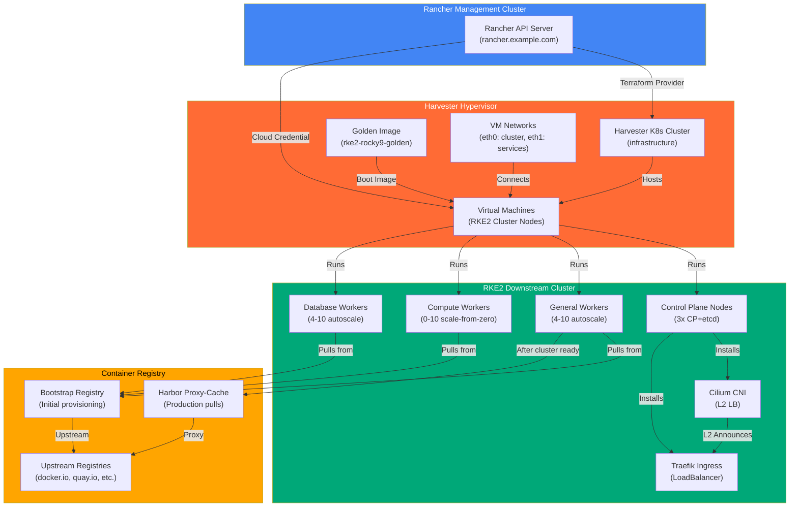
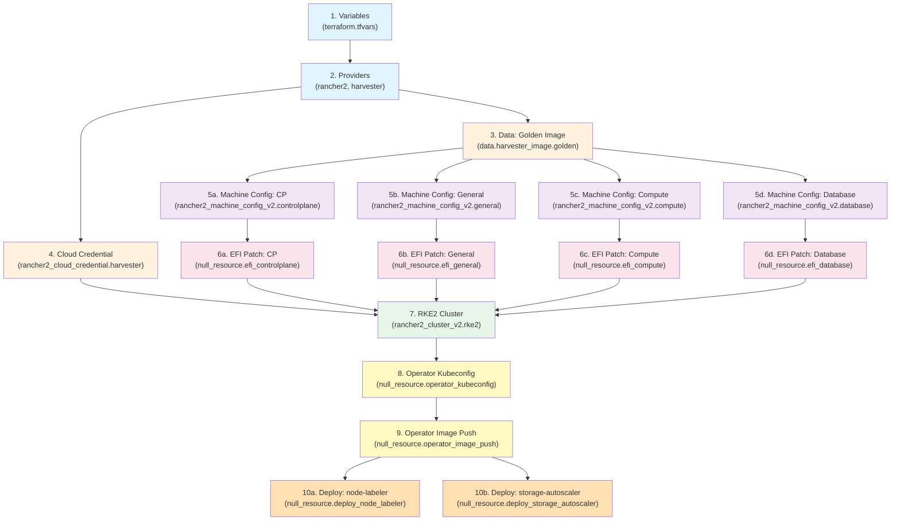
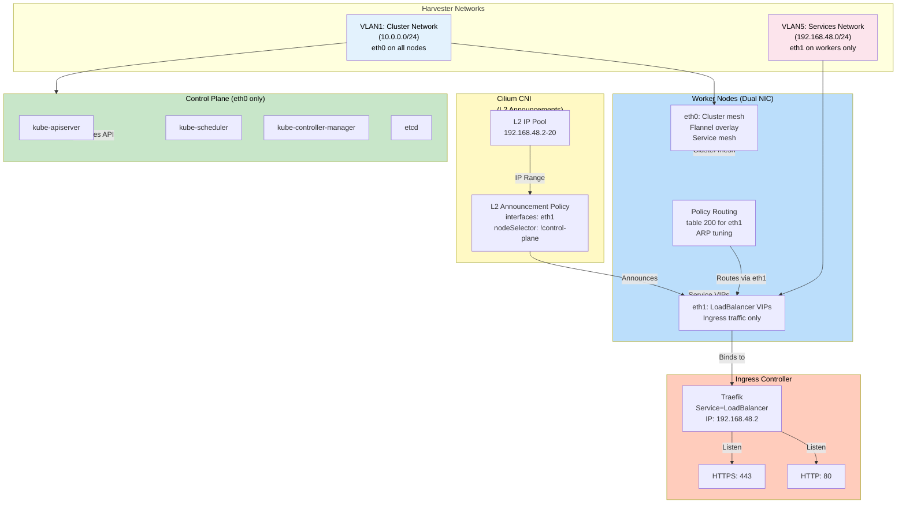
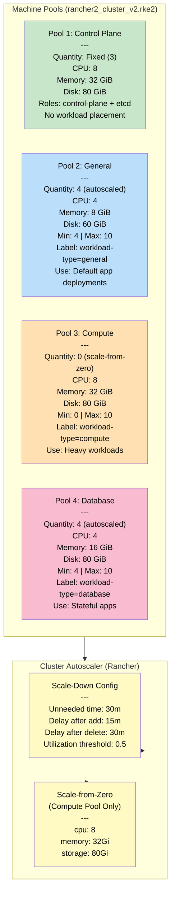
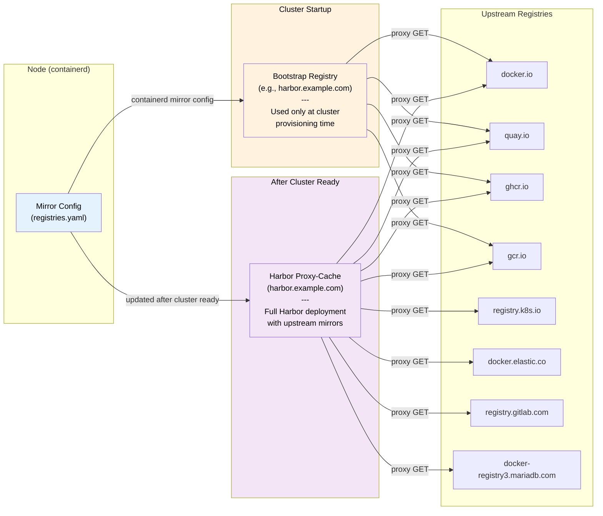
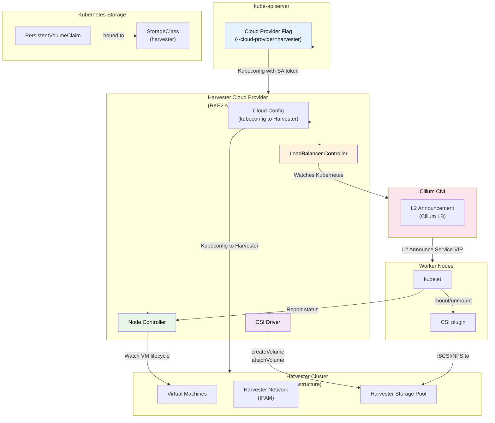
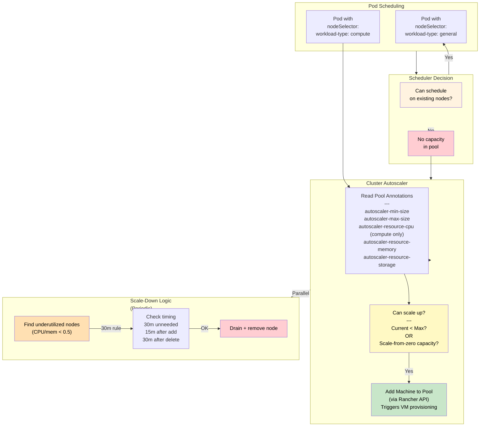
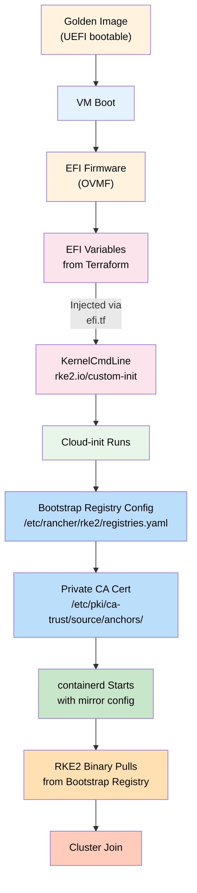
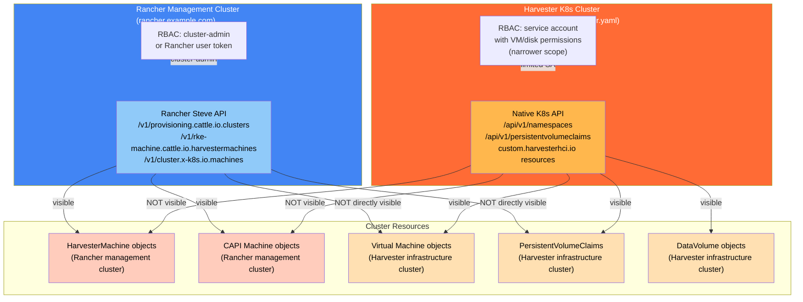

# RKE2 Cluster Architecture

## Overview

This document provides a technical deep-dive into the Harvester-based RKE2 cluster provisioning system. The Terraform codebase in this repository orchestrates the creation of a production-grade Kubernetes cluster on Harvester hypervisor infrastructure, integrated with Rancher management, Harbor container registry, and automated node management via custom operators.

**Key characteristics:**
- Golden image-first deployment (no vanilla OS downloads)
- Airgap-ready with Harbor proxy-cache for all upstream registries
- Four specialized node pools with autoscaling and scale-from-zero
- Cilium networking with L2 LoadBalancer announcement
- Private CA TLS trust chain
- EFI/UEFI boot requirement (OVMF firmware)
- Custom operators for node labeling and storage autoscaling
- Rancher 2 API integration for cluster lifecycle management

---

## 1. System Architecture Overview

The system consists of four major components that work together to provision and manage the RKE2 cluster:

**Component Relationships:**

1. **Rancher Management Cluster** — The control point; provides API for Terraform and defines cloud credentials for Harvester
2. **Harvester Hypervisor** — Physical/virtualized infrastructure; hosts all RKE2 cluster VMs and the golden image
3. **RKE2 Cluster** — The downstream managed cluster with four node pools and Cilium + Traefik networking
4. **Container Registry** — Bootstrap registry for initial node provisioning, Harbor for production image pulls

---

## 2. Terraform Resource Dependency Graph

The Terraform configuration follows this dependency chain. Understanding the flow is critical for deployment troubleshooting:

**Dependency explanation:**

- **Stage 1 (Variables/Providers)**: Core Terraform configuration and provider setup
- **Stage 2 (Data/Credentials)**: Queries golden image, creates Harvester cloud credential in Rancher
- **Stage 3 (Machine Configs)**: Defines node configuration for each pool (CP, general, compute, database)
- **Stage 4 (EFI Patches)**: Applies initial bootstrap patches to node configurations (registries, CA certs)
- **Stage 5 (RKE2 Cluster)**: Creates the actual cluster in Rancher; depends on machine configs and credentials
  - **Critical**: The cluster resource must set `cloud_credential_secret_name = rancher2_cloud_credential.harvester.id` at the cluster level (not just per-pool)
  - This tells Rancher which cloud credential to use for all machine pools
  - Without this, Rancher cannot provision VMs correctly and may create duplicate machine deployments
- **Stage 6 (Operators)**: Once cluster is running, deploys node-labeler and storage-autoscaler operators

---

## 3. Network Architecture

The cluster uses two physical networks on Harvester: one for cluster communication (eth0) and one dedicated for Cilium LoadBalancer announcement (eth1).

**Network details:**

- **Control Plane (eth0 only)**
  - Single NIC simplifies networking for API servers and etcd
  - Cilium L2 policy explicitly excludes CP nodes
  - No ingress traffic received on CP

- **Workers (Dual NIC)**
  - **eth0 (cluster network, 10.0.0.0/24)**: Primary cluster communication, Kubernetes service mesh, CNI overlay
  - **eth1 (services network, 192.168.48.0/24)**: Dedicated to Cilium L2 LoadBalancer IP announcement

- **Policy Routing (Worker-only)**
  - NetworkManager dispatcher script activates when eth1 comes up
  - Adds routing table 200 ("ingress") with priority 100
  - Rule: `ip rule add from <eth1_ip> table ingress` ensures responses on services-network stay on eth1
  - Kernel ARP tuning (`arp_ignore=1, arp_announce=2`) prevents eth0 from answering ARP for eth1 addresses

- **Cilium L2 Announcement**
  - Pool: 192.168.48.2 – 192.168.48.20 (adjustable via `cilium_lb_pool_start/stop`)
  - Traefik LoadBalancer IP: 192.168.48.2
  - Policy matches all services, excludes CP nodes
  - Announces on `eth1` only

---

## 4. Node Pool Design

The cluster uses four specialized pools for different workload types. Each pool is independently autoscalable with dedicated node labels.

**Pool architecture notes:**

1. **Control Plane Pool**
   - Fixed quantity (no autoscaling); typically 3 for etcd quorum
   - Single NIC (eth0 only) to simplify network requirements
   - All CP components run without workload placement restrictions

2. **General Worker Pool**
   - Autoscaled (4–10 nodes, configurable)
   - Default destination for most Kubernetes workloads
   - Dual NIC for ingress traffic separation

3. **Compute Worker Pool**
   - **Scale-from-zero enabled** via annotations that tell autoscaler the capacity of a hypothetical new node
   - Starts at 0 nodes (no idle compute cost)
   - When a Pod with `workload-type=compute` nodeSelector cannot be scheduled, autoscaler knows a new node would fit and adds one
   - Useful for batch jobs, ML training, etc.

4. **Database Worker Pool**
   - Autoscaled (4–10 nodes)
   - Dedicated for stateful workloads (CNPG, Redis, etc.)
   - Same dual-NIC as general workers

**Node label application:**
- Workload-type labels applied at provisioning time via machine pool configuration
- kubelet receives labels via RKE2 machine config

---

## 5. Container Registry Architecture

All container image pulls flow through a tiered registry system designed for airgap resilience and rate-limit avoidance:

**Registry flow details:**

1. **Node Container Runtime (containerd)**
   - Reads `registries.yaml` injected by Terraform via `rke_config.registries` block
   - Specifies mirrors and rewrite rules for each upstream registry

2. **Bootstrap Phase (Cluster Startup)**
   - Registry endpoint: `var.bootstrap_registry` (e.g., `harbor.example.com`)
   - Mirror config rewrites: e.g., `docker.io/library/alpine` → `bootstrap_registry/docker.io/library/alpine`
   - Small registry can pre-cache images needed for RKE2 startup (e.g., containerd, CNI plugins, system pods)
   - TLS trust: `bootstrap_registry_ca_pem` (defaults to `private_ca_pem` if not specified)

3. **Harbor Proxy-Cache Phase (After Cluster Ready)**
   - Registry config is configured to point to Harbor
   - Same mirror rewrites but now endpoint is `var.harbor_fqdn` (e.g., `harbor.example.com`)
   - Harbor configured with upstream projects (one per upstream registry)
   - Caching behavior: pull from upstream on first request, cache locally
   - Dramatically reduces bandwidth and upstream rate-limit pressure

4. **Upstream Registries**
   - Docker Hub, Quay, GHCR, GCR, K8s registry, Elastic, GitLab, MariaDB
   - Configurable via `harbor_registry_mirrors` variable (defaults to the 8 listed above)
   - Can be extended or modified based on organization needs

**Private CA Trust:**
- `private_ca_pem` provided at Terraform time
- Injected into all nodes via cloud-init (`write_files` → `/etc/pki/ca-trust/source/anchors/private-ca.pem`)
- Both bootstrap and Harbor registries use this CA for TLS validation

---

## 6. Cloud Provider Integration

The Harvester cloud provider enables native Kubernetes integration for LoadBalancer services, persistent volumes, and node lifecycle management:

**Cloud provider functionality:**

1. **LoadBalancer Controller**
   - Intercepts Kubernetes `Service type: LoadBalancer` requests
   - For Cilium L2 announcement: controller ensures VIP is allocated from pool, Cilium announces it
   - Creates no additional Harvester resources; Cilium L2 handles the announcement natively

2. **CSI Driver**
   - Enables `PersistentVolumeClaim` consumption from Harvester storage pools
   - Typical flow: Create PVC → CSI controller provisions volume on Harvester → CSI kubelet plugin mounts via iSCSI/NFS
   - StorageClass `provisioner: harvester.cattle.io` required in cluster

3. **Node Controller**
   - Monitors Harvester VM lifecycle (created, running, terminated)
   - Updates Kubernetes `Node` resource status accordingly
   - Handles node draining on VM termination (graceful shutdown)

4. **Authentication**
   - Uses `harvester_cloud_provider_kubeconfig_path` (separate from main Rancher integration)
   - ServiceAccount-based authentication
   - Kubeconfig injected into RKE2 system pod by Terraform

---

## 7. Cluster Autoscaler

Rancher's cluster autoscaler drives node pool sizing based on workload demand. The system supports both traditional autoscaling and scale-from-zero:

**Autoscaler behavior:**

- **Scale-up**: When a pod is unschedulable due to insufficient capacity, autoscaler checks if it can add a new node to the affected pool
- **Scale-down**: Periodically scans for underutilized nodes; if a node is idle for 30 minutes with < 50% utilization, it's drained and removed
- **Scale-from-zero**: Compute pool starts at 0 nodes; annotations tell autoscaler the capacity of a hypothetical new node, allowing scale-up decisions even with 0 current nodes
- **Cooldowns**: After adding a node, no scale-down for 15 minutes; after removing, no scale-down for 30 minutes

---

## 8. EFI Firmware Patching

Initial node bootstrap requires EFI firmware patches to inject bootstrap registry credentials and CA certificates before cloud-init runs:

**Why EFI patches are needed:**
- Cloud-init runs after boot, but containerd needs registry config before pulling RKE2 images
- EFI variables allow passing configuration that survives the bootloader → kernel transition
- Private CA must be available during first container pull (even from bootstrap registry)

**Implementation:**
- `efi.tf` resource: generates EFI patches for each node pool
- Patches injected into `machine_config.tf` via `efi_patch` block
- Terraform applies patches when creating machine configs

---

## 9. Operator Deployment

Two custom Kubernetes operators are optionally deployed after cluster creation:

### node-labeler (v0.2.0)

Watches Harvester VM annotations and syncs them to Kubernetes node labels. Enables workload affinity based on VM properties.

### storage-autoscaler (v0.2.0)

Monitors Harvester VM disk usage and automatically expands PersistentVolumes on nodes near capacity.

**Deployment flow:**
1. Operator images built from source (must exist in `operators/images/`)
2. Terraform runs `push-images.sh` via `null_resource.operator_image_push`
3. Images pushed to Harbor via `crane` CLI
4. Manifests rendered from `operators/templates/` via `templatefile()` function
5. Operators deployed via kubectl using RKE2 kubeconfig

**Operator images:**
- Image tarballs are NOT committed to git
- To deploy operators, build images from source in `operators/` directory
- Place tarballs in `operators/images/` before `terraform apply`
- If `deploy_operators = false`, operators are not deployed

---

## 10. Rancher API vs Harvester Kubeconfig — RBAC & Visibility Gap

A critical operational detail: Rancher's Steve API and direct Harvester kubeconfig provide **different visibility** into cluster resources due to RBAC role differences.

**Key visibility differences:**

1. **Rancher Steve API** (used by `terraform.sh destroy` cleanup)
   - Can see HarvesterMachine, CAPI Machine, provisioning cluster resources
   - **Cannot directly delete VMs** — only the Harvester kubeconfig can
   - Operates on Rancher management cluster; uses `cluster-admin` or higher privileges
   - Used by `post_destroy_cleanup()` to clear finalizers and metadata

2. **Harvester kubeconfig** (direct K8s API)
   - Can see/delete VMs, VMIs, PVCs, DataVolumes
   - **Cannot see HarvesterMachine or CAPI resources** — those live on Rancher
   - Uses ServiceAccount with limited VM/storage permissions
   - Used by `nuke-cluster.sh` to force-delete stuck VMs and orphaned disks

**Operational implication:**

When destroying a cluster, both must be used:
1. **Rancher API** clears finalizers on HarvesterMachine/CAPI objects
2. **Harvester API** force-deletes orphaned VMs and disks

If only one approach is used, resources will remain orphaned. This is why `destroy-cluster.sh` (which calls both via Terraform's cleanup logic) and `nuke-cluster.sh` (which handles both explicitly) both exist and may both be needed in failure scenarios.

---

## 11. Summary

This architecture delivers a production-ready RKE2 cluster on Harvester with:

- **Reliability**: Three-node CP, etcd quorum, pod disruption budgets
- **Scalability**: Autoscaling pools, scale-from-zero for compute workloads
- **Networking**: Cilium CNI with L2 LB, dual-NIC separation of cluster/ingress traffic
- **Air-gap**: Bootstrap registry + Harbor proxy-cache isolation from public internet
- **Observability**: Cluster autoscaler, node-labeler, storage-autoscaler custom operators
- **Security**: Private CA trust chain, node encryption, service account RBAC

All infrastructure is managed by Terraform, enabling repeatable, auditable cluster deployments.
