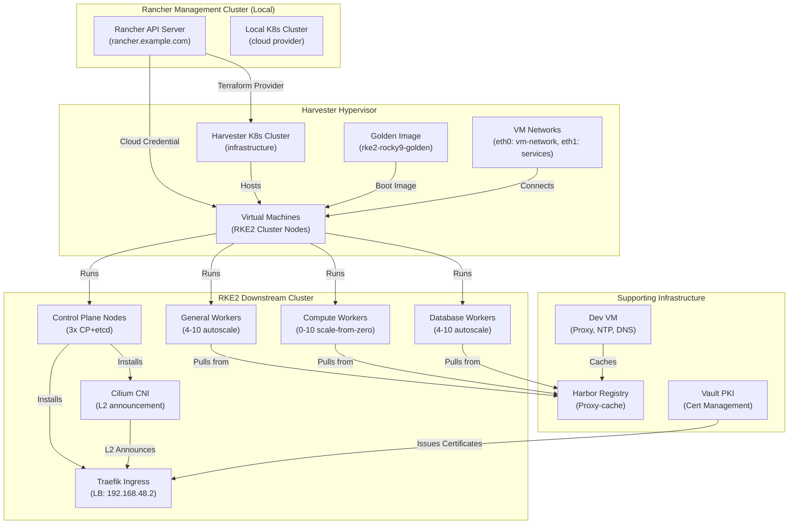
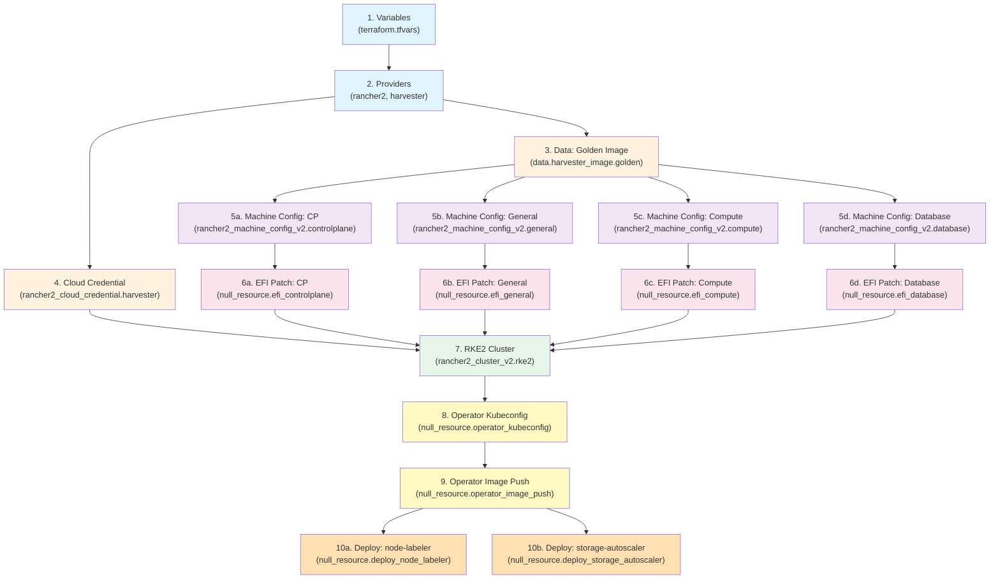
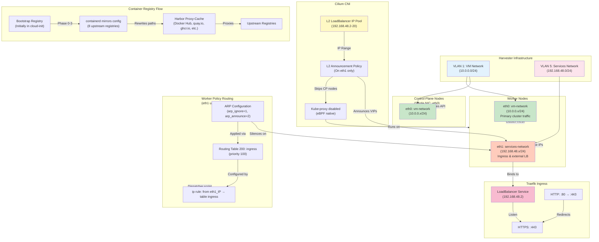
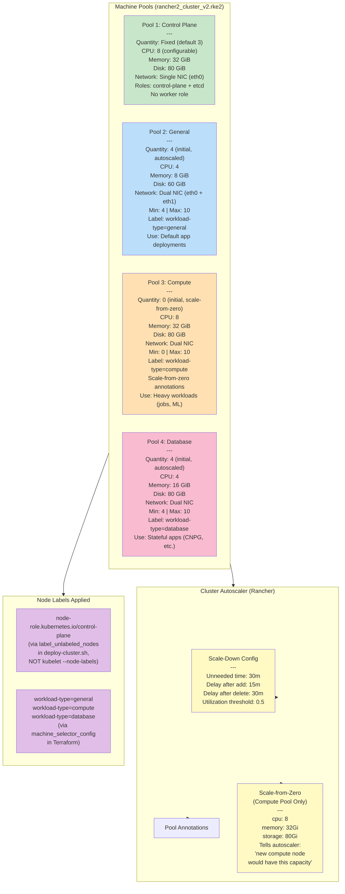
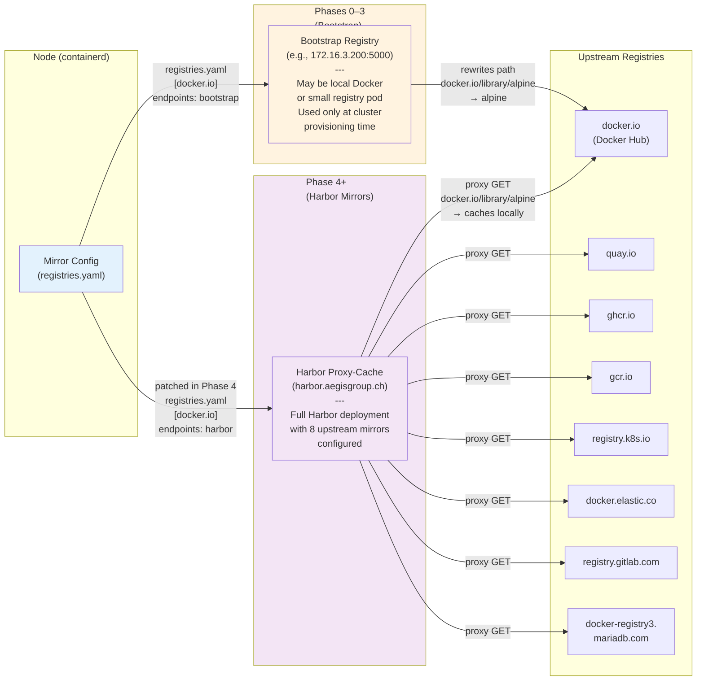
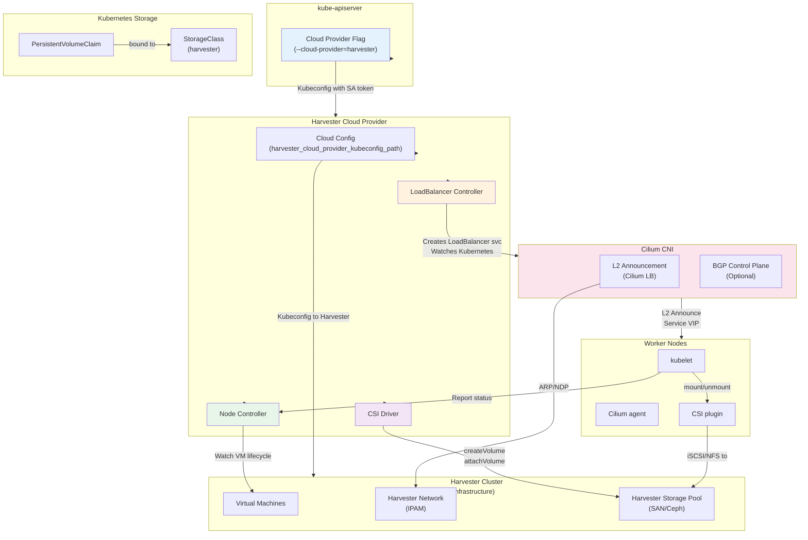
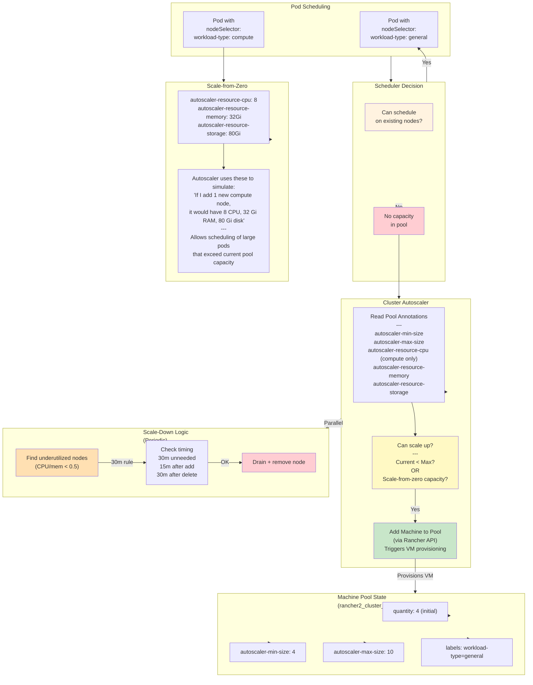
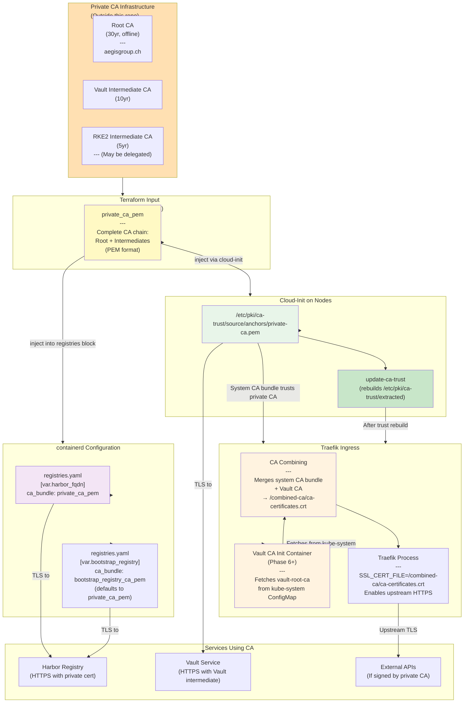
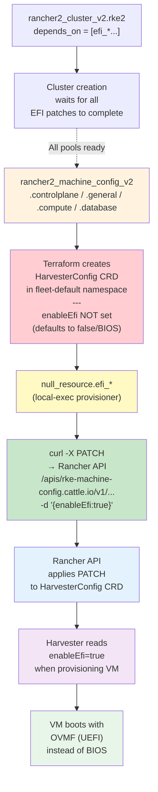
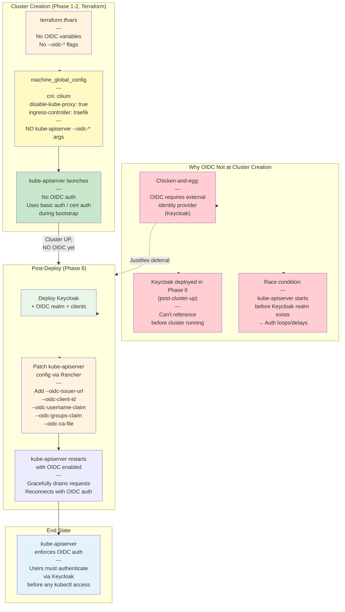

# RKE2 Cluster Architecture

## Overview

This document provides a technical deep-dive into the Harvester-based RKE2 cluster provisioning system. The Terraform codebase in this repository orchestrates the creation of a production-grade Kubernetes cluster on Harvester hypervisor infrastructure, integrated with Rancher management, Harbor container registry, and automated node management via custom operators.

**Key characteristics:**
- Golden image-first deployment (no vanilla OS downloads)
- Airgap-ready with Harbor proxy-cache for all upstream registries
- Four specialized node pools with autoscaling and scale-from-zero
- Cilium networking with L2 LoadBalancer announcement
- Private CA TLS trust chain
- EFI/UEFI boot requirement (OVMF firmware)
- Custom operators for node labeling and storage autoscaling
- Rancher 2 API integration for cluster lifecycle management

---

## 1. System Architecture Overview

The system consists of five major components that work together to provision and manage the RKE2 cluster:



**Component Relationships:**

1. **Rancher Management Cluster** — The control point; provides API for Terraform and defines cloud credentials for Harvester
2. **Harvester Hypervisor** — Physical/virtualized infrastructure; hosts all RKE2 cluster VMs and the golden image
3. **RKE2 Cluster** — The downstream managed cluster with four node pools and Cilium + Traefik networking
4. **Infrastructure Services** — Harbor for container images, Dev VM for proxy caching, Vault for PKI

---

## 2. Terraform Resource Dependency Graph

The Terraform configuration follows this dependency chain. Understanding the flow is critical for deployment troubleshooting:



**Dependency explanation:**

- **Stages 1-2**: Initialization (variables loaded, providers configured)
- **Stage 3**: Golden image lookup from Harvester (used by all machine configs)
- **Stage 4**: Cloud credential registration in Rancher (required for VM provisioning)
- **Stages 5a-5d**: Four machine configurations defined (CP, general, compute, database)
  - Each specifies disk (golden image), network, CPU/memory, cloud-init user data
  - Network info differs: CP has single NIC; workers have dual NIC (vm-network + services-network)
- **Stages 6a-6d**: EFI firmware patches applied via Rancher API
  - Patches HarvesterConfig CRDs to enable UEFI boot
  - Must complete before cluster creation (explicit dependency in cluster.tf)
- **Stage 7**: RKE2 cluster creation
  - Depends on all EFI patches and cloud credential
  - Provisions VMs via Rancher machine pool orchestration
  - Configures CNI (Cilium), ingress (Traefik), registries (Harbor), cloud provider (Harvester)
- **Stages 8-9**: Operator setup (kubeconfig retrieval, image push to Harbor)
  - Gated by `var.deploy_operators` flag
  - Image push requires Harbor credentials
- **Stages 10a-10b**: Operator deployments (node-labeler, storage-autoscaler)
  - Run in parallel after image push
  - Waits for nodes to be Ready before applying manifests

---

## 3. Network Architecture

The cluster uses a dual-network design with policy routing to separate management and service traffic:



**Network details:**

- **Control Plane (eth0 only)**
  - Single NIC simplifies networking for API servers and etcd
  - Cilium L2 policy explicitly excludes CP nodes (matchExpressions excludes control-plane role)
  - CP handles kubeconfig requests and API proxy via eth0

- **Workers (Dual NIC)**
  - **eth0 (vm-network, 10.0.0.0/24)**: Primary cluster communication, Kubernetes service mesh, CNI overlay
  - **eth1 (services-network, 192.168.48.0/24)**: Dedicated to Cilium L2 LoadBalancer IP announcement

- **Policy Routing (Worker-only)**
  - NetworkManager dispatcher script (`10-ingress-routing`) activates when eth1 comes up
  - Adds routing table 200 ("ingress") with priority 100
  - Rule: `ip rule add from <eth1_ip> table ingress` ensures responses on services-network stay on eth1 (not asymmetric routing)
  - Kernel ARP tuning (`arp_ignore=1, arp_announce=2`) prevents eth0 from answering ARP for eth1 addresses

- **Cilium L2 Announcement**
  - Pool: 192.168.48.2 – 192.168.48.20 (adjustable via `cilium_lb_pool_start/stop`)
  - Traefik LoadBalancer IP: 192.168.48.2 (via `traefik_lb_ip` var)
  - Policy matches all services (`serviceSelector: matchLabels: {}`), excludes CP nodes
  - Announces on `eth1` only (`interfaces: ["^eth1$"]`)

- **Container Registry Flow**
  - **Phase 0-3 (Bootstrap)**: Pulls via bootstrap registry (defined in machine_config.tf registries block)
  - **Phase 4+**: `configure_rancher_registries()` patches the cluster to use Harbor proxy-cache
  - **Mirror config**: 8 upstream registries (docker.io, quay.io, ghcr.io, gcr.io, registry.k8s.io, docker.elastic.co, registry.gitlab.com, docker-registry3.mariadb.com) → containerd → Harbor with path rewrites
  - **Harbor TLS**: Private CA certificate in cloud-init enables HTTPS to Harbor

---

## 4. Node Pool Design

The cluster uses four specialized pools for different workload types. Each pool is independently autoscalable with dedicated node labels.



**Pool architecture notes:**

1. **Control Plane Pool**
   - Fixed quantity (no autoscaling); typically 3 for etcd quorum
   - Single NIC to simplify network requirements
   - All CP components run without workload placement restrictions

2. **General Worker Pool**
   - Autoscaled (4–10 nodes, configurable)
   - Default destination for most Kubernetes workloads
   - Dual NIC for ingress traffic separation

3. **Compute Worker Pool**
   - **Scale-from-zero enabled** via annotations that tell autoscaler the capacity of a hypothetical new node
   - Starts at 0 nodes (no idle compute cost)
   - When a Pod with `workload-type=compute` nodeSelector cannot be scheduled, autoscaler knows a new node would fit and adds one
   - Useful for batch jobs, ML training, etc.

4. **Database Worker Pool**
   - Autoscaled (4–10 nodes)
   - Dedicated for stateful workloads (CNPG, Redis, etc.)
   - Same dual-NIC as general workers

**Node label application:**
- Control-plane labels applied by `label_unlabeled_nodes()` in deploy-cluster.sh (Phase 3), not at kubelet launch
  - Reason: NodeRestriction admission plugin prevents kubelet from setting `node-role.kubernetes.io/*` labels
- Workload-type labels applied at provisioning time via `machine_selector_config` in Terraform
  - kubelet receives `--node-labels=workload-type=general` etc. via RKE2 machine config

---

## 5. Container Registry Architecture

All container image pulls flow through a tiered registry system designed for airgap resilience and rate-limit avoidance:



**Registry flow details:**

1. **Node Container Runtime (containerd)**
   - Reads `registries.yaml` injected by Terraform via `rke_config.registries` block
   - Specifies mirrors and rewrite rules for each upstream registry

2. **Bootstrap Phase (Phases 0–3)**
   - Registry endpoint: `var.bootstrap_registry` (e.g., `172.16.3.200:5000`)
   - Mirror config rewrites: e.g., `docker.io/library/alpine` → `bootstrap_registry/docker.io/library/alpine`
   - Small registry can pre-cache images needed for RKE2 startup (e.g., containerd, CNI plugins, system pods)
   - TLS trust: `bootstrap_registry_ca_pem` (defaults to `private_ca_pem` if not specified)

3. **Harbor Proxy-Cache Phase (Phase 4+)**
   - `configure_rancher_registries()` patches `rke_config.registries` to point to Harbor
   - Same mirror rewrites but now endpoint is `var.harbor_fqdn` (e.g., `harbor.aegisgroup.ch`)
   - Harbor configured with 8 upstream projects (one per upstream registry)
   - Caching behavior: pull from upstream on first request, cache locally
   - Dramatically reduces bandwidth and upstream rate-limit pressure

4. **Upstream Registries**
   - Docker Hub, Quay, GHCR, GCR, K8s registry, Elastic, GitLab, MariaDB
   - Configurable via `harbor_registry_mirrors` variable (defaults to the 8 listed above)
   - Can be extended or modified based on organization needs

**Private CA Trust:**
- `private_ca_pem` provided at Terraform time
- Injected into all nodes via cloud-init (`write_files` → `/etc/pki/ca-trust/source/anchors/private-ca.pem`)
- Both bootstrap and Harbor registries use this CA for TLS validation
- No separate `bootstrap_registry_ca_pem` defaults to the same CA chain

---

## 6. Cloud Provider Integration

The Harvester cloud provider enables native Kubernetes integration for LoadBalancer services, persistent volumes, and node lifecycle management:



**Cloud provider functionality:**

1. **LoadBalancer Controller**
   - Intercepts Kubernetes `Service type: LoadBalancer` requests
   - For Cilium L2 announcement (L2 pool mode): controller ensures VIP is allocated from pool, Cilium announces it
   - Creates no additional Harvester resources; Cilium L2 handles the announcement natively

2. **CSI Driver**
   - Enables `PersistentVolumeClaim` consumption from Harvester storage pools
   - Typical flow: Create PVC → CSI controller provisions volume on Harvester → CSI kubelet plugin mounts via iSCSI/NFS
   - StorageClass `provisioner: harvester.cattle.io` required in cluster

3. **Node Controller**
   - Monitors Harvester VM lifecycle (created, running, terminated)
   - Updates Kubernetes `Node` resource status accordingly
   - Handles node draining on VM termination (graceful shutdown)

4. **Authentication**
   - Uses `harvester_cloud_provider_kubeconfig_path` (separate from main Rancher integration)
   - ServiceAccount-based authentication (not user token)
   - Kubeconfig injected into RKE2 system pod by Terraform

---

## 7. Cluster Autoscaler

Rancher's cluster autoscaler drives node pool sizing based on workload demand. The system supports both traditional autoscaling and scale-from-zero:



**Autoscaler configuration (via cluster annotations):**

| Annotation | Default | Purpose |
|-----------|---------|---------|
| `cluster.provisioning.cattle.io/autoscaler-scale-down-unneeded-time` | `30m0s` | How long a node must be underutilized before removal |
| `cluster.provisioning.cattle.io/autoscaler-scale-down-delay-after-add` | `15m0s` | Cooldown after adding a node before scale-down considered |
| `cluster.provisioning.cattle.io/autoscaler-scale-down-delay-after-delete` | `30m0s` | Cooldown after removing a node before next removal |
| `cluster.provisioning.cattle.io/autoscaler-scale-down-utilization-threshold` | `0.5` | CPU/mem threshold below which node is unneeded (0.0–1.0) |

**Per-pool annotations (in machine_pools block):**

```hcl
# General & Database pools: Traditional autoscaling
annotations = {
  "cluster.provisioning.cattle.io/autoscaler-min-size" = "4"
  "cluster.provisioning.cattle.io/autoscaler-max-size" = "10"
}

# Compute pool ONLY: Scale-from-zero
annotations = {
  "cluster.provisioning.cattle.io/autoscaler-min-size" = "0"
  "cluster.provisioning.cattle.io/autoscaler-max-size" = "10"
  "cluster.provisioning.cattle.io/autoscaler-resource-cpu"     = "8"
  "cluster.provisioning.cattle.io/autoscaler-resource-memory"  = "32Gi"
  "cluster.provisioning.cattle.io/autoscaler-resource-storage" = "80Gi"
}
```

**Scale-from-zero behavior:**
1. Pod with `nodeSelector: workload-type: compute` cannot schedule
2. Autoscaler checks compute pool: current = 0, min = 0, max = 10
3. Autoscaler simulates: "If I add one node with 8 CPU, 32 Gi RAM, 80 Gi disk, can pod fit?"
4. If yes: scales up from 0 → 1 (provisions new VM)
5. Pod schedules; workload runs
6. After scale-down-unneeded-time (30m) with low utilization: node is drained and removed back to 0

---

## 8. TLS/CA Trust Chain

The cluster uses a private certificate authority for internal service TLS and secure registry access:



**TLS trust flow:**

1. **Input: terraform.tfvars**
   - `private_ca_pem`: Complete PEM-encoded certificate chain (root + all intermediates)
   - Validated by `regex("-----BEGIN CERTIFICATE-----[\\s\\S]+-----END CERTIFICATE-----")`
   - May be same for all services or split per service (e.g., `bootstrap_registry_ca_pem` optional)

2. **Cloud-Init Injection**
   - All nodes: write `private_ca_pem` to `/etc/pki/ca-trust/source/anchors/private-ca.pem`
   - Run `update-ca-trust` to rebuild system CA bundle (`/etc/pki/ca-trust/extracted/pem/tls-ca-bundle.pem`)
   - Every application (containerd, curl, openssl, etc.) automatically trusts the CA

3. **Containerd Registry Configuration**
   - Harbor config: `ca_bundle: var.private_ca_pem` in registries block
   - Bootstrap registry config: `ca_bundle: coalesce(var.bootstrap_registry_ca_pem, var.private_ca_pem)`
   - Containerd uses these certs for HTTPS validation on pull requests

4. **Traefik Ingress (Phase 6+)**
   - Placeholder ConfigMap created at cluster boot: `vault-root-ca` in kube-system (empty initially)
   - Phase 6 post-deploy: Vault PKI CA populated into ConfigMap
   - Init container: combines system CA bundle + Vault CA → `/combined-ca/ca-certificates.crt`
   - Traefik env var: `SSL_CERT_FILE=/combined-ca/ca-certificates.crt`
   - Enables upstream HTTPS connections to Vault, Harbor, etc.

**Security implications:**
- Private CA is **sensitive** and must be protected
- Stored in `terraform.tfvars` (gitignored)
- Injected to every node's CA trust store (no secrets)
- Traefik ConfigMap update (Phase 6) requires manual Vault unsealing or automation

---

## 9. EFI Firmware Patching

Harvester virtual machines require UEFI (EFI) firmware for proper boot support. The Terraform provider doesn't directly expose this flag, so it must be patched via the Kubernetes API:



**Why EFI patching is necessary:**

- **Provider limitation**: The Rancher Terraform provider's `harvester_config` block doesn't expose the `enableEfi` field
- **CRD structure**: HarvesterConfig CRDs live in `fleet-default` namespace as `rke-machine-config.cattle.io/v1` resources
- **Field name**: camelCase `enableEfi` (not `enableEFI`)
- **Patching approach**: Use Rancher API directly (PATCH, not PUT) to avoid overwriting the machine config

**Patch flow (in efi.tf):**

```hcl
resource "null_resource" "efi_controlplane" {
  triggers = {
    name = rancher2_machine_config_v2.controlplane.name  # e.g., "cluster-cp-abc123"
  }

  provisioner "local-exec" {
    command = <<-EOT
      curl -X PATCH \
        -H "Authorization: Bearer ${var.rancher_token}" \
        -H "Content-Type: application/merge-patch+json" \
        "${var.rancher_url}/apis/rke-machine-config.cattle.io/v1/namespaces/fleet-default/harvesterconfigs/${rancher2_machine_config_v2.controlplane.name}" \
        -d '{"enableEfi":true}'
    EOT
  }
}
```

**Dependency in cluster.tf:**

```hcl
resource "rancher2_cluster_v2" "rke2" {
  # ... cluster config ...

  depends_on = [
    null_resource.efi_controlplane,
    null_resource.efi_general,
    null_resource.efi_compute,
    null_resource.efi_database,
  ]
}
```

This ensures all four EFI patches complete before Rancher attempts to provision VMs.

---

## 10. Decision Record: OIDC Deferred to Post-Deploy (Phase 6)

OIDC (OpenID Connect) authentication for the kube-apiserver is intentionally NOT configured at cluster creation time. This decision prioritizes cluster availability and simplifies the bootstrap sequence.



**Decision rationale:**

| Aspect | Decision | Reason |
|--------|----------|--------|
| **OIDC at cluster creation?** | No | Keycloak doesn't exist yet; would cause auth failures |
| **When enabled?** | Phase 6 (post-cluster-up) | After Keycloak deployed and realm configured |
| **How applied?** | Rancher cluster config patch | Not at terraform time; allows rollback if needed |
| **Auth during bootstrap?** | Basic/cert auth via kubeconfig | Terraform and early deployments use direct certs |
| **User experience** | Transparent; kubeconfig switch at Phase 6 | Users switch credentials after cluster ready |

**Benefits:**
1. **Cluster reliability**: No auth delays or loops during bootstrap
2. **Decoupled deployment**: OIDC setup independent of cluster infrastructure
3. **Simpler troubleshooting**: Early phase issues not entangled with identity system
4. **Reversibility**: OIDC can be disabled if Keycloak fails

**Related:**
- Identity Portal integration: Phase 6 post-deploy (same script that configures OIDC)
- OIDC client creation: Phase 5 (bootstrap-platform.sh B4 tier) in the main project
- Token refresh: Handled by oauth2-proxy (separate from kube-apiserver OIDC)

---

## 11. Known Constraints & Warnings

### Expected During Deployment

**ImagePullBackOff on Operators (Phases 0–3)**
- **Symptom**: Custom operators (node-labeler, storage-autoscaler) ImagePullBackOff until Phase 4
- **Cause**: Bootstrap registry not yet configured on cluster (only exists at cluster creation time)
- **When resolves**: Phase 4 when Harbor comes online and registries are patched
- **Action**: Expected; no intervention needed

**identity-portal-backend CrashLoopBackOff (Phases 0–5)**
- **Symptom**: identity-portal-backend pods crash
- **Cause**: Keycloak realm doesn't exist until Phase 6
- **When resolves**: Phase 6 when Keycloak realm is created
- **Action**: Expected; recover in Phase 6

**oauth2-proxy 500s (Phases 0–5)**
- **Symptom**: oauth2-proxy returns HTTP 500
- **Cause**: OIDC provider (Keycloak) not yet configured
- **When resolves**: Phase 6 when OIDC is enabled
- **Action**: Expected; users cannot authenticate until Phase 6

**Cilium LB pool initialization**
- **Symptom**: Traefik LoadBalancer unscheduled if traefik_lb_ip outside hardcoded range
- **Default range**: 192.168.48.2–192.168.48.20 (from cloud-init cilium-lb-ippool.yaml)
- **Fix**: If needed, patch `CiliumLoadBalancerIPPool` ingress-pool after cluster is running
  ```bash
  kubectl patch ciliumloadbalancerippool ingress-pool -p '{"spec":{"blocks":[{"start":"192.168.48.2","stop":"192.168.48.50"}]}}'
  ```

### Permanent Constraints

**No direct pulls from Docker Hub, GHCR, quay.io**
- Always via Harbor proxy-cache (or bootstrap registry in Phases 0–3)
- Ensures registry control and rate-limit management

**Private CA mandatory**
- `private_ca_pem` is required (validation fails otherwise)
- Must contain complete chain (root + intermediates)
- Injected to all nodes and containerd config

**Golden image required**
- No vanilla Rocky 9 download path
- `golden_image_name` must exist on Harvester before terraform apply
- Validation ensures non-empty string

**OIDC not at cluster creation**
- Kube-apiserver OIDC args added in Phase 6 post-deploy
- No OIDC flags in Terraform (cluster-wide auth unavailable until then)
- Justification: dependency on Keycloak which doesn't exist yet

**EFI patching via curl**
- Terraform provider doesn't expose `enableEfi` flag
- Patched by local-exec curl + Rancher API after machine config creation
- Node pool names must be deterministic (used in curl targets)

---

## 12. Terraform Variables Reference

**Connection & Authentication**
- `rancher_url`: Rancher API endpoint
- `rancher_token`: API token for Rancher
- `harvester_kubeconfig_path`: Path to Harvester cluster kubeconfig (for Terraform state + image lookups)
- `harvester_cloud_credential_kubeconfig_path`: ServiceAccount kubeconfig for cloud credential registration
- `harvester_cluster_id`: Rancher cluster ID of Harvester (e.g., `c-bdrxb`)

**Cluster Naming & Kubernetes Version**
- `cluster_name`: Name of RKE2 cluster (becomes Rancher cluster name)
- `kubernetes_version`: RKE2 version (default: `v1.34.2+rke2r1`)
- `cni`: CNI plugin (default: `cilium`)

**Networking**
- `vm_namespace`: Harvester namespace for VMs
- `harvester_network_name`: VM network name (eth0)
- `harvester_network_namespace`: Namespace of VM network
- `harvester_services_network_name`: Services network name (eth1, default: `services-network`)
- `harvester_services_network_namespace`: Namespace of services network (default: `default`)
- `traefik_lb_ip`: Static LoadBalancer IP for Traefik (default: `192.168.48.2`)
- `cilium_lb_pool_start`: Start of Cilium L2 pool (default: `192.168.48.2`)
- `cilium_lb_pool_stop`: End of Cilium L2 pool (default: `192.168.48.20`)

**Node Pools**

Control Plane:
- `controlplane_count`: Number of CP nodes (default: 3)
- `controlplane_cpu`: vCPUs per CP (default: 8)
- `controlplane_memory`: Memory GiB per CP (default: 32)
- `controlplane_disk_size`: Disk GiB per CP (default: 80)

General Workers:
- `general_cpu`: vCPUs (default: 4)
- `general_memory`: Memory GiB (default: 8)
- `general_disk_size`: Disk GiB (default: 60)
- `general_min_count`: Min nodes (default: 4)
- `general_max_count`: Max nodes (default: 10)

Compute Workers (scale-from-zero):
- `compute_cpu`: vCPUs (default: 8)
- `compute_memory`: Memory GiB (default: 32)
- `compute_disk_size`: Disk GiB (default: 80)
- `compute_min_count`: Min nodes (default: 0) — scale-from-zero
- `compute_max_count`: Max nodes (default: 10)

Database Workers:
- `database_cpu`: vCPUs (default: 4)
- `database_memory`: Memory GiB (default: 16)
- `database_disk_size`: Disk GiB (default: 80)
- `database_min_count`: Min nodes (default: 4)
- `database_max_count`: Max nodes (default: 10)

**Autoscaler Behavior**
- `autoscaler_scale_down_unneeded_time`: Cooldown before scale-down (default: `30m0s`)
- `autoscaler_scale_down_delay_after_add`: Delay after node add (default: `15m0s`)
- `autoscaler_scale_down_delay_after_delete`: Delay after node delete (default: `30m0s`)
- `autoscaler_scale_down_utilization_threshold`: Utilization threshold (default: `0.5`)

**Container Registry**
- `harbor_fqdn`: Harbor registry hostname (required)
- `harbor_registry_mirrors`: List of upstream registries to mirror (default: 8 registries)
- `bootstrap_registry`: Pre-existing registry for Phases 0–3 (required)
- `bootstrap_registry_ca_pem`: CA for bootstrap registry (optional; defaults to `private_ca_pem`)
- `private_ca_pem`: Complete PEM-encoded CA chain (required)

**Docker Hub (optional, rate-limit workaround)**
- `dockerhub_username`: Docker Hub username (default: empty, disables auth)
- `dockerhub_token`: Docker Hub personal access token (default: empty)

**SSH & Cloud Provider**
- `ssh_user`: SSH user for cloud image (default: `rocky`)
- `ssh_authorized_keys`: List of SSH public keys
- `harvester_cloud_credential_name`: Name of pre-existing Harvester cloud credential in Rancher
- `harvester_cloud_provider_kubeconfig_path`: Path to cloud provider kubeconfig

**Golden Image**
- `golden_image_name`: Pre-existing image name on Harvester (required, non-empty validation)

**Operators**
- `deploy_operators`: Deploy node-labeler & storage-autoscaler (default: true)
- `harbor_admin_password`: Harbor admin password for image push (required if `deploy_operators = true`)

---

## Summary

This architecture represents a production-hardened, airgap-ready Kubernetes platform on Harvester. Key design principles:

1. **Golden image first**: All nodes from pre-baked image, no downloads
2. **Airgap ready**: Bootstrap registry for Phases 0–3, Harbor proxy-cache Phase 4+
3. **Specialized pools**: CP, general workers, compute (scale-from-zero), database; each autoscalable
4. **Cilium L2**: Native LoadBalancer support without external controller
5. **Private CA throughout**: Injected to all nodes, registries, Traefik
6. **Deferred OIDC**: Cluster available immediately; identity configured post-deploy (Phase 6)
7. **Custom operators**: Automated node labeling and storage autoscaling
8. **Rancher integration**: Cluster lifecycle managed via Rancher API, not kubectl

The Terraform codebase in `/home/rocky/code/harvester-rke2-cluster` implements this architecture, orchestrating the provisioning of a fully functional RKE2 cluster on Harvester hypervisor infrastructure.
