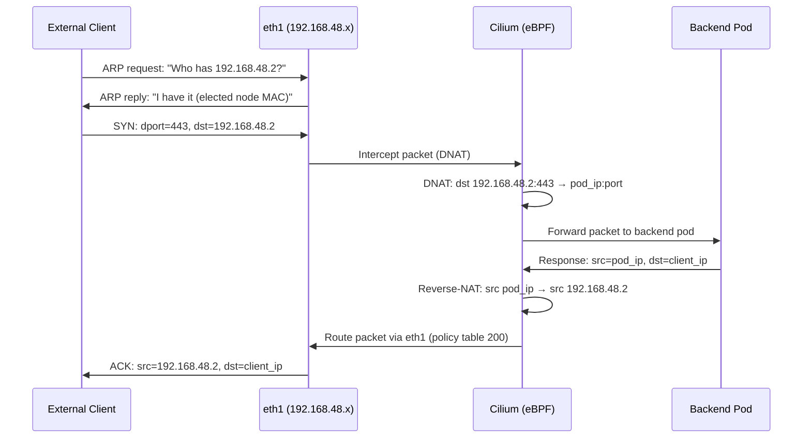
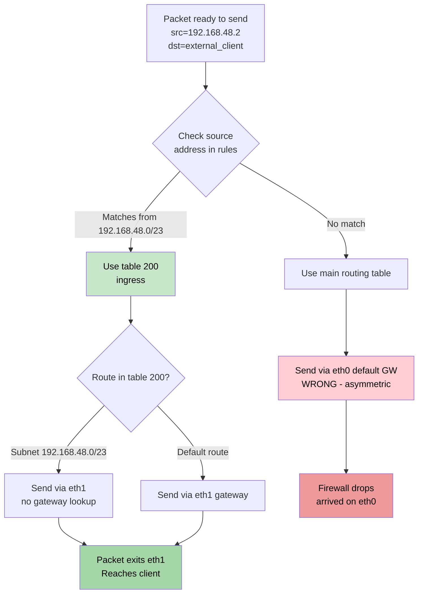

# RKE2 Cluster Network Topology — Dual-NIC Design

## Overview

The RKE2 cluster uses a dual-network-interface architecture to separate control-plane communication from ingress traffic. This document details the network topology, traffic flows, policy routing implementation, and operational considerations for the dual-NIC setup.

**Key principle:** Cluster management (API server, etcd, node-to-node communication) uses eth0 (10.0.0.0/24). Ingress LoadBalancer VIPs use eth1 (192.168.48.0/23). Policy routing ensures ingress return traffic exits via eth1, not the default gateway on eth0.

---

## 1. Network Interfaces and VLAN Assignment

### Control Plane Nodes

Control plane nodes run a single network interface:

- **eth0 (10.0.0.0/24)**: Cluster management network
  - kube-apiserver listens on eth0
  - etcd communication on eth0
  - Inter-node control traffic (kubelet-to-API-server, inter-etcd)
  - Rancher cluster agent communicates via eth0
  - DHCP-assigned IP (300-second lease)

**Why single NIC on CP nodes?**
- Control plane workloads do not receive ingress traffic
- Simplified network stack for critical components
- Reduced attack surface (no unnecessary NICs)
- Cilium L2 announcement policy explicitly excludes control-plane nodes

### Worker Nodes (General, Compute, Database Pools)

Worker nodes (all three worker pools: general, compute, database) use two network interfaces:

#### eth0: Cluster Management Network

- **Subnet**: 10.0.0.0/24
- **DHCP**: 300-second lease
- **Purpose**: Cluster mesh, kubelet, container runtime, pod-to-pod overlay
- **Kubernetes traffic**:
  - kubelet ↔ kube-apiserver
  - Container runtime ↔ image registry
  - CNI overlay (Cilium vxlan/GENEVE)
  - Kubernetes Service traffic (via iptables/eBPF rules on eth0)
- **Default gateway**: Points to Harvester DHCP server

#### eth1: Ingress/Services Network

- **Subnet**: 192.168.48.0/23 (192.168.48.0 – 192.168.49.255)
- **DHCP**: 300-second lease (separate DHCP pool)
- **Purpose**: Cilium L2 LoadBalancer IP announcement and ingress traffic
- **No default gateway**: eth1 is secondary; policy routing (not default routing) determines how traffic destined to VIPs is handled
- **Traffic type**: Ingress only (external traffic → VIP → backend pod)

---

## 2. Cilium L2 LoadBalancer Architecture

Cilium L2 announcements enable bare-metal-style LoadBalancer IP assignment on eth1. This section details the configuration and behavior.

### CiliumLoadBalancerIPPool

The cluster defines a single IP pool for LoadBalancer Services:

```yaml
apiVersion: cilium.io/v2alpha1
kind: CiliumLoadBalancerIPPool
metadata:
  name: ingress-pool
spec:
  blocks:
    - start: "192.168.48.2"
      stop: "192.168.49.250"
```

**Pool properties:**
- **Range**: 192.168.48.2 – 192.168.49.250 (505 usable IPs)
- **First IP (192.168.48.2)**: Assigned to Traefik LoadBalancer Service
- **Remaining IPs**: Available for additional LoadBalancer Services

### CiliumL2AnnouncementPolicy

The L2 announcement policy controls which nodes announce which VIPs:

```yaml
apiVersion: cilium.io/v2alpha1
kind: CiliumL2AnnouncementPolicy
metadata:
  name: l2-policy
spec:
  nodeSelector:
    matchExpressions:
      - key: node-role.kubernetes.io/control-plane
        operator: DoesNotExist
  interfaces:
    - eth1
  externalIPs: false
  loadBalancerIPs: true
```

**Policy behavior:**
- **nodeSelector**: Matches all worker nodes (excludes control-plane via DoesNotExist match)
- **interfaces**: Only eth1 responds to ARP for VIPs (not eth0)
- **loadBalancerIPs: true**: Announcements apply to Services of type LoadBalancer
- **ARP announcement**: One worker node (elected via leader-election) responds "I have VIP 192.168.48.2 on eth1"

### Traffic Flow: Ingress to LoadBalancer

```
1. External client → VIP (e.g., 192.168.48.2) on eth1 (any destination port)
   - Client ARP request: "Who has 192.168.48.2?"
   - Cilium on elected node responds via eth1: "I have it (MAC address)"

2. Packets arrive at elected node eth1 (VIP as destination)

3. Cilium eBPF programs intercept (DNAT):
   - Source: <external_IP>:<port>
   - Destination: 192.168.48.2:<port> → DNAT to pod IP (10.x.x.x)

4. Packet forwarded to backend pod on same or different node

5. Pod responds with source IP = pod IP

6. Cilium reverse-NAT (egress masquerade):
   - Source: pod IP → Source becomes VIP (192.168.48.2)
   - Destination stays as external client

7. Return packet routed back to client via eth1 (policy routing ensures this; see section 3)
```

**Key property:** Cilium announces the VIP on eth1 only, ensuring clients on eth1's subnet can reach the LoadBalancer. External clients outside the subnet cannot reach the VIP unless they are routed to the eth1 subnet by the network operator.

---

## 3. Policy Routing and Return-Path Symmetry

### The Problem: Asymmetric Routing

Without policy routing, ingress traffic creates an asymmetric path:

```
Ingress path:     External client → eth1 (VIP arrives)
Return path:      Pod responds → Kernel routes via default GW on eth0

Result: Firewall drops return traffic (arrives on different interface)
        OR packet never reaches client (wrong subnet)
```

The kernel's default routing decision based on destination subnet sends return traffic destined for the external client via eth0 (default gateway on 10.0.0.0/24 subnet), but the client expects traffic to come from eth1 (192.168.48.0/23 subnet). Stateful firewalls drop such asymmetric traffic.

### Solution: Policy Routing Table 200 ("ingress")

Worker nodes maintain a custom routing table (table 200) that ensures all traffic originating from the VIP subnet exits via eth1:

#### Components

**1. Routing Table Entry**

File: `/etc/iproute2/rt_tables` (persistent)
```
200 ingress
```

**2. Routing Rule (Policy)**

```bash
ip rule add from 192.168.48.0/23 table ingress priority 100
```

**Semantics:**
- Any packet with source address in 192.168.48.0/23 uses table 200
- Priority 100 (lower = higher precedence; system rules are >100)
- Applies to all traffic from the VIP subnet, not just traffic from the node's own eth1 IP

**Why match `from 192.168.48.0/23`?**
- After Cilium reverse-NAT, return packet source = VIP (e.g., 192.168.48.2)
- Policy rule matches source 192.168.48.2 (within 192.168.48.0/23)
- Kernel consults table 200 to find how to route packets from 192.168.48.2

**3. Routes in Table 200**

```bash
ip route add 192.168.48.0/23 dev eth1 table ingress
ip route add default via <eth1_gateway> table ingress
```

**Semantics:**
- Subnet route: Traffic for 192.168.48.0/23 stays on eth1 (no gateway lookup)
- Default route: Other traffic (external clients) exits via eth1's gateway

#### Implementation: Persistent Systemd Service

A systemd service (`ingress-routing.service`) ensures policy routing rules persist across reboots and network resets:

**File**: `/etc/systemd/system/ingress-routing.service`
```ini
[Unit]
Description=Ingress VIP Routing (Table 200)
After=network-online.target
Wants=network-online.target

[Service]
Type=oneshot
ExecStart=/usr/local/bin/ingress-routing.sh

[Install]
WantedBy=multi-user.target
```

**Script**: `/usr/local/bin/ingress-routing.sh`
```bash
#!/bin/bash
set -euo pipefail

# Ensure table entry in rt_tables
if ! grep -q "^200 ingress" /etc/iproute2/rt_tables; then
  echo "200 ingress" >> /etc/iproute2/rt_tables
fi

# Set policy rule
ip rule add from 192.168.48.0/23 table ingress priority 100 2>/dev/null || true

# Get eth1 gateway from DHCP
eth1_gw=$(ip route | grep "^default.*eth1" | awk '{print $3}' | head -1)
if [ -z "$eth1_gw" ]; then
  exit 1
fi

# Set routes in table 200
ip route replace 192.168.48.0/23 dev eth1 table ingress
ip route replace default via "$eth1_gw" table ingress
```

**Why persistent service instead of NetworkManager dispatcher?**

- **Issue**: NetworkManager 1.54 (Rocky Linux 9) actively removes "foreign" routes from custom tables approximately 10 seconds after creation
- **Root cause**: NM syncs the kernel's routing state with its internal model and purges unknown routes
- **Workaround**: The persistent service polls every 5 seconds (via systemd timer or inline loop) to re-apply routes before NM removes them
- **Previous approach failure**: The `50-eth1-dispatcher` NetworkManager dispatcher script would create routes successfully, but NM would delete them within 10 seconds, causing return traffic asymmetry

**Polling mechanism** (alternative, run as timer):

```ini
[Unit]
Description=Ingress VIP Routing Persistence Check

[Timer]
OnBootSec=5s
OnUnitActiveSec=5s
Unit=ingress-routing.service

[Install]
WantedBy=timers.target
```

---

## 4. ARP Hardening

To prevent eth0 from responding to ARP requests intended for eth1 addresses, kernel ARP behavior is tuned:

### Sysctl Configuration

**File**: `/etc/sysctl.d/99-arp-hardening.conf`
```
net.ipv4.conf.all.arp_ignore = 1
net.ipv4.conf.all.arp_announce = 2
```

### Semantics

**arp_ignore = 1**
- Node only responds to ARP requests for IP addresses on the interface the request arrived on
- Example: eth0 ignores ARP requests for 192.168.48.2 (because 192.168.48.2 belongs to eth1, not eth0)
- Prevents eth0 from stealing ARP responses intended for eth1

**arp_announce = 2**
- When responding to ARP, use the best (most specific/local) source address available
- Example: If both eth0 and eth1 have configured IPs, use the IP from the outgoing interface
- Ensures ARP replies from eth1 include eth1's MAC address

### Effect

With these settings:
- External clients querying eth1 for VIP 192.168.48.2 get a response from the elected node's eth1 MAC
- eth0 never advertises 192.168.48.2 via ARP, preventing confusion
- Cilium can reliably announce VIPs on eth1 only

---

## 5. Traefik Ingress Controller

Traefik is deployed as a Kubernetes Service of type LoadBalancer and receives a VIP from the Cilium pool.

### Service Configuration

```yaml
apiVersion: v1
kind: Service
metadata:
  name: traefik
  namespace: kube-system
spec:
  type: LoadBalancer
  selector:
    app: traefik
  ports:
    - name: http
      port: 80
      targetPort: 8000
      protocol: TCP
    - name: https
      port: 443
      targetPort: 8443
      protocol: TCP
    - name: ssh
      port: 22
      targetPort: 2222
      protocol: TCP
```

### LoadBalancer IP Assignment

1. Service is created with `type: LoadBalancer`
2. Cilium controller detects the service
3. Cilium allocates an IP from the ingress-pool: 192.168.48.2
4. `status.loadBalancer.ingress[0].ip` is set to 192.168.48.2
5. Cilium L2 announcement policy instructs a worker node to respond to ARP for 192.168.48.2 on eth1

### Ingress Routes

Traefik listens on:
- **HTTP (80)**: Configured to redirect to HTTPS
- **HTTPS (443)**: Serves TLS-terminated ingress routes (private CA trust chain)
- **SSH (22)**: Optional; used for Git operations or direct pod access

All traffic arrives at 192.168.48.2 (eth1) on these ports and is forwarded to the traefik pod(s) running on worker nodes.

---

## 6. Diagrams

### High-Level Network Topology

```mermaid
graph TB
    subgraph Harvester["Harvester Infrastructure"]
        VLAN10["VLAN 10: Cluster Network (10.0.0.0/24)"]
        VLAN48["VLAN 48-49: Services Network (192.168.48.0/23)"]
    end

    subgraph ControlPlane["Control Plane Pool (single-NIC, mgmt only)"]
        CP1["CP1 eth0: 10.0.0.10"]
        CP2["CP2 eth0: 10.0.0.11"]
        CP3["CP3 eth0: 10.0.0.12"]
    end

    subgraph WorkerPools["General/Compute/Database Pools (single-NIC, mgmt only)"]
        GW["General workers<br/>eth0 only (10.0.0.x)"]
        CW["Compute workers<br/>eth0 only (10.0.0.x)"]
        DW["Database workers<br/>eth0 only (10.0.0.x)"]
    end

    subgraph LBPool["LB Pool — Cilium L2 announcer ONLY (no Traefik)"]
        LB1["lb-1<br/>eth0: 10.0.0.30<br/>eth1: 192.168.48.30"]
        LB2["lb-2<br/>eth0: 10.0.0.31<br/>eth1: 192.168.48.31"]
    end

    subgraph IngressPool["Ingress Pool — Traefik DS ONLY (no L2 announce)"]
        IN1["ingress-1<br/>eth0: 10.0.0.40<br/>eth1: 192.168.48.40<br/>Traefik pod"]
        IN2["ingress-2<br/>eth0: 10.0.0.41<br/>eth1: 192.168.48.41<br/>Traefik pod"]
    end

    subgraph Cilium["Cilium LoadBalancer (Shape B-2)"]
        VIP["VIP: 192.168.48.2<br/>(Traefik svc externalIP)"]
        L2Policy["L2 Announcement Policy<br/>nodeSelector: workload-type=lb<br/>interfaces: ^eth1$"]
    end

    subgraph External["External Client"]
        Client["Client<br/>ARP: Who has 192.168.48.2?"]
    end

    subgraph PolicyRouting["lb + ingress Pool Policy Routing (only on dual-NIC pools)"]
        Rule["Rule: from 192.168.48.0/23 → table 200"]
        Table200["Table 200: default via eth1 gateway"]
    end

    VLAN10 --> CP1
    VLAN10 --> CP2
    VLAN10 --> CP3
    VLAN10 --> GW
    VLAN10 --> CW
    VLAN10 --> DW
    VLAN10 --> LB1
    VLAN10 --> LB2
    VLAN10 --> IN1
    VLAN10 --> IN2

    VLAN48 --> LB1
    VLAN48 --> LB2
    VLAN48 --> IN1
    VLAN48 --> IN2

    LB1 -.->|"Elected (one of LB pool wins lease)"| L2Policy
    LB2 -->|Standby| L2Policy

    L2Policy -->|Assigns| VIP
    Client -->|ARP request| LB1
    LB1 -->|"ARP reply (lb-1 eth1 MAC)"| Client
    LB1 -.->|"Cilium DNAT to ingress-pool backend pod IP"| IN1

    LB1 --> Rule
    Rule --> Table200
    Table200 -->|Return traffic via eth1| LB1

    style VLAN10 fill:#e3f2fd,color:#000
    style VLAN48 fill:#fce4ec,color:#000
    style ControlPlane fill:#c8e6c9,color:#000
    style WorkerPools fill:#bbdefb,color:#000
    style LBPool fill:#fff59d,color:#000
    style IngressPool fill:#ffe0b2,color:#000
    style VIP fill:#fff9c4,color:#000
```



**Key invariant (Shape B-2):** the L2 lease can only land on a `workload-type=lb` node, and Traefik can only run on `workload-type=ingress` nodes. By construction the lease holder has no local Traefik backend, so cilium #44630's same-node DNAT path is unreachable. General/compute/database workers are now single-NIC because they don't carry service traffic.

### Ingress Traffic Flow (Detailed)



### Policy Routing Decision Tree



---

## 7. Operational Procedures

### Verify Network Configuration

```bash
# Check eth0 and eth1 IPs on a worker node
ip addr show eth0
ip addr show eth1

# Verify DHCP leases
cat /var/lib/dhcp/dhclient.eth0.leases
cat /var/lib/dhcp/dhclient.eth1.leases

# Check default gateway
ip route | grep "^default"
```

### Verify Policy Routing

```bash
# Check routing table entry
grep "^200 ingress" /etc/iproute2/rt_tables

# Check policy rule
ip rule list | grep "from 192.168.48.0/23"

# Check routes in table 200
ip route show table ingress

# Expected output:
# 192.168.48.0/23 dev eth1 scope link
# default via 192.168.48.1 dev eth1 scope global
```

### Verify ARP Hardening

```bash
# Check arp_ignore setting
sysctl net.ipv4.conf.all.arp_ignore

# Check arp_announce setting
sysctl net.ipv4.conf.all.arp_announce

# Expected values:
# net.ipv4.conf.all.arp_ignore = 1
# net.ipv4.conf.all.arp_announce = 2
```

### Verify Cilium L2 Announcements

```bash
# Get the elected node announcing the VIP
kubectl get ciliumloadbalancerippool ingress-pool -o yaml

# Get the L2 announcement policy
kubectl get ciliuml2announcementpolicy l2-policy -o yaml

# Check which node is announcing via ARP (from a node in eth1 subnet)
arp -a | grep 192.168.48.2

# Should show one entry with elected node's MAC address
```

### Verify Traefik LoadBalancer IP

```bash
# Check Traefik Service status
kubectl get svc traefik -n kube-system

# Expected: EXTERNAL-IP shows 192.168.48.2

# Verify Traefik pod is running
kubectl get pods -n kube-system -l app=traefik

# Test connectivity (from external client in eth1 subnet)
curl -k https://192.168.48.2
```

### Troubleshoot Asymmetric Routing

**Symptom:** External clients can reach Traefik but get no response (TCP timeout, RST).

**Diagnosis:**
```bash
# On a worker node, capture return traffic
sudo tcpdump -i eth1 "src 192.168.48.2 or src <any_pod_ip>"

# On a worker node, check if packets leave via eth0 instead of eth1
sudo tcpdump -i eth0 "src 192.168.48.2"

# If packets appear on eth0, policy routing is broken
```

**Fix:**
```bash
# Re-apply policy routing manually
ip rule add from 192.168.48.0/23 table ingress priority 100 2>/dev/null || true
ip route replace 192.168.48.0/23 dev eth1 table ingress
ip route replace default via $(ip route | grep "^default.*eth1" | awk '{print $3}' | head -1) table ingress

# Restart ingress-routing service to ensure persistence
systemctl restart ingress-routing.service
```

---

## 8. Known Issues and Workarounds

### Issue 1: NetworkManager Removes Custom Routes

**Symptom:** Policy routing rules work briefly, then disappear (return traffic becomes asymmetric).

**Root cause:** NetworkManager 1.54 (Rocky Linux 9) syncs routing state and removes "foreign" routes from custom tables every ~10 seconds.

**Workaround:** Use a persistent systemd service (as shown in section 3) that re-applies routes every 5 seconds, outpacing NetworkManager's cleanup cycle.

**Status:** Acceptable (routes persist at worker node level). Future upgrade: configure NetworkManager to ignore custom routing tables or move to modern systemd-networkd.

### Issue 2: eth1 DHCP Lease Renewal

**Symptom:** After 300 seconds (DHCP lease duration), eth1 IP changes, and gateway may change, breaking policy routing.

**Mitigation:** Configure DHCP client to renew earlier or extend lease. Current setup: 300-second lease is acceptable for this architecture (VIP address on eth1 does not change; only node IP may change but policy rules match the VIP subnet, not node IP).

**Note:** If node IP on eth1 changes, no action needed — policy routing rules still match traffic from 192.168.48.0/23 (the VIP subnet).

### Issue 3: L2 Announcement Failover

**Symptom:** Elected node for L2 announcements fails, and a backup node takes over, but clients still see old MAC (cached ARP).

**Mitigation:** Cilium handles failover automatically; external clients' ARP caches expire (typically 300 seconds) and refresh with the new elected node's MAC. No action needed.

**Manual refresh (if needed):**
```bash
# On external client, flush ARP entry
arp -d 192.168.48.2

# Refresh by sending new request
ping -c 1 192.168.48.2
```

---

## 9. Summary

The dual-NIC network topology provides clean separation between cluster management (eth0) and ingress traffic (eth1), with policy routing ensuring symmetric return paths. Key operational points:

1. **Control plane** has single NIC (eth0 only)
2. **Workers** have dual NIC (eth0 for cluster, eth1 for VIPs)
3. **Cilium L2 announcements** bind LoadBalancer IPs to eth1
4. **Policy routing (table 200)** forces return traffic to exit via eth1
5. **ARP hardening** prevents eth0/eth1 confusion
6. **Persistent systemd service** re-applies policy routes every 5 seconds (outpaces NetworkManager cleanup)

This architecture scales to thousands of services with distinct VIPs, each using its own LoadBalancer IP from the 505-IP Cilium pool.

---

## 10. References

- [Cilium L2 Announcements](https://docs.cilium.io/en/latest/topics/operators/cilium/)
- [Linux Policy-Based Routing](https://linux.die.net/man/8/ip-rule)
- [Kernel ARP Tuning](https://www.kernel.org/doc/html/latest/networking/ip-sysctl.html)
- [RKE2 Networking](https://docs.rke2.io/networking)
- [Traefik LoadBalancer Services](https://doc.traefik.io/traefik/routing/services/)
