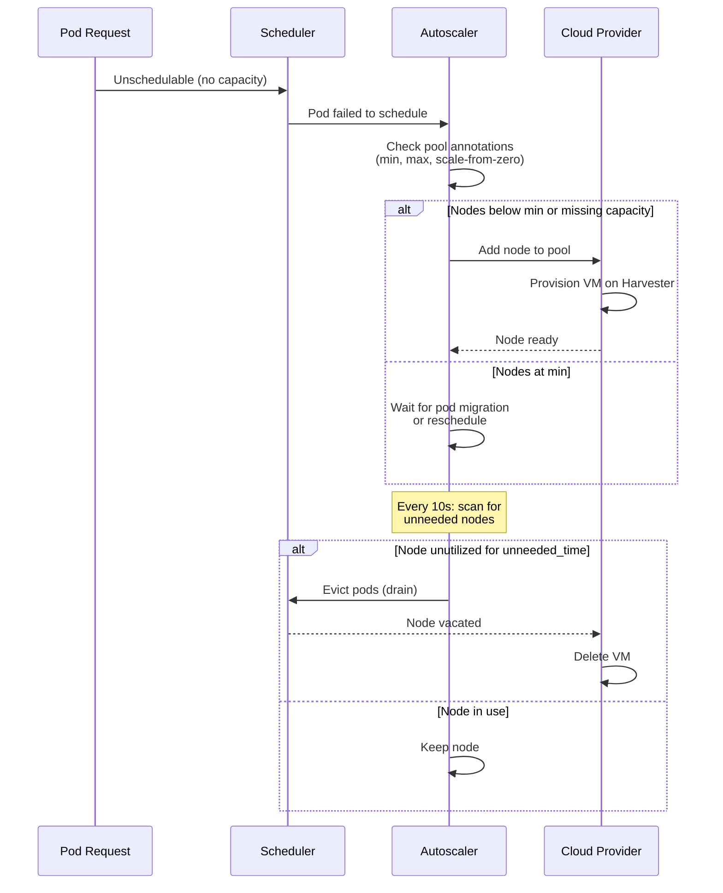
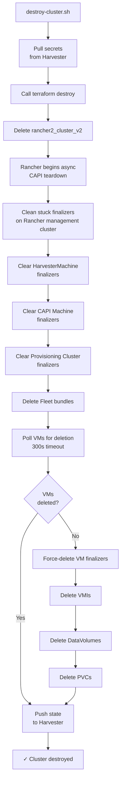

# RKE2 Cluster on Harvester — Day-2 Operations Guide

This guide covers routine operational tasks for the RKE2 cluster deployed on Harvester via Rancher. It includes scaling, upgrades, golden image updates, certificate rotation, registry management, backup/recovery, and common troubleshooting workflows.

## Table of Contents

1. [Scaling Operations](#1-scaling-operations)
2. [Kubernetes Version Upgrades](#2-kubernetes-version-upgrades)
3. [Golden Image Updates](#3-golden-image-updates)
4. [Certificate Rotation](#4-certificate-rotation)
5. [Registry Mirror Management](#5-registry-mirror-management)
6. [Backup and Recovery](#6-backup-and-recovery)
7. [Database Operator Management](#7-database-operator-management)
8. [Clean Destroy](#9-clean-destroy)
9. [Nuclear Cleanup](#10-nuclear-cleanup)
10. [terraform.sh Reference](#11-terraformsh-reference)
11. [prepare.sh Reference](#12-preparesh-reference)

---

## 1. Scaling Operations

The cluster has four node pools, three of which autoscale. This section covers manual scaling and autoscaler behavior.

### 1.1 Manual Scaling

To change node counts manually, edit `terraform.tfvars` and apply changes via `terraform.sh`.

#### Control Plane Pool (Fixed)

The control plane pool does not autoscale. To change the number of control plane nodes:

```bash
# Edit terraform.tfvars
vim terraform.tfvars

# Change controlplane_count (should be odd: 3, 5, 7, etc. for etcd quorum)
controlplane_count = 3

# Plan and apply
./terraform.sh apply
```

Rolling update strategy: max 1 unavailable, max 1 surge. A 3-node cluster rolls to 4, then to 3 (safe for etcd).

#### Autoscaled Pools (General, Compute, Database)

Three pools autoscale: **General**, **Compute**, and **Database**.

Each pool has:
- Min/max count (controls autoscaler bounds)
- Current quantity (ignored by Terraform — autoscaler owns this)

To change min/max:

```bash
# Edit terraform.tfvars
general_min_count  = 4
general_max_count  = 10

compute_min_count  = 0   # Scale from zero
compute_max_count  = 10

database_min_count = 4
database_max_count = 10

# Plan and apply
./terraform.sh apply
```

Terraform applies min/max annotations to machine pools. The autoscaler respects these bounds and scales live node count independently.

#### Node Pool Resource Specifications

Edit pool sizing in `terraform.tfvars`:

```bash
# General workers
general_cpu        = "4"      # vCPUs
general_memory     = "8"      # GiB
general_disk_size  = 60       # GiB

# Compute workers (for heavy workloads)
compute_cpu        = "8"
compute_memory     = "32"
compute_disk_size  = 80

# Database workers (for stateful services)
database_cpu       = "4"
database_memory    = "16"
database_disk_size = 80
```

Changes apply to **new nodes only**. Existing nodes keep their old spec until replaced by autoscaler.

### 1.2 Cluster Autoscaler

The Rancher Cluster Autoscaler monitors pod scheduling events and adds/removes nodes based on demand.

#### How It Works



#### Scale-Down Behavior

Nodes are removed if:
1. **Utilization is low**: CPU/memory requests below `autoscaler_scale_down_utilization_threshold` (default: 50%)
2. **Node has been unneeded for**: `autoscaler_scale_down_unneeded_time` (default: 30 minutes)
3. **Cooldown has elapsed**: No scale-down for `autoscaler_scale_down_delay_after_delete` (default: 30 minutes) after the last deletion

Edit in `terraform.tfvars`:

```bash
autoscaler_scale_down_unneeded_time         = "30m0s"  # How long before removal
autoscaler_scale_down_delay_after_add       = "15m0s"  # Grace period after add
autoscaler_scale_down_delay_after_delete    = "30m0s"  # Cooldown after delete
autoscaler_scale_down_utilization_threshold = "0.5"    # 50% threshold
```

After changes, apply via Terraform:

```bash
./terraform.sh apply
```

Annotations on machine pools are updated immediately; autoscaler picks up new values within 1 minute.

#### Scale-from-Zero (Compute Pool)

The **Compute pool** (with `compute_min_count = 0`) has special annotations for scale-from-zero support:

```bash
"cluster.provisioning.cattle.io/autoscaler-resource-cpu"     = "8"
"cluster.provisioning.cattle.io/autoscaler-resource-memory"  = "32Gi"
"cluster.provisioning.cattle.io/autoscaler-resource-storage" = "80Gi"
```

These annotations tell the autoscaler: "If a compute node existed, it would have 8 CPU, 32 GiB memory, 80 GiB storage." When a pod requests more compute capacity than general nodes have, the autoscaler scales the compute pool from zero.

### 1.3 Adding a New Node Pool

To add a fourth worker pool (e.g., "gpu" for GPU workloads):

#### Step 1: Add variables to `variables.tf`

```hcl
# GPU Worker Pool
variable "gpu_cpu" {
  description = "vCPUs per GPU worker node"
  type        = string
  default     = "8"
}

variable "gpu_memory" {
  description = "Memory (GiB) per GPU worker node"
  type        = string
  default     = "64"
}

variable "gpu_disk_size" {
  description = "Disk size (GiB) per GPU worker node"
  type        = number
  default     = 200
}

variable "gpu_min_count" {
  description = "Minimum number of GPU worker nodes (autoscaler)"
  type        = number
  default     = 0
}

variable "gpu_max_count" {
  description = "Maximum number of GPU worker nodes (autoscaler)"
  type        = number
  default     = 5
}
```

#### Step 2: Add machine config to `machine_config.tf`

```hcl
resource "rancher2_machine_config_v2" "gpu" {
  cluster_id = rancher2_cluster_v2.rke2.id
  name       = "${var.cluster_name}-gpu-config"
  driver     = "harvester"

  harvester_config = yamlencode({
    vmNamespace     = var.vm_namespace
    networkInfo     = local.network_info_worker
    imageName       = local.image_full_name
    cpuCount        = var.gpu_cpu
    memorySize      = var.gpu_memory * 1024 * 1024 * 1024  # Convert to bytes
    diskSize        = var.gpu_disk_size * 1024 * 1024 * 1024
    sshUser         = var.ssh_user
  })
}
```

#### Step 3: Add pool to `cluster.tf`

Insert into `rancher2_cluster_v2.rke2` resource:

```hcl
# Pool 5: GPU Workers
machine_pools {
  name                         = "gpu"
  cloud_credential_secret_name = rancher2_cloud_credential.harvester.id
  control_plane_role           = false
  etcd_role                    = false
  worker_role                  = true
  quantity                     = var.gpu_min_count
  drain_before_delete          = true

  machine_config {
    kind = rancher2_machine_config_v2.gpu.kind
    name = rancher2_machine_config_v2.gpu.name
  }

  rolling_update {
    max_unavailable = "0"
    max_surge       = "1"
  }

  labels = {
    "workload-type" = "gpu"
    "accelerator"   = "nvidia"
  }

  annotations = {
    "cluster.provisioning.cattle.io/autoscaler-min-size" = tostring(var.gpu_min_count)
    "cluster.provisioning.cattle.io/autoscaler-max-size" = tostring(var.gpu_max_count)
    "cluster.provisioning.cattle.io/autoscaler-resource-cpu"     = var.gpu_cpu
    "cluster.provisioning.cattle.io/autoscaler-resource-memory"  = "${var.gpu_memory}Gi"
    "cluster.provisioning.cattle.io/autoscaler-resource-storage" = "${var.gpu_disk_size}Gi"
  }
}
```

#### Step 4: Add values to `terraform.tfvars.example`

```bash
# GPU Worker Pool
gpu_cpu        = "8"
gpu_memory     = "64"
gpu_disk_size  = 200
gpu_min_count  = 0
gpu_max_count  = 5
```

#### Step 5: Apply

```bash
# Add values to terraform.tfvars
vim terraform.tfvars

# Plan and apply
./terraform.sh plan
./terraform.sh apply
```

New nodes will be provisioned on Harvester and joined to the cluster.

---

## 2. Kubernetes Version Upgrades

RKE2 rolling updates are controlled via the `kubernetes_version` variable. Rancher orchestrates controlled rolling updates of control plane and worker pools.

### Upgrade Steps

1. **Update `kubernetes_version` in `terraform.tfvars`**:

   ```bash
   # Current
   kubernetes_version = "v1.34.2+rke2r1"

   # Upgrade to
   kubernetes_version = "v1.35.1+rke2r1"
   ```

2. **Validate the new version is available**:

   Check the [RKE2 releases page](https://github.com/rancher/rke2/releases) for available versions.

3. **Plan and review**:

   ```bash
   ./terraform.sh plan
   ```

   Output shows the cluster's `kubernetes_version` will change. No other changes (Terraform ignores instance count drift from autoscaler).

4. **Apply**:

   ```bash
   ./terraform.sh apply
   ```

   Rancher begins rolling upgrade:
   - Control plane: 1 CP node at a time (respects max_unavailable=0, max_surge=1)
   - Workers: 1 worker at a time (drain before replacement)

5. **Monitor the upgrade**:

   ```bash
   # Watch node status
   kubectl get nodes -w

   # Check upgrade progress in Rancher UI
   # https://<rancher-url>/c/<cluster-id>/monitoring

   # Verify all nodes are running the new version
   kubectl get nodes -o wide
   ```

### Expected Timeline

- **3-node control plane**: ~10-15 minutes (1 node at a time)
- **4-10 worker nodes**: ~5-10 minutes per node
- **Total**: 30-45 minutes for typical cluster

### Rollback

If something goes wrong during upgrade, Rancher does not auto-rollback. To restore:

```bash
# Revert terraform.tfvars to the old version
kubernetes_version = "v1.34.2+rke2r1"

# Apply
./terraform.sh apply

# This re-triggers the rolling upgrade in reverse
# Takes the same time as the original upgrade
```

---

## 3. Golden Image Updates

New golden images are built and uploaded to Harvester separately. Once available, update the cluster to use the new image.

### Build a New Golden Image

Refer to the golden image builder in `/home/rocky/code/harvester-golden-image/` for building and uploading.

### Update the Cluster to Use a New Image

1. **Verify the image exists on Harvester**:

   ```bash
   # SSH to Harvester or use kubectl
   kubectl --kubeconfig=./kubeconfig-harvester.yaml get virtualmachineimages.harvesterhci.io \
     -n <vm_namespace>

   # Should see: rke2-rocky9-golden-20260301
   ```

2. **Update `terraform.tfvars`**:

   ```bash
   golden_image_name = "rke2-rocky9-golden-20260301"
   ```

3. **Validate**:

   ```bash
   ./terraform.sh validate
   ```

   Confirms the new image exists on Harvester.

4. **Plan and apply**:

   ```bash
   ./terraform.sh plan
   ./terraform.sh apply
   ```

   Only machine config (image reference) changes. Existing nodes **keep the old image** until they are removed/replaced.

### Rolling Replacement

To replace all nodes with the new image:

1. **Scale down autoscaled pools to minimum**:

   This makes the process faster and more predictable.

2. **Manually delete nodes** or **wait for autoscaler** to scale down naturally.

   New nodes automatically use the new image.

3. **For control plane**, the only way to replace is to change count:

   ```bash
   # Current: 3 nodes
   # Temporarily scale to 4
   controlplane_count = 4

   ./terraform.sh apply
   # Cluster rolls to 4 CP nodes (all with old image)

   # Then scale back to 3
   controlplane_count = 3

   ./terraform.sh apply
   # One old node is removed

   # Repeat until all old nodes are gone
   ```

   A faster approach: manually delete VM nodes in Harvester and let Rancher recreate them.

---

## 4. Certificate Rotation

The cluster uses a private CA for internal service TLS. The CA cert is distributed to all nodes and consumed by Traefik.

### CA Certificate Distribution

1. **Private CA PEM** is set in `terraform.tfvars`:

   ```bash
   private_ca_pem = "-----BEGIN CERTIFICATE-----\nMIIDXTCCAk..."
   ```

2. **On cluster creation**:
   - Machine config cloud-init writes CA to `/etc/pki/ca-trust/source/anchors/private-ca.pem`
   - `update-ca-trust` is run to add to system trust
   - Traefik reads CA via init container at deployment

### Updating the Private CA

If a new CA certificate is generated:

1. **Extract the new CA PEM**:

   ```bash
   cat private-ca.pem
   ```

2. **Update `terraform.tfvars`**:

   ```bash
   private_ca_pem = "-----BEGIN CERTIFICATE-----\n...-----END CERTIFICATE-----"
   ```

3. **Apply**:

   ```bash
   ./terraform.sh apply
   ```

   Machine configs update, but **existing nodes are not redeployed**. CA is only distributed on new nodes.

4. **Force node replacement** (to distribute new CA immediately):

   ```bash
   # Via kubectl: drain and delete nodes
   for node in $(kubectl get nodes -o name | grep general); do
     kubectl drain $node --ignore-daemonsets --delete-emptydir-data
     kubectl delete $node
   done
   # Autoscaler recreates them with new CA

   # Or: manually delete VMs in Harvester, let Rancher recreate
   ```

### Traefik CA Refresh

Traefik has an init container that combines system CA certs with any additional CAs:

```yaml
# From cluster.tf
initContainers:
  - name: combine-ca
    image: alpine:3.21
    command: ["sh", "-c", "cp /etc/ssl/certs/ca-certificates.crt /combined-ca/ca-certificates.crt 2>/dev/null || true"]
```

When Traefik restarts, the new CA is automatically merged. To force a refresh:

```bash
# Delete Traefik pod (it will restart via DaemonSet)
kubectl delete pod -n kube-system -l app.kubernetes.io/name=traefik
```

---

## 5. Registry Mirror Management

The cluster routes all container pulls through Harbor proxy-cache. Mirrors are configured in the RKE2 cluster's registries config via Terraform.

### Adding an Upstream Mirror

1. **Add to `terraform.tfvars`**:

   ```bash
   harbor_registry_mirrors = [
     "docker.io",
     "quay.io",
     "ghcr.io",
     "gcr.io",
     "registry.k8s.io",
     "docker.elastic.co",
     "registry.gitlab.com",
     "docker-registry3.mariadb.com",
     "my-custom-registry.example.com"  # New
   ]
   ```

2. **Validate**:

   ```bash
   ./terraform.sh validate
   ```

3. **Apply**:

   ```bash
   ./terraform.sh apply
   ```

   RKE2 registries config is updated (rewritts to new mirror). Restart containerd or kubelet for changes to take effect.

### Removing an Upstream Mirror

1. **Remove from `terraform.tfvars`**:

   ```bash
   harbor_registry_mirrors = [
     "docker.io",
     "quay.io",
     "ghcr.io",
     # "my-custom-registry.example.com"  # Removed
   ]
   ```

2. **Apply**:

   ```bash
   ./terraform.sh apply
   ```

3. **Clear any cached layers** in Harbor (manually via Harbor UI):

   Navigate to Harbor's **Administration > Registry Endpoints** and purge old mirror repositories.

### How Mirrors Work

On cluster creation, mirrors route to the **bootstrap registry**:

```
Image pull: docker.io/nginx:latest
     ↓
Registry rewrite: bootstrap-registry:5000/docker.io/nginx:latest
     ↓
If not cached on bootstrap registry → fetch from upstream → cache locally
```

After cluster deployment, the registry mirrors are configured to use **Harbor**:

```
Image pull: docker.io/nginx:latest
     ↓
Registry rewrite: harbor.example.com/docker.io/nginx:latest
     ↓
Harbor proxy-cache → upstream mirror
```

---

## 6. Backup and Recovery

### 6.1 etcd Snapshots

RKE2 etcd snapshots are automatic. Configuration in `cluster.tf`:

```hcl
etcd {
  snapshot_schedule_cron = "0 */6 * * *"  # Every 6 hours
  snapshot_retention     = 5              # Keep last 5 snapshots
}
```

Snapshots are stored on control plane nodes at `/var/lib/rancher/rke2/server/db/snapshots/`.

#### Manual Snapshot

To trigger a manual snapshot:

```bash
# SSH to a control plane node
ssh <cp-node>

# Trigger snapshot via RKE2 API
mkdir -p /var/lib/rancher/rke2/server/db/snapshots
/var/lib/rancher/rke2/bin/ctr --namespace k8s.io \
  task exec -e ETCDCTL_API=3 $(pgrep -f "etcd") \
  etcdctl --endpoints=127.0.0.1:2379 snapshot save /var/lib/rancher/rke2/server/db/snapshots/manual-$(date +%s).db
```

Or use Rancher UI: **Cluster > Etcd Snapshots** (if monitoring is configured).

#### Restore from Snapshot

If etcd is corrupted:

```bash
# On control plane, stop RKE2
sudo systemctl stop rke2-server

# Restore from snapshot
sudo /var/lib/rancher/rke2/bin/rke2 server \
  --cluster-reset \
  --cluster-reset-restore-path=/var/lib/rancher/rke2/server/db/snapshots/<snapshot-name>.db

# Start RKE2 again
sudo systemctl start rke2-server

# Wait for API to be ready
kubectl cluster-info

# Verify etcd is healthy
kubectl get etcd -A
```

### 6.2 Terraform State

State is stored in Kubernetes backend on the Harvester cluster (K8s secret: `tfstate-default-rke2-cluster` in `terraform-state` namespace).

#### Backup State

```bash
# Pull state from Harvester
./terraform.sh pull-secrets

# Verify local copy
ls -lh terraform.tfvars kubeconfig-harvester.yaml

# Backup to external storage
tar czf rke2-cluster-state-$(date +%Y%m%d-%H%M%S).tar.gz \
  terraform.tfvars \
  kubeconfig-harvester.yaml \
  kubeconfig-harvester-cloud-cred.yaml \
  harvester-cloud-provider-kubeconfig

# Store in safe location
cp rke2-cluster-state-*.tar.gz /mnt/backups/
```

#### Restore from Corrupted State

If the K8s backend secret is corrupted:

```bash
# Export state from backup
tar xzf rke2-cluster-state-20260301-120000.tar.gz

# Initialize backend (will fail to reach old state)
cd cluster
./terraform.sh init

# Push recovered state
./terraform.sh state push terraform.tfstate

# Verify
./terraform.sh state list
```

---

## 7. Database Operator Management

The cluster optionally deploys three database operators to the database worker pool. This section covers deployment, verification, and troubleshooting.

### 7.1 Enabling Database Operators

Database operators are configured in `terraform.tfvars`:

```bash
# Always required (gatekeeper for all operators)
deploy_operators = true

# Individual database operators
deploy_cnpg              = true     # CloudNativePG (PostgreSQL)
deploy_mariadb_operator  = false    # MariaDB Operator (disabled by default)
deploy_redis_operator    = true     # OpsTree Redis Operator

# Harbor credentials (required when deploy_operators = true)
harbor_admin_user      = "admin"
harbor_admin_password  = "your-harbor-password"
```

After modifying `terraform.tfvars`, apply the changes:

```bash
./terraform.sh apply
```

Operators are deployed in order: node-labeler → storage-autoscaler → CNPG → MariaDB → Redis.

### 7.2 Verifying Operator Deployment

After `terraform apply` completes, verify each operator:

```bash
# CloudNativePG
kubectl get deployment -n cnpg-system
kubectl get pods -n cnpg-system
kubectl get crd | grep cnpg

# MariaDB Operator
kubectl get deployment -n mariadb-operator
kubectl get pods -n mariadb-operator
kubectl get crd | grep mariadb

# Redis Operator
kubectl get deployment -n redis-operator
kubectl get pods -n redis-operator
kubectl get crd | grep redis
```

All pods should be in `Running` state and ready. CRDs should be registered.

### 7.3 Scheduling and Resource Constraints

Database operators automatically schedule on the database worker pool:

```bash
# Verify nodeSelector is set
kubectl get deployment cnpg-controller-manager -n cnpg-system -o yaml | grep -A 5 nodeSelector

# Expected output:
# nodeSelector:
#   workload-type: database
```

Operators include HPA (Horizontal Pod Autoscaler) and PDB (Pod Disruption Budget) for high availability on the database pool.

### 7.4 Adding a Database Instance

Once operators are deployed, create database instances using their CRDs:

**PostgreSQL via CloudNativePG:**
```yaml
apiVersion: postgresql.cnpg.io/v1
kind: Cluster
metadata:
  name: my-postgres
  namespace: default
spec:
  instances: 3
  primaryUpdateStrategy: unsupervised
  postgresql:
    parameters:
      max_connections: "200"
  bootstrap:
    initdb:
      database: myapp
      owner: app_user
```

**MariaDB via MariaDB Operator:**
```yaml
apiVersion: mariadb.mmontes.io/v1alpha1
kind: MariaDB
metadata:
  name: my-mariadb
spec:
  replicas: 1
  image:
    repository: mariadb
    tag: "11.4"
  storage:
    size: 10Gi
```

**Redis via OpsTree Operator:**
```yaml
apiVersion: redis.opstreelabs.in/v1beta2
kind: Redis
metadata:
  name: my-redis
spec:
  kubernetesConfig:
    replicas: 1
  storage:
    size: 5Gi
```

### 7.5 Operator Updates and Maintenance

To update a database operator version:

1. Check the current version in `operators.tf`:
   ```bash
   grep -A 5 "db_operators = {" operators.tf
   ```

2. Download new upstream manifests (if available) to `operators/upstream/`

3. Update the version in `operators.tf`:
   ```hcl
   db_operators = {
     cnpg = {
       version = "1.29.0"  # Updated from 1.28.1
       ...
     }
   }
   ```

4. Apply changes:
   ```bash
   ./terraform.sh apply
   ```

Terraform will redeploy the operator with the new version. Existing database instances are unaffected.

### 7.6 Removing Database Operators

To disable a database operator:

1. Delete all instances created with that operator:
   ```bash
   # For CNPG clusters
   kubectl delete cluster --all -n <namespace>

   # For MariaDB instances
   kubectl delete mariadb --all -n <namespace>

   # For Redis instances
   kubectl delete redis --all -n <namespace>
   ```

2. Set the operator flag to `false` in `terraform.tfvars`:
   ```bash
   deploy_cnpg              = false
   deploy_mariadb_operator  = false
   deploy_redis_operator    = false
   ```

3. Apply changes:
   ```bash
   ./terraform.sh apply
   ```

The operator namespace, CRDs, and RBAC will remain after the deployment is removed. To fully remove them, manually delete the namespace:
```bash
kubectl delete namespace cnpg-system
kubectl delete namespace mariadb-operator
kubectl delete namespace redis-operator
```

### 7.7 Troubleshooting Database Operators

**Operator pod stuck in ImagePullBackOff:**
```bash
kubectl describe pod -n <operator-namespace> <pod-name>
# Check Events section for registry/image pull errors
# Verify Harbor is running and reachable via private CA cert
```

**Operator not scheduling on database nodes:**
```bash
# Check if database nodes exist and are Ready
kubectl get nodes -l workload-type=database

# Check pod events
kubectl describe pod -n <operator-namespace> <pod-name>

# Verify node selector matches
kubectl get nodes --show-labels | grep workload-type
```

**CRD not registered:**
```bash
# Check if CRD exists
kubectl get crd | grep operator-name

# Check operator logs for CRD registration errors
kubectl logs -n <operator-namespace> <pod-name>
```

---

## 8. Monitoring Readiness

RKE2 exposes Prometheus metrics by default, but no monitoring stack is deployed by Terraform. Add monitoring post-deployment.

### What's Exposed by Default

- **etcd metrics** (port 2379): enable via `"etcd-expose-metrics" = true` in cluster.tf
- **Scheduler metrics** (port 10251): bind to 0.0.0.0 via `"kube-scheduler-arg" = ["bind-address=0.0.0.0"]`
- **Controller manager metrics** (port 10252): bind to 0.0.0.0 via `"kube-controller-manager-arg" = ["bind-address=0.0.0.0"]`
- **Kubelet metrics** (port 10250): on each node
- **Cilium metrics** (port 9090): Cilium operator + agent
- **Traefik metrics** (port 8080/metrics): if enabled in chart values

### Add Prometheus + Grafana

After cluster creation, deploy a monitoring stack:

```bash
# Via standalone Helm:
helm repo add prometheus-community https://prometheus-community.github.io/helm-charts
helm repo update

helm install prometheus prometheus-community/kube-prometheus-stack \
  -n monitoring --create-namespace \
  --set prometheus.prometheusSpec.retention=30d \
  --set grafana.adminPassword=$(openssl rand -base64 32)

# Verify
kubectl get pod -n monitoring
kubectl port-forward -n monitoring svc/prometheus-kube-prometheus-prometheus 9090:9090
```

---

## 9. Clean Destroy

Use `destroy-cluster.sh` to safely destroy the cluster and all resources:

```bash
./destroy-cluster.sh              # Interactive (prompts for confirmation)
./destroy-cluster.sh -auto-approve  # Non-interactive
```

This is a convenience wrapper around `terraform.sh destroy`. The cleanup process:

1. **Delete cluster from Rancher API** — Stops Rancher provisioning
2. **Wait for VMs to be deleted by CAPI** — Asynchronous deletion
3. **Clear stuck finalizers** on HarvesterMachines, CAPI Machines, and cluster (if needed)
4. **Clean up orphaned Fleet bundles** for the destroyed cluster
5. **Remove orphaned secrets and RBAC** in `fleet-default` namespace on Rancher
6. **Wait for VM deletion** with 300-second timeout
7. **Force-delete orphaned resources** if VMs are still present:
   - VM finalizers (on stuck VMs)
   - VMIs (Virtual Machine Instances)
   - DataVolumes
   - PVCs (Persistent Volume Claims)
8. **Push recovered state** back to Kubernetes backend

**Cloud Credential Preservation**: The cloud credentials in:
- `kubeconfig-harvester-cloud-cred.yaml`
- `harvester-cloud-provider-kubeconfig`

are **NOT deleted**, so you can recreate the cluster without re-running `prepare.sh`.

**Flowchart**:



### Troubleshooting Destroy

If `destroy-cluster.sh` hangs:

```bash
# Option 1: Force-unlock if state is locked
./terraform.sh destroy -lock=false

# Option 2: Check for stuck finalizers on Rancher management cluster
kubectl config use-context rancher  # Switch to Rancher
kubectl get harvestermachines.rke-machine.cattle.io -n fleet-default
kubectl get machines.cluster.x-k8s.io -n fleet-default

# Patch out finalizers
kubectl patch harvestermachines.rke-machine.cattle.io/<name> \
  -n fleet-default \
  -p '{"metadata":{"finalizers":null}}' --type merge

# Option 3: Kill stuck VMs directly on Harvester
kubectl --kubeconfig=./kubeconfig-harvester.yaml delete vm -n <vm_namespace> --all

# Then re-run destroy
./terraform.sh destroy -auto-approve
```

---

## 10. Nuclear Cleanup

For complete cluster removal when `destroy-cluster.sh` fails or leaves orphaned resources, use `nuke-cluster.sh`:

```bash
./nuke-cluster.sh              # Interactive (prompts for confirmation)
./nuke-cluster.sh -y           # Skip confirmation
./nuke-cluster.sh --yes        # Skip confirmation (long form)
```

**WARNING**: This is a destructive, irreversible operation. All cluster resources will be permanently deleted.

### What nuke-cluster.sh Does

The script performs an 8-step nuclear cleanup:

1. **Delete cluster from Rancher API**
   - Uses Rancher Steve API to delete the RKE2 cluster resource
   - Sends DELETE request to `/v1/provisioning.cattle.io.clusters/fleet-default/<cluster-name>`

2. **Delete orphaned CAPI machines in fleet-default**
   - Finds all CAPI Machine objects with `deletionTimestamp != null`
   - Patches finalizers to unblock deletion

3. **Force-delete all VMs and VMIs in the VM namespace**
   - Gets all Virtual Machine objects in `<vm_namespace>`
   - Patches out all finalizers and labels to force immediate deletion
   - Waits up to 60 seconds per VM
   - Deletes remaining VMIs (Virtual Machine Instances)

4. **Clean up Rancher resources**
   - Removes stuck HarvesterMachine finalizers (root cause of stuck VMs)
   - Deletes orphaned Fleet bundles for the cluster

5. **Clean up orphaned secrets and RBAC in fleet-default**
   - Uses Rancher API with Steve API to clean:
     - Secrets for cluster configuration
     - ServiceAccounts
     - RoleBindings for cluster access

6. **Clean up orphaned Harvester namespace resources**
   - Deletes remaining PVCs
   - Deletes DataVolumes (Harvester CDI volumes)
   - Patches stuck namespace finalizers
   - Removes the namespace itself (if empty)

7. **Wipe Terraform state**
   - Removes local `terraform.tfstate`
   - Deletes state lease from Kubernetes backend
   - Clears all secrets from `terraform-state` namespace

8. **Final verification**
   - Confirms all VMs are deleted
   - Confirms state is wiped
   - Displays summary of cleanup actions

### Prerequisites

- `kubectl`, `terraform`, `jq`, `curl` installed
- `kubeconfig-harvester.yaml` exists (or 'harvester' context in `~/.kube/config`)
- `terraform.tfvars` contains: `rancher_url`, `rancher_token`, `cluster_name`, `vm_namespace`

### Usage Examples

Interactive with full confirmation prompts:

```bash
./nuke-cluster.sh
# Output: You are about to permanently delete the cluster and all its resources.
# Continue? (yes/no):
```

Skip confirmation (useful in CI/CD):

```bash
./nuke-cluster.sh -y
```

After nuclear cleanup, verify nothing remains:

```bash
# On Harvester
kubectl --kubeconfig=./kubeconfig-harvester.yaml get vm -n <vm_namespace>
# Should return: No resources found

# On Rancher management cluster
kubectl config use-context rancher
kubectl get harvestermachines.rke-machine.cattle.io -n fleet-default
# Should return: No resources found

# Verify state is gone
./terraform.sh state list
# Should return: (empty)
```

---

---

## 11. terraform.sh Reference

Wrapper script that manages Terraform state in a Kubernetes backend (stored on Harvester).

### Commands

#### `terraform.sh init`

Initialize the Kubernetes backend:

```bash
./terraform.sh init
```

**Steps**:
1. Checks prerequisites (kubectl, terraform, jq)
2. Validates Harvester kubeconfig connectivity
3. Creates `terraform-state` namespace if missing
4. Verifies RBAC (can create secrets and leases)
5. Pushes local files to K8s secrets:
   - `terraform.tfvars` → `terraform-tfvars` secret
   - `kubeconfig-harvester.yaml` → `kubeconfig-harvester` secret
   - `kubeconfig-harvester-cloud-cred.yaml` → `kubeconfig-harvester-cloud-cred` secret
   - `harvester-cloud-provider-kubeconfig` → `harvester-cloud-provider-kubeconfig` secret
   - `vault-init.json` (if present) → `vault-init` secret
6. Runs `terraform init -migrate-state` (migrates state from local to K8s)

**Use when**:
- First time setting up cluster Terraform
- Fresh clone (no state or secrets present)

#### `terraform.sh apply`

Plan, review, and apply changes:

```bash
./terraform.sh apply
```

**Steps**:
1. Pulls secrets from Harvester to local files
2. Auto-initializes backend if `.terraform` is missing or stale
3. Clears any stale state locks
4. Generates a dated plan file: `tfplan_YYYYMMDD_HHMMSS`
5. Runs `terraform plan -out=tfplan_...`
6. Runs `terraform apply tfplan_...`
7. Handles state lock timeout (cluster creation can exceed lock timeout)
8. Pushes secrets back to Harvester

**Use when**:
- Changing infrastructure (scale, upgrade, etc.)
- Creating cluster for first time

#### `terraform.sh destroy [options]`

Destroy cluster and orphaned resources:

```bash
./terraform.sh destroy -auto-approve
```

**Options**:
- `-auto-approve`: Skip destroy confirmation
- `-lock=false`: Force destroy if state is locked

**Steps**:
1. Pulls secrets from Harvester
2. Captures VM namespace and cluster name (needed for cleanup)
3. Runs `terraform destroy`
4. **If destroy fails with "Failed to save state"**: Recovers kubeconfig and state
5. Cleans up orphaned Harvester resources (see [Clean Destroy](#9-clean-destroy))
6. Pushes recovered state to Harvester

**Use when**:
- Tearing down the entire cluster
- Starting fresh

#### `terraform.sh validate`

Validate configuration and check prerequisites:

```bash
./terraform.sh validate
```

**Steps**:
1. Pulls secrets from Harvester
2. Initializes backend if missing
3. Runs `terraform validate`
4. Verifies golden image exists on Harvester (queries for `golden_image_name` in `vm_namespace`)

**Use when**:
- Pre-flight check before `apply`
- Verifying golden image availability

#### `terraform.sh push-secrets`

Push local files to K8s secrets (already done by `apply` and `destroy`):

```bash
./terraform.sh push-secrets
```

**Pushes**:
- `terraform.tfvars`
- `kubeconfig-harvester.yaml`
- `kubeconfig-harvester-cloud-cred.yaml`
- `harvester-cloud-provider-kubeconfig`
- `vault-init.json` (if present)

#### `terraform.sh pull-secrets`

Pull K8s secrets to local files (already done by `apply`):

```bash
./terraform.sh pull-secrets
```

**Pulls**:
- All secrets from `terraform-state` namespace to local files
- Sets permissions: 600 (secure)

#### `terraform.sh <any-terraform-command>`

Run any Terraform command with automatic secret management:

```bash
# Examples
./terraform.sh plan
./terraform.sh state list
./terraform.sh state show rancher2_cluster_v2.rke2
./terraform.sh output
```

**Flow**: Pulls secrets → runs terraform → (no push, use `apply` or `push-secrets` to save)

#### State Lock Recovery

If Terraform locks up (e.g., during long cluster creation):

```bash
# Check what's holding the lock
./terraform.sh plan
# Output: Error acquiring the state lock

# Force unlock (safe if the locking process is dead)
terraform force-unlock -force <LOCK_ID>

# Retry
./terraform.sh apply
```

### Files and Secrets

**Local files** (gitignored):

```
terraform.tfvars                          # Variables
kubeconfig-harvester.yaml                 # Harvester admin kubeconfig
kubeconfig-harvester-cloud-cred.yaml      # Cloud credential kubeconfig
harvester-cloud-provider-kubeconfig       # Cloud provider kubeconfig
.kubeconfig-rke2-operators                # Operator deployment kubeconfig (auto-generated)
.rendered/                                # Rendered operator manifests
tfplan_*                                  # Dated plan files
terraform.tfstate                         # Local state backup (pulled from K8s)
```

**K8s secrets** (in `terraform-state` namespace on Harvester):

```
terraform-tfvars                          # terraform.tfvars secret
kubeconfig-harvester                      # Harvester kubeconfig
kubeconfig-harvester-cloud-cred           # Cloud credential kubeconfig
harvester-cloud-provider-kubeconfig       # Cloud provider kubeconfig
tfstate-default-rke2-cluster              # Terraform state (leased by backend)
```

---

## 12. prepare.sh Reference

Standalone script for initial credential and kubeconfig setup. Does **not** require prior cluster or state.

### Usage

```bash
cd cluster
./prepare.sh [OPTIONS]
```

### Options

- `-h, --help`: Show help and exit

### What It Does

Generates all files needed to run `terraform init`:

1. **Authenticates to Rancher**: Local auth → API token creation
2. **Discovers Harvester cluster**: Lists registered clusters, prompts user to select
3. **Generates kubeconfigs**: Via Rancher API
4. **Creates terraform-state namespace**: On Harvester
5. **Generates terraform.tfvars**: Pre-fills discovered values

### Prerequisites

- `curl`, `kubectl`, `jq`, `python3` installed
- Network access to Rancher
- Rancher admin credentials (or equivalent)
- A Harvester cluster registered in Rancher

### Interactive Prompts

| Prompt | Example | Required |
|--------|---------|----------|
| Rancher URL | `https://rancher.example.com` | Yes |
| Rancher username | `admin` | Yes (default) |
| Rancher password | (hidden input) | Yes |
| Cluster name | `rke2-prod` | Yes (default) |
| VM namespace on Harvester | `rke2-prod` | Yes (default) |

### Generated Files

After completion, the following files exist in `cluster/`:

| File | Purpose | Manual Edits Required |
|------|---------|----------------------|
| `kubeconfig-harvester.yaml` | Harvester admin access | No |
| `kubeconfig-harvester-cloud-cred.yaml` | Rancher cloud credential | No |
| `harvester-cloud-provider-kubeconfig` | RKE2 cloud provider | No |
| `terraform-state` namespace | K8s backend for state | No |
| `terraform.tfvars` | All cluster variables | **Yes** |

### Required Manual Edits

After `prepare.sh`, edit `terraform.tfvars` to fill in:

```bash
# Golden image — must exist on Harvester
golden_image_name = "rke2-rocky9-golden-20260301"

# Harvester network — your VM network name and namespace
harvester_network_name      = "vm-network"
harvester_network_namespace = "rke2-prod"

# Bootstrap registry — pre-existing registry for initial pulls
bootstrap_registry = "10.0.0.100"

# Harbor proxy-cache FQDN
harbor_fqdn = "harbor.example.com"

# Private CA certificate (PEM-encoded)
private_ca_pem = "-----BEGIN CERTIFICATE-----\nMIIDXTCCAk...\n-----END CERTIFICATE-----"

# SSH public keys
ssh_authorized_keys = [
  "ssh-rsa AAAAB3Nza...",
  "ssh-ed25519 AAAAC3Nza..."
]

# Traefik load balancer IP and Cilium IP pool
traefik_lb_ip        = "192.168.48.2"
cilium_lb_pool_start = "192.168.48.2"
cilium_lb_pool_stop  = "192.168.48.20"

# Node pool sizing (optional — defaults provided)
controlplane_count = 3
general_min_count  = 4
general_max_count  = 10
compute_min_count  = 0
compute_max_count  = 10
database_min_count = 4
database_max_count = 10
```

### When to Re-run

Re-run `prepare.sh` to:
- Regenerate kubeconfigs (if tokens expire)
- Update terraform.tfvars for a new cluster name
- Reset to defaults

**Note**: Overwriting existing files prompts for confirmation.

### Troubleshooting

| Issue | Solution |
|-------|----------|
| "No Harvester cluster found" | Register a Harvester cluster in Rancher first |
| "Could not reach Harvester API" | Check network connectivity; Rancher may have DNS issues |
| "Failed to generate kubeconfig" | Verify Rancher token has permission to access Harvester |
| "terraform.tfvars.example not found" | Run from `cluster/` directory |

---

## Summary

This operations guide covers day-2 cluster management:

- **Scaling**: Manual adjustment via Terraform, autoscaler behavior, scale-from-zero
- **Upgrades**: Kubernetes version, golden image, CA certificates
- **Registries**: Adding/removing mirrors, Harbor proxy-cache configuration
- **Backup/Recovery**: etcd snapshots, Terraform state backups, state restoration
- **Database Operators**: CloudNativePG, MariaDB, Redis deployment and management
- **Clean Destroy**: Safe teardown with cloud credential preservation via `destroy-cluster.sh`
- **Nuclear Cleanup**: Complete resource removal and state wipe via `nuke-cluster.sh` (for stuck/orphaned resources)
- **Tool Reference**: `terraform.sh` and `prepare.sh` commands and workflows

For additional cluster management tasks, refer to the [Architecture Guide](./architecture.md) and [Troubleshooting Guide](./troubleshooting.md).
