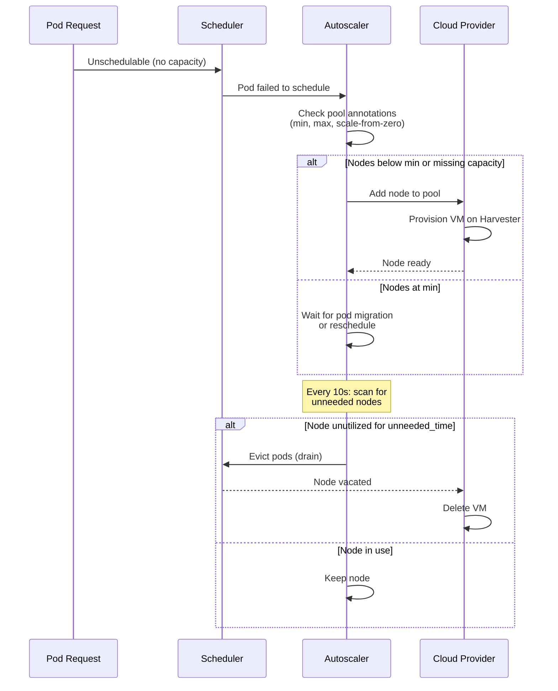
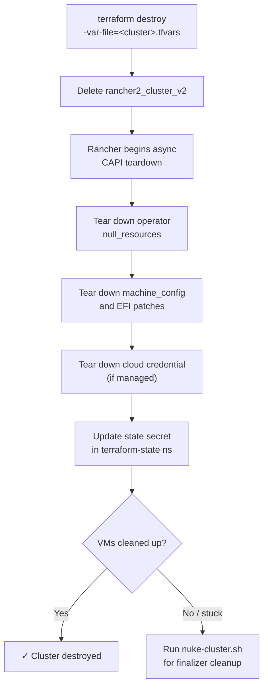

# RKE2 Cluster on Harvester — Day-2 Operations Guide

This guide covers routine operational tasks for the RKE2 cluster deployed on Harvester via Rancher. It includes scaling, upgrades, golden image updates, certificate rotation, registry management, backup/recovery, and common troubleshooting workflows.

## Deployment Method

The cluster is provisioned and managed via Terraform. Each cluster has its own tfvars file (e.g. `deploy-terraform/rke2-test.tfvars`, `deploy-terraform/rke2-prod.tfvars`) and its own Terraform state, segregated by `secret_suffix` in the `terraform-state` namespace on Harvester's Kubernetes backend.

All day-2 operations follow the same pattern: edit the tfvars, plan, apply.

```bash
cd deploy-terraform
TF_CLI_CONFIG_FILE=/tmp/tf-cli-config.tfrc \
  terraform init -reconfigure -backend-config="secret_suffix=<cluster>"
terraform plan -var-file=<cluster>.tfvars -out=/tmp/tfplan
terraform apply /tmp/tfplan
```

Terraform is declarative: there is no separate "update" mode — re-running apply after a tfvars edit reconciles the cluster.

## Table of Contents

1. [Scaling Operations](#1-scaling-operations)
2. [Kubernetes Version Upgrades](#2-kubernetes-version-upgrades)
3. [Golden Image Updates](#3-golden-image-updates)
4. [Certificate Rotation](#4-certificate-rotation)
5. [Registry Mirror Management](#5-registry-mirror-management)
6. [Backup and Recovery](#6-backup-and-recovery)
7. [Database Operator Management](#7-database-operator-management)
8. [Monitoring Readiness](#8-monitoring-readiness)
9. [Clean Destroy](#9-clean-destroy)
10. [Nuclear Cleanup](#10-nuclear-cleanup)
11. [Terraform Workflow Reference](#11-terraform-workflow-reference)
12. [prepare.sh Reference](#12-preparesh-reference)
13. [VM Anti-Affinity / Host Spreading](#13-vm-anti-affinity--host-spreading)
14. [Harvester VM Auto Balance Addon](#14-harvester-vm-auto-balance-addon)
15. [Live Migration Policy per Node Pool](#15-live-migration-policy-per-node-pool)
16. [Pool Rotation](#16-pool-rotation)
17. [Control Plane Rotation](#17-control-plane-rotation)

---

## 1. Scaling Operations

The cluster has four node pools, three of which autoscale. This section covers manual scaling and autoscaler behavior.

### 1.1 Manual Scaling

Edit the cluster's tfvars file and apply changes:

```bash
# Edit deploy-terraform/<cluster>.tfvars
vim deploy-terraform/rke2-prod.tfvars

# Change desired pool counts
controlplane_count = 5     # 3, 5, 7, etc. (must be odd for etcd quorum)
general_min_count  = 6
general_max_count  = 12
compute_min_count  = 0     # Scale from zero
compute_max_count  = 15
database_min_count = 6
database_max_count = 15

# Plan and apply
cd deploy-terraform
terraform plan -var-file=rke2-prod.tfvars -out=/tmp/tfplan
terraform apply /tmp/tfplan
```

#### Control Plane Pool (Fixed)

The control plane pool does not autoscale. Changing `controlplane_count` uses rolling updates: max 1 unavailable, max 1 surge. A 3-node cluster safely rolls to 4, then to 3 (maintains etcd quorum).

#### Autoscaled Pools (General, Compute, Database)

Three pools autoscale independently. Each pool has:
- Min/max count (controls autoscaler bounds)
- Current quantity (ignored by Terraform — autoscaler owns actual node count)

The cluster autoscaler respects min/max bounds and scales live node count based on pod scheduling demand.

#### Node Pool Resource Specifications

Edit pool sizing in `deploy-terraform/<cluster>.tfvars`:

```hcl
general_cpu        = "4"      # vCPUs
general_memory     = "8"      # GiB
general_disk_size  = 60       # GiB

compute_cpu        = "8"
compute_memory     = "32"
compute_disk_size  = 80

database_cpu       = "4"
database_memory    = "16"
database_disk_size = 80
```

Changes apply to **new nodes only**. Existing nodes keep their old spec until replaced by autoscaler.

### 1.2 Cluster Autoscaler

The Rancher Cluster Autoscaler monitors pod scheduling events and adds/removes nodes based on demand.

#### How It Works



#### Scale-Down Behavior

Nodes are removed if:
1. **Utilization is low**: CPU/memory requests below `autoscaler_scale_down_utilization_threshold` (default: 50%)
2. **Node has been unneeded for**: `autoscaler_scale_down_unneeded_time` (default: 30 minutes)
3. **Cooldown has elapsed**: No scale-down for `autoscaler_scale_down_delay_after_delete` (default: 30 minutes) after the last deletion

Edit autoscaler tunables in `deploy-terraform/<cluster>.tfvars`:

```hcl
autoscaler_scale_down_unneeded_time         = "30m0s"  # How long before removal
autoscaler_scale_down_delay_after_add       = "15m0s"  # Grace period after add
autoscaler_scale_down_delay_after_delete    = "30m0s"  # Cooldown after delete
autoscaler_scale_down_utilization_threshold = "0.5"    # 50% threshold
```

After changes, apply:

```bash
cd deploy-terraform
terraform apply -var-file=<cluster>.tfvars
```

Annotations on machine pools are updated immediately; autoscaler picks up new values within 1 minute.

#### Scale-from-Zero (Compute Pool)

The **Compute pool** (with `compute_min_count = 0`) has special annotations for scale-from-zero support:

```bash
"cluster.provisioning.cattle.io/autoscaler-resource-cpu"     = "8"
"cluster.provisioning.cattle.io/autoscaler-resource-memory"  = "32Gi"
"cluster.provisioning.cattle.io/autoscaler-resource-storage" = "80Gi"
```

These annotations tell the autoscaler: "If a compute node existed, it would have 8 CPU, 32 GiB memory, 80 GiB storage." When a pod requests more compute capacity than general nodes have, the autoscaler scales the compute pool from zero.

### 1.3 Adding a New Node Pool

To add a fifth worker pool (e.g., "gpu" for GPU workloads):

#### Step 1 — Add variables to `deploy-terraform/variables.tf`

```hcl
# GPU Worker Pool
variable "gpu_cpu" {
  description = "vCPUs per GPU worker node"
  type        = string
  default     = "8"
}

variable "gpu_memory" {
  description = "Memory (GiB) per GPU worker node"
  type        = string
  default     = "64"
}

variable "gpu_disk_size" {
  description = "Disk size (GiB) per GPU worker node"
  type        = number
  default     = 200
}

variable "gpu_min_count" {
  description = "Minimum number of GPU worker nodes (autoscaler)"
  type        = number
  default     = 0
}

variable "gpu_max_count" {
  description = "Maximum number of GPU worker nodes (autoscaler)"
  type        = number
  default     = 5
}
```

#### Step 2 — Add machine config to `deploy-terraform/machine_config.tf`

```hcl
resource "rancher2_machine_config_v2" "gpu" {
  cluster_id = rancher2_cluster_v2.rke2.id
  name       = "${var.cluster_name}-gpu-config"
  driver     = "harvester"

  harvester_config = yamlencode({
    vmNamespace     = var.vm_namespace
    networkInfo     = local.network_info_worker
    imageName       = local.image_full_name
    cpuCount        = var.gpu_cpu
    memorySize      = var.gpu_memory * 1024 * 1024 * 1024  # Convert to bytes
    diskSize        = var.gpu_disk_size * 1024 * 1024 * 1024
    sshUser         = var.ssh_user
  })
}
```

#### Step 3 — Add pool to `deploy-terraform/cluster.tf`

Insert into `rancher2_cluster_v2.rke2` resource:

```hcl
# Pool 5: GPU Workers
machine_pools {
  name                         = "gpu"
  cloud_credential_secret_name = rancher2_cloud_credential.harvester.id
  control_plane_role           = false
  etcd_role                    = false
  worker_role                  = true
  quantity                     = var.gpu_min_count
  drain_before_delete          = true

  machine_config {
    kind = rancher2_machine_config_v2.gpu.kind
    name = rancher2_machine_config_v2.gpu.name
  }

  rolling_update {
    max_unavailable = "0"
    max_surge       = "1"
  }

  labels = {
    "workload-type" = "gpu"
    "accelerator"   = "nvidia"
  }

  annotations = {
    "cluster.provisioning.cattle.io/autoscaler-min-size" = tostring(var.gpu_min_count)
    "cluster.provisioning.cattle.io/autoscaler-max-size" = tostring(var.gpu_max_count)
    "cluster.provisioning.cattle.io/autoscaler-resource-cpu"     = var.gpu_cpu
    "cluster.provisioning.cattle.io/autoscaler-resource-memory"  = "${var.gpu_memory}Gi"
    "cluster.provisioning.cattle.io/autoscaler-resource-storage" = "${var.gpu_disk_size}Gi"
  }
}
```

#### Step 4 — Add values to `deploy-terraform/terraform.tfvars.example`

```hcl
# GPU Worker Pool
gpu_cpu        = "8"
gpu_memory     = "64"
gpu_disk_size  = 200
gpu_min_count  = 0
gpu_max_count  = 5
```

#### Step 5 — Apply

```bash
# Add values to your cluster's tfvars
vim deploy-terraform/<cluster>.tfvars

# Plan and apply
cd deploy-terraform
terraform plan -var-file=<cluster>.tfvars -out=/tmp/tfplan
terraform apply /tmp/tfplan
```

New nodes will be provisioned on Harvester and joined to the cluster.

---

## 2. Kubernetes Version Upgrades

RKE2 rolling updates are controlled via the `kubernetes_version` variable. Rancher orchestrates controlled rolling updates of control plane and worker pools.

### Upgrade Steps

1. **Validate the new version is available**:

   Check the [RKE2 releases page](https://github.com/rancher/rke2/releases) for available versions.

2. **Update `kubernetes_version` in your cluster's tfvars**:

```hcl
# Edit deploy-terraform/<cluster>.tfvars
# Current:
kubernetes_version = "v1.34.2+rke2r1"
# Upgrade to:
kubernetes_version = "v1.35.1+rke2r1"
```

3. **Plan and apply**:

```bash
cd deploy-terraform
terraform plan -var-file=<cluster>.tfvars -out=/tmp/tfplan
# Output shows the cluster's `kubernetes_version` will change.
# No other changes (Terraform ignores instance count drift from autoscaler).

terraform apply /tmp/tfplan
```

### Monitor the Upgrade

```bash
# Watch node status
kubectl get nodes -w

# Check upgrade progress in Rancher UI
# https://<rancher-url>/c/<cluster-id>/monitoring

# Verify all nodes are running the new version
kubectl get nodes -o wide
```

### Expected Timeline

- **3-node control plane**: ~10-15 minutes (1 node at a time)
- **4-10 worker nodes**: ~5-10 minutes per node
- **Total**: 30-45 minutes for typical cluster

### Rollback

If something goes wrong during upgrade, Rancher does not auto-rollback. To restore:

```bash
# Revert kubernetes_version in deploy-terraform/<cluster>.tfvars
kubernetes_version = "v1.34.2+rke2r1"

cd deploy-terraform
terraform apply -var-file=<cluster>.tfvars
```

This re-triggers the rolling upgrade in reverse. Takes the same time as the original upgrade.

---

## 3. Golden Image Updates

New golden images are built and uploaded to Harvester separately. Once available, update the cluster to use the new image.

### Build a New Golden Image

Refer to the golden image builder in `/home/rocky/code/harvester-golden-image/` for building and uploading.

### Update the Cluster to Use a New Image

1. **Verify the image exists on Harvester**:

   ```bash
   # SSH to Harvester or use kubectl
   kubectl --kubeconfig=./kubeconfig-harvester.yaml get virtualmachineimages.harvesterhci.io \
     -n <vm_namespace>

   # Should see: rke2-rocky9-golden-20260301
   ```

2. **Update your tfvars** (`deploy-terraform/<cluster>.tfvars`):

   ```hcl
   golden_image_name = "rke2-rocky9-golden-20260301"
   ```

3. **Validate**:

   ```bash
   cd deploy-terraform
   terraform validate
   ```

4. **Plan and apply**:

   ```bash
   cd deploy-terraform
   terraform plan -var-file=<cluster>.tfvars -out=/tmp/tfplan
   terraform apply /tmp/tfplan
   ```

   Only machine config (image reference) changes. Existing nodes **keep the old image** until they are removed/replaced.

### Rolling Replacement

To replace all nodes with the new image:

1. **Scale down autoscaled pools to minimum**:

   This makes the process faster and more predictable.

2. **Manually delete nodes** or **wait for autoscaler** to scale down naturally.

   New nodes automatically use the new image.

3. **For control plane**, use one of:

   - Bump `rotation_marker` in the tfvars file and `terraform apply` to trigger a CAPI rolling replacement (one CP at a time, etcd-quorum-safe — see [Section 17](#17-control-plane-rotation)).
   - `terraform taint rancher2_machine_config_v2.controlplane` followed by `terraform apply` to force a fresh CP machine config.

   A faster (riskier) approach: manually delete a CP VM in Harvester and let Rancher recreate it from the updated machine config. Always wait for the replacement to be `Ready=True` before deleting the next CP, or you'll lose etcd quorum.

---

## 4. Certificate Rotation

The cluster uses a private CA for internal service TLS. The CA cert is distributed to all nodes and consumed by Traefik.

### CA Certificate Distribution

1. **Private CA PEM** is set in `<cluster>.tfvars`:

   ```bash
   private_ca_pem = "-----BEGIN CERTIFICATE-----\nMIIDXTCCAk..."
   ```

2. **On cluster creation**:
   - Machine config cloud-init writes CA to `/etc/pki/ca-trust/source/anchors/private-ca.pem`
   - `update-ca-trust` is run to add to system trust
   - Traefik reads CA via init container at deployment

### Updating the Private CA

If a new CA certificate is generated:

1. **Extract the new CA PEM**:

   ```bash
   cat private-ca.pem
   ```

2. **Update `<cluster>.tfvars`**:

   ```hcl
   private_ca_pem = "-----BEGIN CERTIFICATE-----\n...-----END CERTIFICATE-----"
   ```

3. **Apply**:

   ```bash
   cd deploy-terraform
   terraform apply -var-file=<cluster>.tfvars
   ```

   Machine configs update, but **existing nodes are not redeployed**. CA is only distributed on new nodes.

4. **Force node replacement** (to distribute new CA immediately):

   ```bash
   # Via kubectl: drain and delete nodes
   for node in $(kubectl get nodes -o name | grep general); do
     kubectl drain $node --ignore-daemonsets --delete-emptydir-data
     kubectl delete $node
   done
   # Autoscaler recreates them with new CA

   # Or: manually delete VMs in Harvester, let Rancher recreate
   ```

### Traefik CA Refresh

Traefik has an init container that combines system CA certs with any additional CAs:

```yaml
# From cluster.tf
initContainers:
  - name: combine-ca
    image: alpine:3.21
    command: ["sh", "-c", "cp /etc/ssl/certs/ca-certificates.crt /combined-ca/ca-certificates.crt 2>/dev/null || true"]
```

When Traefik restarts, the new CA is automatically merged. To force a refresh:

```bash
# Delete Traefik pod (it will restart via DaemonSet)
kubectl delete pod -n kube-system -l app.kubernetes.io/name=traefik
```

---

## 5. Registry Mirror Management

The cluster routes all container pulls through Harbor proxy-cache. Mirrors are configured in the RKE2 cluster's registries config via Terraform.

### Adding an Upstream Mirror

1. **Add to `<cluster>.tfvars`**:

   ```hcl
   harbor_registry_mirrors = [
     "docker.io",
     "quay.io",
     "ghcr.io",
     "gcr.io",
     "registry.k8s.io",
     "docker.elastic.co",
     "registry.gitlab.com",
     "docker-registry3.mariadb.com",
     "my-custom-registry.example.com"  # New
   ]
   ```

2. **Validate**:

   ```bash
   cd deploy-terraform
   terraform validate
   ```

3. **Apply**:

   ```bash
   terraform apply -var-file=<cluster>.tfvars
   ```

   RKE2 registries config is updated (rewrites to new mirror). Restart containerd or kubelet for changes to take effect.

### Removing an Upstream Mirror

1. **Remove from `<cluster>.tfvars`**:

   ```hcl
   harbor_registry_mirrors = [
     "docker.io",
     "quay.io",
     "ghcr.io",
     # "my-custom-registry.example.com"  # Removed
   ]
   ```

2. **Apply**:

   ```bash
   cd deploy-terraform
   terraform apply -var-file=<cluster>.tfvars
   ```

3. **Clear any cached layers** in Harbor (manually via Harbor UI):

   Navigate to Harbor's **Administration > Registry Endpoints** and purge old mirror repositories.

### How Mirrors Work

On cluster creation, mirrors route to the **bootstrap registry**:

```
Image pull: docker.io/nginx:latest
     ↓
Registry rewrite: bootstrap-registry:5000/docker.io/nginx:latest
     ↓
If not cached on bootstrap registry → fetch from upstream → cache locally
```

After cluster deployment, the registry mirrors are configured to use **Harbor**:

```
Image pull: docker.io/nginx:latest
     ↓
Registry rewrite: harbor.example.com/docker.io/nginx:latest
     ↓
Harbor proxy-cache → upstream mirror
```

---

## 6. Backup and Recovery

### 6.1 etcd Snapshots

RKE2 etcd snapshots are automatic. Configuration in `cluster.tf`:

```hcl
etcd {
  snapshot_schedule_cron = "0 */6 * * *"  # Every 6 hours
  snapshot_retention     = 5              # Keep last 5 snapshots
}
```

Snapshots are stored on control plane nodes at `/var/lib/rancher/rke2/server/db/snapshots/`.

#### Manual Snapshot

To trigger a manual snapshot:

```bash
# SSH to a control plane node
ssh <cp-node>

# Trigger snapshot via RKE2 API
mkdir -p /var/lib/rancher/rke2/server/db/snapshots
/var/lib/rancher/rke2/bin/ctr --namespace k8s.io \
  task exec -e ETCDCTL_API=3 $(pgrep -f "etcd") \
  etcdctl --endpoints=127.0.0.1:2379 snapshot save /var/lib/rancher/rke2/server/db/snapshots/manual-$(date +%s).db
```

Or use Rancher UI: **Cluster > Etcd Snapshots** (if monitoring is configured).

#### Restore from Snapshot

If etcd is corrupted:

```bash
# On control plane, stop RKE2
sudo systemctl stop rke2-server

# Restore from snapshot
sudo /var/lib/rancher/rke2/bin/rke2 server \
  --cluster-reset \
  --cluster-reset-restore-path=/var/lib/rancher/rke2/server/db/snapshots/<snapshot-name>.db

# Start RKE2 again
sudo systemctl start rke2-server

# Wait for API to be ready
kubectl cluster-info

# Verify etcd is healthy
kubectl get etcd -A
```

### 6.2 Terraform State

State is stored in Kubernetes backend on the Harvester cluster (K8s secret: `tfstate-default-rke2-cluster` in `terraform-state` namespace).

#### Backup State

```bash
# Pull state secret to local file
kubectl --kubeconfig=./kubeconfig-harvester.yaml -n terraform-state \
  get secret tfstate-default-<cluster> -o jsonpath='{.data.tfstate}' \
  | base64 -d > terraform.tfstate.<cluster>.bak

# Backup tfvars and kubeconfigs
tar czf rke2-cluster-state-$(date +%Y%m%d-%H%M%S).tar.gz \
  deploy-terraform/<cluster>.tfvars \
  terraform.tfstate.<cluster>.bak \
  kubeconfig-harvester.yaml \
  kubeconfig-harvester-cloud-cred-<cluster>.yaml \
  harvester-cloud-provider-kubeconfig-<cluster>

# Store in safe location
cp rke2-cluster-state-*.tar.gz /mnt/backups/
```

#### Per-cluster credential rotation

When a cluster's Rancher token expires or you suspect compromise:

```bash
./prepare.sh --env .env.<cluster> -r
```

This regenerates the Rancher token, `harvester-cloud-provider-kubeconfig-<cluster>`, and
`kubeconfig-harvester-cloud-cred-<cluster>.yaml`. Other clusters are untouched. Update the
matching `rancher_token` value in `deploy-terraform/<cluster>.tfvars`.

After rotation, re-apply the cluster spec to push the new userData (which embeds the new
cloud-provider kubeconfig) into VM bootstrap:

```bash
cd deploy-terraform
terraform apply -var-file=<cluster>.tfvars
```

This triggers a rolling node replacement; new VMs come up with the refreshed credentials.
Existing VMs keep the old credentials in their userData but continue to work as long as the
SA token isn't actively revoked.

#### Restore from Corrupted State

If the K8s backend secret is corrupted:

```bash
# Re-create the state secret from backup
kubectl --kubeconfig=./kubeconfig-harvester.yaml -n terraform-state \
  create secret generic tfstate-default-<cluster> \
  --from-file=tfstate=terraform.tfstate.<cluster>.bak

# Initialize backend pointing at this secret
cd deploy-terraform
TF_CLI_CONFIG_FILE=/tmp/tf-cli-config.tfrc \
  terraform init -reconfigure -backend-config="secret_suffix=<cluster>"

# Verify
terraform state list
```

---

## 7. Database Operator Management

The cluster optionally deploys three database operators to the database worker pool. This section covers deployment, verification, and troubleshooting.

### 7.1 Enabling Database Operators

Database operators are configured in `<cluster>.tfvars`:

```hcl
# Always required (gatekeeper for all operators)
deploy_operators = true

# Individual database operators
deploy_cnpg              = true     # CloudNativePG (PostgreSQL)
deploy_mariadb_operator  = false    # MariaDB Operator (disabled by default)
deploy_redis_operator    = true     # OpsTree Redis Operator

# Harbor credentials (required when deploy_operators = true)
harbor_admin_user      = "admin"
harbor_admin_password  = "your-harbor-password"
```

After modifying the tfvars, apply the changes:

```bash
cd deploy-terraform
terraform apply -var-file=<cluster>.tfvars
```

Operators are deployed in order: node-labeler → storage-autoscaler → CNPG → MariaDB → Redis.

### 7.2 Verifying Operator Deployment

After `terraform apply` completes, verify each operator:

```bash
# CloudNativePG
kubectl get deployment -n cnpg-system
kubectl get pods -n cnpg-system
kubectl get crd | grep cnpg

# MariaDB Operator
kubectl get deployment -n mariadb-operator
kubectl get pods -n mariadb-operator
kubectl get crd | grep mariadb

# Redis Operator
kubectl get deployment -n redis-operator
kubectl get pods -n redis-operator
kubectl get crd | grep redis
```

All pods should be in `Running` state and ready. CRDs should be registered.

### 7.3 Scheduling and Resource Constraints

Database operators automatically schedule on the database worker pool:

```bash
# Verify nodeSelector is set
kubectl get deployment cnpg-controller-manager -n cnpg-system -o yaml | grep -A 5 nodeSelector

# Expected output:
# nodeSelector:
#   workload-type: database
```

Operators include HPA (Horizontal Pod Autoscaler) and PDB (Pod Disruption Budget) for high availability on the database pool.

### 7.4 Adding a Database Instance

Once operators are deployed, create database instances using their CRDs:

**PostgreSQL via CloudNativePG:**
```yaml
apiVersion: postgresql.cnpg.io/v1
kind: Cluster
metadata:
  name: my-postgres
  namespace: default
spec:
  instances: 3
  primaryUpdateStrategy: unsupervised
  postgresql:
    parameters:
      max_connections: "200"
  bootstrap:
    initdb:
      database: myapp
      owner: app_user
```

**MariaDB via MariaDB Operator:**
```yaml
apiVersion: mariadb.mmontes.io/v1alpha1
kind: MariaDB
metadata:
  name: my-mariadb
spec:
  replicas: 1
  image:
    repository: mariadb
    tag: "11.4"
  storage:
    size: 10Gi
```

**Redis via OpsTree Operator:**
```yaml
apiVersion: redis.opstreelabs.in/v1beta2
kind: Redis
metadata:
  name: my-redis
spec:
  kubernetesConfig:
    replicas: 1
  storage:
    size: 5Gi
```

### 7.5 Operator Updates and Maintenance

To update a database operator version:

1. Check the current version in `operators.tf`:
   ```bash
   grep -A 5 "db_operators = {" operators.tf
   ```

2. Download new upstream manifests (if available) to `operators/upstream/`

3. Update the version in `operators.tf`:
   ```hcl
   db_operators = {
     cnpg = {
       version = "1.29.0"  # Updated from 1.28.1
       ...
     }
   }
   ```

4. Apply changes:
   ```bash
   cd deploy-terraform
   terraform apply -var-file=<cluster>.tfvars
   ```

Terraform will redeploy the operator with the new version. Existing database instances are unaffected.

### 7.6 Removing Database Operators

To disable a database operator:

1. Delete all instances created with that operator:
   ```bash
   # For CNPG clusters
   kubectl delete cluster --all -n <namespace>

   # For MariaDB instances
   kubectl delete mariadb --all -n <namespace>

   # For Redis instances
   kubectl delete redis --all -n <namespace>
   ```

2. Set the operator flag to `false` in `<cluster>.tfvars`:
   ```hcl
   deploy_cnpg              = false
   deploy_mariadb_operator  = false
   deploy_redis_operator    = false
   ```

3. Apply changes:
   ```bash
   cd deploy-terraform
   terraform apply -var-file=<cluster>.tfvars
   ```

The operator namespace, CRDs, and RBAC will remain after the deployment is removed. To fully remove them, manually delete the namespace:
```bash
kubectl delete namespace cnpg-system
kubectl delete namespace mariadb-operator
kubectl delete namespace redis-operator
```

### 7.7 Troubleshooting Database Operators

**Operator pod stuck in ImagePullBackOff:**
```bash
kubectl describe pod -n <operator-namespace> <pod-name>
# Check Events section for registry/image pull errors
# Verify Harbor is running and reachable via private CA cert
```

**Operator not scheduling on database nodes:**
```bash
# Check if database nodes exist and are Ready
kubectl get nodes -l workload-type=database

# Check pod events
kubectl describe pod -n <operator-namespace> <pod-name>

# Verify node selector matches
kubectl get nodes --show-labels | grep workload-type
```

**CRD not registered:**
```bash
# Check if CRD exists
kubectl get crd | grep operator-name

# Check operator logs for CRD registration errors
kubectl logs -n <operator-namespace> <pod-name>
```

---

## 8. Monitoring Readiness

RKE2 exposes Prometheus metrics by default, but no monitoring stack is deployed by Terraform. Add monitoring post-deployment.

### What's Exposed by Default

- **etcd metrics** (port 2379): enable via `"etcd-expose-metrics" = true` in cluster.tf
- **Scheduler metrics** (port 10251): bind to 0.0.0.0 via `"kube-scheduler-arg" = ["bind-address=0.0.0.0"]`
- **Controller manager metrics** (port 10252): bind to 0.0.0.0 via `"kube-controller-manager-arg" = ["bind-address=0.0.0.0"]`
- **Kubelet metrics** (port 10250): on each node
- **Cilium metrics** (port 9090): Cilium operator + agent
- **Traefik metrics** (port 8080/metrics): if enabled in chart values

### Add Prometheus + Grafana

After cluster creation, deploy a monitoring stack:

```bash
# Via standalone Helm:
helm repo add prometheus-community https://prometheus-community.github.io/helm-charts
helm repo update

helm install prometheus prometheus-community/kube-prometheus-stack \
  -n monitoring --create-namespace \
  --set prometheus.prometheusSpec.retention=30d \
  --set grafana.adminPassword=$(openssl rand -base64 32)

# Verify
kubectl get pod -n monitoring
kubectl port-forward -n monitoring svc/prometheus-kube-prometheus-prometheus 9090:9090
```

---

## 9. Clean Destroy

```bash
cd deploy-terraform
TF_CLI_CONFIG_FILE=/tmp/tf-cli-config.tfrc \
  terraform init -reconfigure -backend-config="secret_suffix=<cluster>"
terraform destroy -var-file=<cluster>.tfvars
```

What `terraform destroy` does:

1. **Delete cluster from Rancher API** — Stops Rancher provisioning
2. **Wait for VMs to be deleted by CAPI** — Asynchronous deletion
3. **Tear down Terraform-managed resources** — machine configs, EFI patches, operators, MigrationPolicies, etc.

**Cloud Credential Preservation**: The cloud credentials in:
- `kubeconfig-harvester-cloud-cred.yaml`
- `harvester-cloud-provider-kubeconfig`

are **NOT deleted** by `terraform destroy`, so you can recreate the cluster without re-running `prepare.sh`.

**Flowchart**:



### Troubleshooting Destroy

If `terraform destroy` hangs:

```bash
# Option 1: Force-unlock if state is locked
cd deploy-terraform
terraform force-unlock <LOCK_ID>
terraform destroy -var-file=<cluster>.tfvars -lock=false

# Option 2: Check for stuck finalizers on Rancher management cluster
kubectl config use-context rancher  # Switch to Rancher
kubectl get harvestermachines.rke-machine.cattle.io -n fleet-default
kubectl get machines.cluster.x-k8s.io -n fleet-default

# Patch out finalizers
kubectl patch harvestermachines.rke-machine.cattle.io/<name> \
  -n fleet-default \
  -p '{"metadata":{"finalizers":null}}' --type merge

# Option 3: Kill stuck VMs directly on Harvester
kubectl --kubeconfig=./kubeconfig-harvester.yaml delete vm -n <vm_namespace> --all

# Then re-run destroy
cd deploy-terraform
terraform destroy -var-file=<cluster>.tfvars -auto-approve

# Option 4: For deeper finalizer / orphan cleanup, fall back to nuke-cluster.sh
./nuke-cluster.sh --env .env.<cluster> -y
```

---

## 10. Nuclear Cleanup

For complete cluster removal when `terraform destroy` fails or leaves orphaned resources, use `nuke-cluster.sh`:

```bash
./nuke-cluster.sh --env .env.<cluster>          # Interactive (prompts for confirmation)
./nuke-cluster.sh --env .env.<cluster> -y       # Skip confirmation
./nuke-cluster.sh --env .env.<cluster> --yes    # Skip confirmation (long form)
```

**WARNING**: This is a destructive, irreversible operation. All cluster resources will be permanently deleted.

### What nuke-cluster.sh Does

The script performs an 8-step nuclear cleanup:

1. **Delete cluster from Rancher API**
   - Uses Rancher Steve API to delete the RKE2 cluster resource
   - Sends DELETE request to `/v1/provisioning.cattle.io.clusters/fleet-default/<cluster-name>`

2. **Delete orphaned CAPI machines in fleet-default**
   - Finds all CAPI Machine objects with `deletionTimestamp != null`
   - Patches finalizers to unblock deletion

3. **Force-delete all VMs and VMIs in the VM namespace**
   - Gets all Virtual Machine objects in `<vm_namespace>`
   - Patches out all finalizers and labels to force immediate deletion
   - Waits up to 60 seconds per VM
   - Deletes remaining VMIs (Virtual Machine Instances)

4. **Clean up Rancher resources**
   - Removes stuck HarvesterMachine finalizers (root cause of stuck VMs)
   - Deletes orphaned Fleet bundles for the cluster

5. **Clean up orphaned secrets and RBAC in fleet-default**
   - Uses Rancher API with Steve API to clean:
     - Secrets for cluster configuration
     - ServiceAccounts
     - RoleBindings for cluster access

6. **Clean up orphaned Harvester namespace resources**
   - Deletes remaining PVCs
   - Deletes DataVolumes (Harvester CDI volumes)
   - Patches stuck namespace finalizers
   - Removes the namespace itself (if empty)

7. **Wipe Terraform state**
   - Removes local `terraform.tfstate`
   - Deletes state lease from Kubernetes backend
   - Clears all secrets from `terraform-state` namespace

8. **Final verification**
   - Confirms all VMs are deleted
   - Confirms state is wiped
   - Displays summary of cleanup actions

### Prerequisites

- `kubectl`, `terraform`, `jq`, `curl` installed
- `kubeconfig-harvester.yaml` exists (or 'harvester' context in `~/.kube/config`)
- `.env.<cluster>` contains: `RANCHER_URL`, `RANCHER_TOKEN`, `CLUSTER_NAME`, `VM_NAMESPACE` (consumed only by `nuke-cluster.sh` — Terraform itself reads from the matching `<cluster>.tfvars`)

### Usage Examples

Interactive with full confirmation prompts:

```bash
./nuke-cluster.sh --env .env.<cluster>
# Output: You are about to permanently delete the cluster and all its resources.
# Continue? (yes/no):
```

Skip confirmation (useful in CI/CD):

```bash
./nuke-cluster.sh --env .env.<cluster> -y
```

After nuclear cleanup, verify nothing remains:

```bash
# On Harvester
kubectl --kubeconfig=./kubeconfig-harvester.yaml get vm -n <vm_namespace>
# Should return: No resources found

# On Rancher management cluster
kubectl config use-context rancher
kubectl get harvestermachines.rke-machine.cattle.io -n fleet-default
# Should return: No resources found

# Verify Terraform state is gone
cd deploy-terraform
TF_CLI_CONFIG_FILE=/tmp/tf-cli-config.tfrc \
  terraform init -reconfigure -backend-config="secret_suffix=<cluster>"
terraform state list
# Should return: (empty)
```

---

## 11. Terraform Workflow Reference

The cluster is managed via the standard `terraform` CLI. State is stored in a Kubernetes backend on Harvester (`terraform-state` namespace), with one state secret per cluster, segregated by `secret_suffix`.

### Backend init pattern

Initialize the backend pointing at a specific cluster's state secret. Re-run with `-reconfigure` to switch workspaces:

```bash
cd deploy-terraform
TF_CLI_CONFIG_FILE=/tmp/tf-cli-config.tfrc \
  terraform init -reconfigure -backend-config="secret_suffix=rke2-prod"
```

The `TF_CLI_CONFIG_FILE` points at a local CLI config file that may pin provider mirrors / dev overrides; omit if not used in your environment.

### Common commands

#### Plan

```bash
cd deploy-terraform
terraform plan -var-file=<cluster>.tfvars -out=/tmp/tfplan
```

#### Apply

```bash
cd deploy-terraform
terraform apply /tmp/tfplan
# or, plan-and-apply in one step:
terraform apply -var-file=<cluster>.tfvars
```

Apply is the primary tool for both initial provisioning and ongoing day-2 changes (Kubernetes version, pool sizes, registry mirrors, operator toggles, MigrationPolicy flags). Terraform is declarative — re-running apply after a tfvars edit reconciles drift.

#### Destroy

```bash
cd deploy-terraform
terraform destroy -var-file=<cluster>.tfvars
# Skip the prompt:
terraform destroy -var-file=<cluster>.tfvars -auto-approve
```

If Terraform can't make progress because of stuck CAPI / HarvesterMachine finalizers, fall back to [`nuke-cluster.sh`](#10-nuclear-cleanup).

#### Validate

```bash
cd deploy-terraform
terraform validate
```

Confirms HCL syntax and provider schema. Use before plan / apply on a fresh checkout.

#### State inspection

```bash
cd deploy-terraform
terraform state list
terraform state show rancher2_cluster_v2.rke2
terraform output
```

#### State lock recovery

If Terraform reports `Error acquiring the state lock` after a previous run was killed:

```bash
# Identify the lock
terraform plan -var-file=<cluster>.tfvars 2>&1 | grep "Lock ID:"

# Force unlock (safe if no terraform process is currently running)
terraform force-unlock <LOCK_ID>

# Or delete the lease directly
kubectl --kubeconfig=./kubeconfig-harvester.yaml -n terraform-state \
  delete lease tfstate-default-<cluster>
```

### Files and Secrets

**Local files** (gitignored):

```
deploy-terraform/<cluster>.tfvars         # Per-cluster variables
kubeconfig-harvester.yaml                 # Harvester admin kubeconfig (shared)
kubeconfig-harvester-cloud-cred-<cluster>.yaml      # Per-cluster cloud credential kubeconfig
harvester-cloud-provider-kubeconfig-<cluster>       # Per-cluster cloud provider kubeconfig
.kubeconfig-rke2-operators                # Operator deployment kubeconfig (auto-generated)
.rendered/                                # Rendered operator manifests
.env.<cluster>                            # nuke-cluster.sh env file (per cluster)
```

**K8s secrets** (in `terraform-state` namespace on Harvester):

```
tfstate-default-<cluster>                 # Terraform state (one per cluster, lease-locked)
```

---

## 12. prepare.sh Reference

Standalone script for initial credential and kubeconfig setup. Does **not** require prior cluster or state.

### Usage

```bash
cd cluster
./prepare.sh [OPTIONS]
```

### Options

- `-h, --help`: Show help and exit

### What It Does

Generates all files needed to run `terraform init` and apply:

1. **Authenticates to Rancher**: Local auth → API token creation
2. **Discovers Harvester cluster**: Lists registered clusters, prompts user to select
3. **Generates kubeconfigs**: Via Rancher API
4. **Creates terraform-state namespace**: On Harvester
5. **Generates configuration files**:
   - `deploy-terraform/terraform.tfvars` (default) or `deploy-terraform/<cluster>.tfvars` (with `--env`)
   - `.env` (default) or `.env.<cluster>` (with `--env`) — consumed only by `nuke-cluster.sh`

### Prerequisites

- `curl`, `kubectl`, `jq`, `python3` installed
- Network access to Rancher
- Rancher admin credentials (or equivalent)
- A Harvester cluster registered in Rancher

### Interactive Prompts

| Prompt | Example | Required |
|--------|---------|----------|
| Rancher URL | `https://rancher.example.com` | Yes |
| Rancher username | `admin` | Yes (default) |
| Rancher password | (hidden input) | Yes |
| Cluster name | `rke2-prod` | Yes (default) |
| VM namespace on Harvester | `rke2-prod` | Yes (default) |

### Generated Files

After completion, the following files are generated:

| File | Purpose | Manual Edits Required |
|------|---------|----------------------|
| `kubeconfig-harvester.yaml` | Harvester admin access | No |
| `kubeconfig-harvester-cloud-cred[-<cluster>].yaml` | Rancher cloud credential | No |
| `harvester-cloud-provider-kubeconfig[-<cluster>]` | RKE2 cloud provider | No |
| `terraform-state` namespace on Harvester | K8s backend for state | No |
| `.env[.<cluster>]` | nuke-cluster.sh config | **Yes** (paths) |
| `deploy-terraform/[<cluster>.]tfvars` | Terraform configuration | **Yes** (most fields) |

### Required Manual Edits

After `prepare.sh`, edit `deploy-terraform/<cluster>.tfvars`:

```hcl
# Golden image — must exist on Harvester
golden_image_name = "rke2-rocky9-golden-20260301"

# Harvester network — your VM network name and namespace
harvester_network_name      = "vm-network"
harvester_network_namespace = "rke2-prod"

# Bootstrap registry — pre-existing registry for initial pulls
bootstrap_registry = "10.0.0.100"

# Harbor proxy-cache FQDN
harbor_fqdn = "harbor.example.com"

# Private CA certificate (PEM-encoded)
private_ca_pem = "-----BEGIN CERTIFICATE-----\nMIIDXTCCAk...\n-----END CERTIFICATE-----"

# SSH public keys
ssh_authorized_keys = [
  "ssh-rsa AAAAB3Nza...",
  "ssh-ed25519 AAAAC3Nza..."
]

# Traefik load balancer IP and Cilium IP pool
traefik_lb_ip        = "192.168.48.2"
cilium_lb_pool_start = "192.168.48.2"
cilium_lb_pool_stop  = "192.168.48.20"

# Node pool sizing (optional — defaults provided)
controlplane_count = 3
general_min_count  = 4
general_max_count  = 10
compute_min_count  = 0
compute_max_count  = 10
database_min_count = 4
database_max_count = 10
```

### When to Re-run

Re-run `prepare.sh` to:
- Regenerate kubeconfigs (if tokens expire) — use `--env <env-file> -r`
- Bootstrap a new cluster — use `--env .env.<new-cluster>`
- Reset to defaults

**Note**: Overwriting existing files prompts for confirmation.

### Troubleshooting

| Issue | Solution |
|-------|----------|
| "No Harvester cluster found" | Register a Harvester cluster in Rancher first |
| "Could not reach Harvester API" | Check network connectivity; Rancher may have DNS issues |
| "Failed to generate kubeconfig" | Verify Rancher token has permission to access Harvester |
| "terraform.tfvars.example not found" | Run from the repo root directory |

---

## 13. VM Anti-Affinity / Host Spreading

Terraform injects a `vmAffinity` policy into every `HarvesterConfig` (via the `rancher2_machine_config_v2` resources in `machine_config.tf`), distributing VMs across Harvester hosts via KubeVirt pod anti-affinity rules.

### Default Policy

| Pool | Mode | Effect |
| ---- | ---- | ------ |
| `cp` | **Preferred** (weight 100) | Scheduler prefers each CP VM on a distinct host but does not block if a host is unavailable. This is required to allow rolling-update surge (4 CPs temporarily on 3 hosts). etcd quorum is preserved by maintaining 3 healthy CPs at any moment, not by VM placement. |
| `general`, `compute`, `database` | **Preferred** (weight 100) | Scheduler tries to spread VMs across hosts; does not fail if a host is unavailable. |

> **Note**: prior to the 2026-04-17 fix, CP used **required** (hard) anti-affinity.
> That caused rolling replacements to stall because the surge replica had
> nowhere to schedule. See MR `fix/vm-anti-affinity-soft-cp` for the change, and
> the [Post-Restore Cluster Recovery SOP](troubleshooting.md#sop-post-restore-cluster-recovery-stuck-after-etcd-snapshot-restore)
> for the recovery procedure if you encounter a cluster still on the old template.

The selector key is `harvesterhci.io/machineSetName`, which the Harvester
docker-machine driver automatically applies to every VM it creates (requires
Harvester ≥1.2.2 / 1.3.0). The topology key is `kubernetes.io/hostname` (per Harvester
node, not per-rack).

### Applying to Existing Clusters

When `terraform apply` runs with a changed `vmAffinity` value, Terraform updates
the `HarvesterConfig` (machine config) objects via the Rancher API. This triggers
a rolling node replacement via Rancher CAPI.

For existing VMs that are already violating the new affinity (e.g., multiple CP VMs
on the same host), the Harvester scheduler will not retroactively move them. Use the
rebalance helper to trigger live-migration:

```bash
# Apply tfvars / machine_config changes first
cd deploy-terraform
terraform apply -var-file=rke2-test.tfvars

# Verify HarvesterConfigs patched
kubectl --kubeconfig=./kubeconfig-harvester.yaml \
  -n fleet-default get harvesterconfig rke2-test-cp -o yaml | grep -A1 vmAffinity

# Trigger live-migration for existing CP VMs
./scripts/rebalance-cp-vms.sh rke2-test
```

### Verifying Placement

After rebalancing, confirm each CP VM is on a distinct host:

```bash
kubectl --kubeconfig=./kubeconfig-harvester-cloud-cred.yaml \
  -n <cluster> get vmi -o wide | grep controlplane
```

Expected output: three rows with three distinct values in the `NODE` column
(`hvst-01`, `hvst-02`, `hvst-03`).

### Caveats

- Fewer than 3 Harvester hosts will allow CP VMs to provision (soft
  anti-affinity degrades gracefully) but CPs will co-locate, losing the
  hypervisor-level HA that the soft policy still pursues at weight 100.
- `VirtualMachineInstanceMigration` requires the VM to be running and the target
  host to have sufficient capacity. Check migration status via
  `kubectl -n <cluster> get vmim`.
- For controlled one-at-a-time replacement of CPs still running an older
  HarvesterMachineTemplate (e.g. after a stalled rolling update), see
  [Section 17 — Control Plane Rotation](#17-control-plane-rotation).

---

## 14. Harvester VM Auto Balance Addon

Pool-level anti-affinity (Section 14) guarantees placement **within** each
machine pool but does not coordinate **across** pools. Cumulative stacking
can still land a hot CP + 2 workers + Longhorn instance-manager on the same
Harvester host while another host sits at 30% utilization.

The Harvester VM Auto Balance addon (descheduler-backed) periodically
evicts virt-launcher pods from overutilized hosts. With VMs carrying
`evictionStrategy: LiveMigrateIfPossible` (Harvester default), evictions
become live migrations — a few seconds of VM pause — not restarts.

### Enable

```bash
./scripts/apply-harvester-auto-balance.sh
```

Applies `addons/harvester-vm-auto-balance.yaml` against the Harvester
management kubeconfig. Conservative thresholds are baked into the manifest:
`deschedulingInterval: 15m`, thresholds 20/80 (vs upstream 30/50),
`maxNoOfPodsToEvictPerNode: 3`, and all RKE2/Harvester/Rancher system
namespaces excluded.

### Disable

```bash
./scripts/disable-harvester-auto-balance.sh
```

Flips `spec.enabled=false`. Descheduler pods terminate. Re-enable by
re-running `apply-harvester-auto-balance.sh`.

### Observability

Watch for live-migration events:

```bash
kubectl --kubeconfig=./kubeconfig-harvester.yaml get vmim -A --watch
```

Each row is one live-migration request. Healthy run: migrations happen
at most every 15 minutes; no single VM migrates more than once per hour
(flapping). If you see frequent back-and-forth, widen the thresholds
in the manifest or disable the addon.

### RKE2 safety notes

- **CP VMs are hard-excluded** from eviction via a `NotIn` labelSelector on
  `harvesterhci.io/machineSetName`. Even with `LiveMigrateIfPossible`, migrating
  an etcd-bearing CP causes a transient leader election — never worth the
  rebalance benefit.
- Worker pools (`general`, `compute`, `database`) remain eligible for live-migration-based eviction.
- When adding a new RKE2 cluster, append `<vmNamespace>-<clusterName>-controlplane`
  to the manifest's `labelSelector.matchExpressions[0].values` list and re-apply.

---

## 15. Live Migration Policy per Node Pool

Terraform manages per-pool KubeVirt `MigrationPolicy` objects on the Harvester
cluster (via `migration_policy.tf`). These policies control whether a live
migration for a VM in that pool is allowed to fall back to **post-copy** mode
when pre-copy does not converge.

### Pre-copy vs post-copy

KubeVirt defaults to **pre-copy** live migration:

1. Target pod starts
2. RAM pages copy from source to target while the VM runs on source
3. Repeat until the remaining dirty-page set fits in the final switchover
   window (< a few hundred ms)
4. Brief freeze — final dirty pages copy, target takes over, source stops

This is safe: if anything goes wrong during phases 2-3, the source is still
running and has all state. But **high page-dirty workloads** (busy Postgres,
message queues under load) can dirty pages faster than the migration
bandwidth can copy them. Pre-copy then iterates forever without converging
and the migration is eventually abandoned as Failed.

**Post-copy** flips the model: the target resumes execution before all RAM
has copied, and pulls remaining pages on-demand from the source. Converges
reliably on busy VMs. The trade-off: if the source crashes or loses network
connectivity mid post-copy fetch, the VM is unrecoverable — whatever wasn't
persisted to the PVC is lost.

### Recommended defaults

| Pool | allowPostCopy | Rationale |
|------|---------------|-----------|
| `controlplane` | **false** | etcd leader loss during post-copy failure is too costly. CPs rarely have high page-dirty rate anyway. |
| `general` | **false** | Mixed workloads — safer default. Override per-cluster if the actual workload is known-safe. |
| `compute` | **false** | Same as general. |
| `database` | **true** | Postgres commits to WAL on its PVC before acknowledging writes. In-memory loss on post-copy failure is acceptable — data is durable. Pre-copy most often fails to converge in this pool, which is where post-copy shines. |

### Configuration

Edit `deploy-terraform/<cluster>.tfvars`:

```hcl
cp_allow_post_copy       = false
general_allow_post_copy  = false
compute_allow_post_copy  = false
database_allow_post_copy = true
```

Apply:

```bash
cd deploy-terraform
terraform apply -var-file=<cluster>.tfvars
```

Uses the `kubernetes` provider against Harvester's kubeconfig to apply the
MigrationPolicy CRDs.

### Verifying policies are active

```bash
kubectl --kubeconfig=kubeconfig-harvester.yaml get migrationpolicy

# Expected (one per pool per cluster):
# NAME
# rke2-prod-cp-migration-policy
# rke2-prod-general-migration-policy
# rke2-prod-compute-migration-policy
# rke2-prod-database-migration-policy

# Confirm allowPostCopy for a specific pool:
kubectl --kubeconfig=kubeconfig-harvester.yaml \
  get migrationpolicy rke2-prod-database-migration-policy \
  -o jsonpath='{.spec.allowPostCopy}{"\n"}'
```

### Incident-time override

If a particular VM's migration is stuck pre-copy and you need it to succeed
without re-running the deploy script:

```bash
# Edit the policy in place — effective on the next migration attempt
kubectl --kubeconfig=kubeconfig-harvester.yaml \
  patch migrationpolicy <pool-policy-name> \
  --type=merge -p '{"spec":{"allowPostCopy":true}}'

# Then delete and recreate any in-flight VMIM objects so they pick up the
# updated policy:
kubectl --kubeconfig=kubeconfig-harvester.yaml -n <vm-namespace> \
  delete vmim <migration-name>
```

Remember to either (a) revert the patch when the incident is resolved, or
(b) update `<cluster>.tfvars` to match and re-apply, so the policy doesn't
drift on the next `terraform apply`.

---

## 16. Pool Rotation

To force every VM in every pool to be replaced (e.g., to pick up a new
golden image, fresh cloud-init, or a refreshed cloud-provider kubeconfig
without waiting for the autoscaler to churn nodes naturally), bump the
`rotation_marker` variable in your tfvars and re-apply:

```hcl
# deploy-terraform/<cluster>.tfvars
rotation_marker = "2026-04-26-shape-b2-roll"   # any string change works
```

```bash
cd deploy-terraform
terraform apply -var-file=<cluster>.tfvars
```

`rotation_marker` is wired into every machine config such that any change
to its value triggers a fresh `HarvesterMachineTemplate`, and CAPI's
MachineDeployment performs a controlled rolling replacement (max 1
unavailable, max 1 surge) per pool.

### Caveats

- The CP pool is etcd-backed; trust CAPI's pace. If the rolling replacement
  stalls (PDB on etcd-member eviction, anti-affinity symmetry, etc.), see
  Section 17 for one-at-a-time recovery.
- Worker pools converge on their own. Watch via:

  ```bash
  kubectl --kubeconfig=./kubeconfig-harvester.yaml -n fleet-default \
    get machinedeployments,machinesets,machines
  ```

---

## 17. Control Plane Rotation

For a controlled, one-at-a-time CP rotation (e.g., when CPs are stuck on
mixed `HarvesterMachineTemplate` versions after a stalled rolling update),
use one of:

### Option A — `terraform taint` on the CP machine config

```bash
cd deploy-terraform
terraform taint rancher2_machine_config_v2.controlplane
terraform apply -var-file=<cluster>.tfvars
```

This forces a new HarvesterMachineTemplate; CAPI then performs the rolling
replacement of CP machines using the standard MachineDeployment rolling
update strategy (`max_unavailable=0`, `max_surge=1`).

### Option B — Bump `rotation_marker`

If you need both worker and CP refresh, bump `rotation_marker` (Section 16);
CAPI handles the CP roll the same way.

### Safety properties of CAPI rolling replacement

- Adds one surge CP first; waits for it to be `Ready=True` (etcd member
  joined) before deleting any old CP.
- Respects PDBs on etcd via the pre-terminate hook.
- Drains before delete (uses `drain_before_delete = true` set in
  `cluster.tf`).
- Each CP replacement takes ~10-20 minutes.

### When CAPI rolling replacement gets stuck

If a CP machine sits in `Provisioning` for >30 minutes, or two MachineSets
hold replicas with different templates and CAPI doesn't converge:

1. Check etcd quorum first:

   ```bash
   kubectl --kubeconfig=./kubeconfig-rke2-<cluster>.yaml \
     get nodes -l node-role.kubernetes.io/control-plane
   # Want: 3/3 Ready
   ```

2. If quorum is intact (≥2 of 3 CPs `Ready`), force-delete the stuck CP
   machine (one at a time only — see
   [feedback_force_delete_cp_cascade.md](../memory/feedback_force_delete_cp_cascade.md)):

   ```bash
   curl -sk -X PATCH \
     -H "Authorization: Bearer $RANCHER_TOKEN" \
     -H "Content-Type: application/merge-patch+json" \
     --data '{"metadata":{"annotations":{"machine.cluster.x-k8s.io/exclude-node-draining":"true","machine.cluster.x-k8s.io/exclude-wait-for-node-volume-detach":"true"}}}' \
     "$RANCHER_URL/k8s/clusters/local/apis/cluster.x-k8s.io/v1beta1/namespaces/fleet-default/machines/<stuck-machine>"
   ```

3. Wait for the replacement to come up `Ready=True` before touching the next CP.

4. If quorum is gone (2 of 3 unhealthy), do **not** delete more CPs — see
   the [Post-Restore Cluster Recovery SOP](troubleshooting.md#sop-post-restore-cluster-recovery-stuck-after-etcd-snapshot-restore).

---

## Summary

This operations guide covers day-2 cluster management:

- **Scaling**: Manual adjustment via Terraform, autoscaler behavior, scale-from-zero
- **Upgrades**: Kubernetes version, golden image, CA certificates
- **Registries**: Adding/removing mirrors, Harbor proxy-cache configuration
- **Backup/Recovery**: etcd snapshots, Terraform state backups, state restoration
- **Database Operators**: CloudNativePG, MariaDB, Redis deployment and management
- **Clean Destroy**: Safe teardown with cloud credential preservation via `terraform destroy`
- **Nuclear Cleanup**: Complete resource removal and state wipe via `nuke-cluster.sh` (for stuck/orphaned resources)
- **Workflow Reference**: `terraform` and `prepare.sh` commands and patterns
- **Harvester VM Auto Balance**: Opt-in addon evicts (live-migrates) VMs from hot Harvester hosts to cold ones; enable/disable via `scripts/apply-harvester-auto-balance.sh` / `scripts/disable-harvester-auto-balance.sh`
- **VM Anti-Affinity**: CP hard anti-affinity + worker preferred spreading; rebalance procedure via `scripts/rebalance-cp-vms.sh`
- **Pool / CP Rotation**: `rotation_marker` for full pool rolls, `terraform taint` for CP-only refresh

For additional cluster management tasks, refer to the [Architecture Guide](./architecture.md) and [Troubleshooting Guide](./troubleshooting.md).
