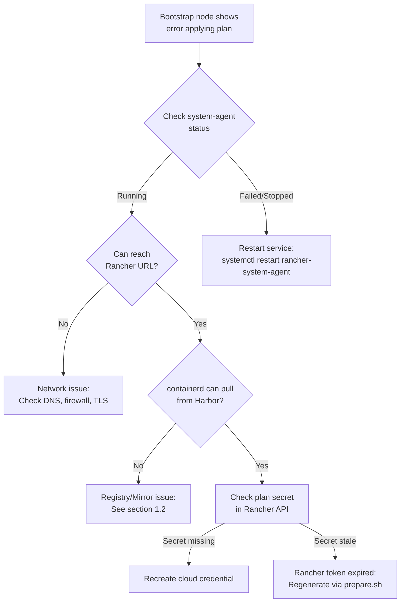
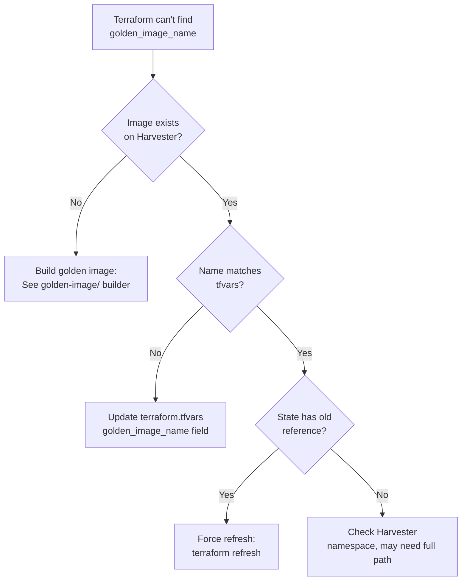
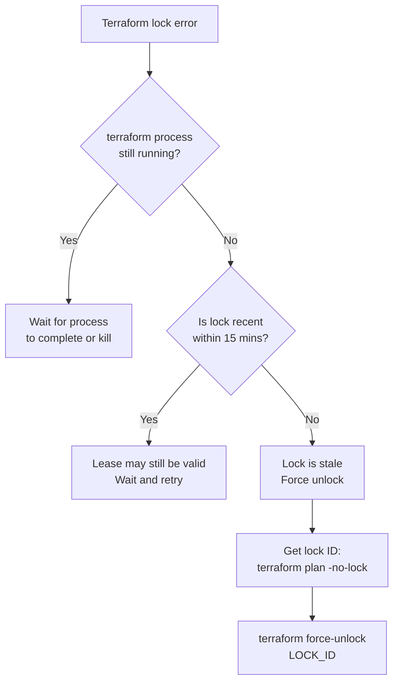
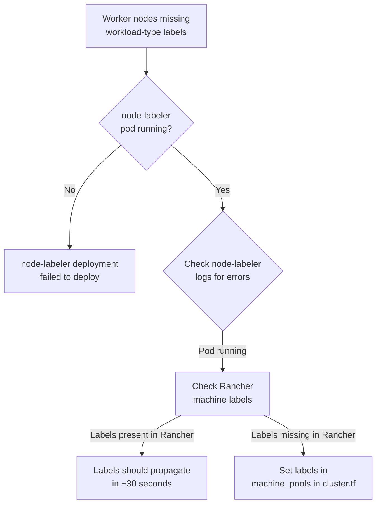
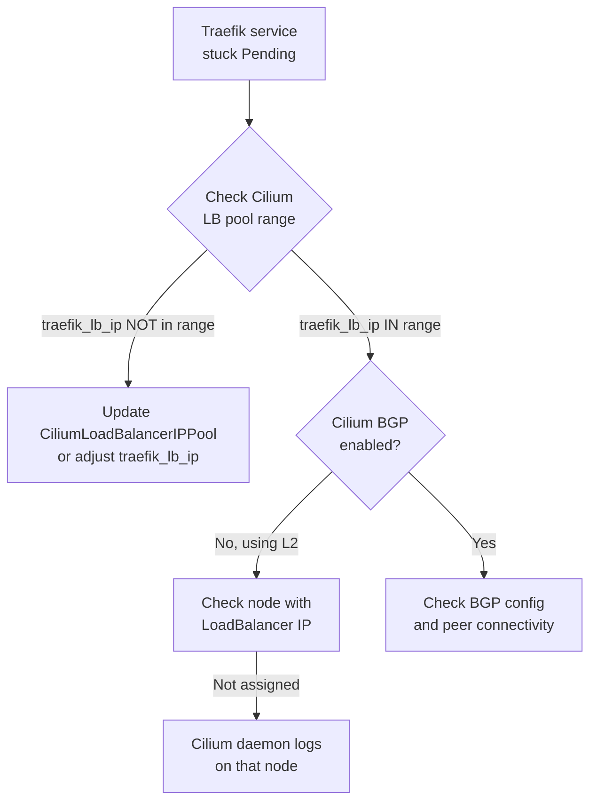
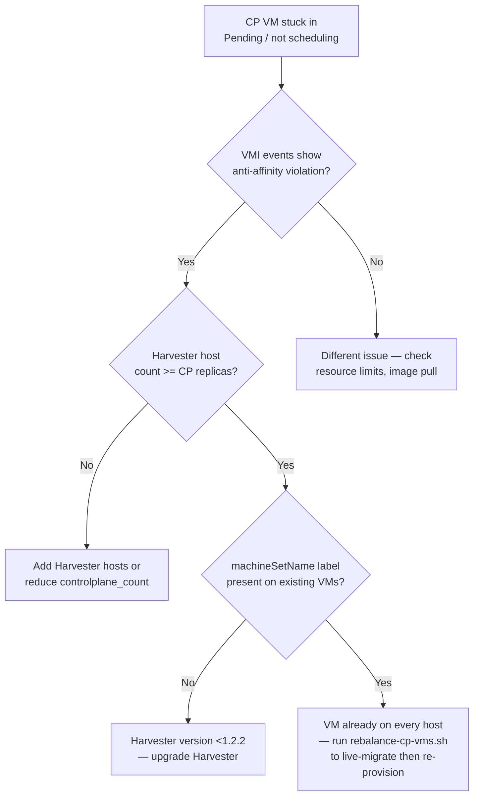
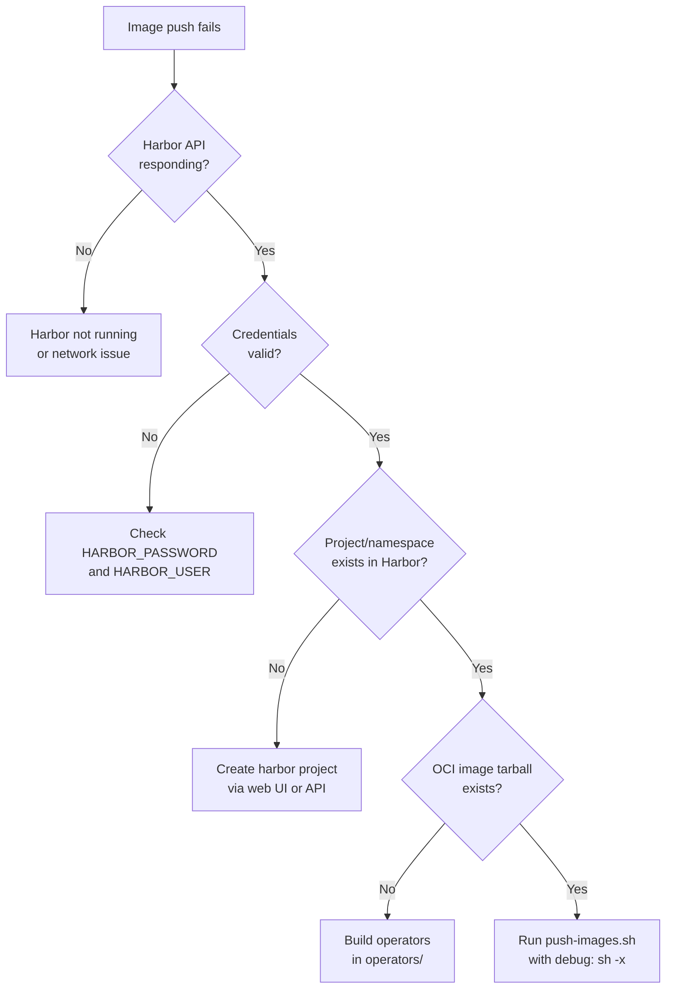
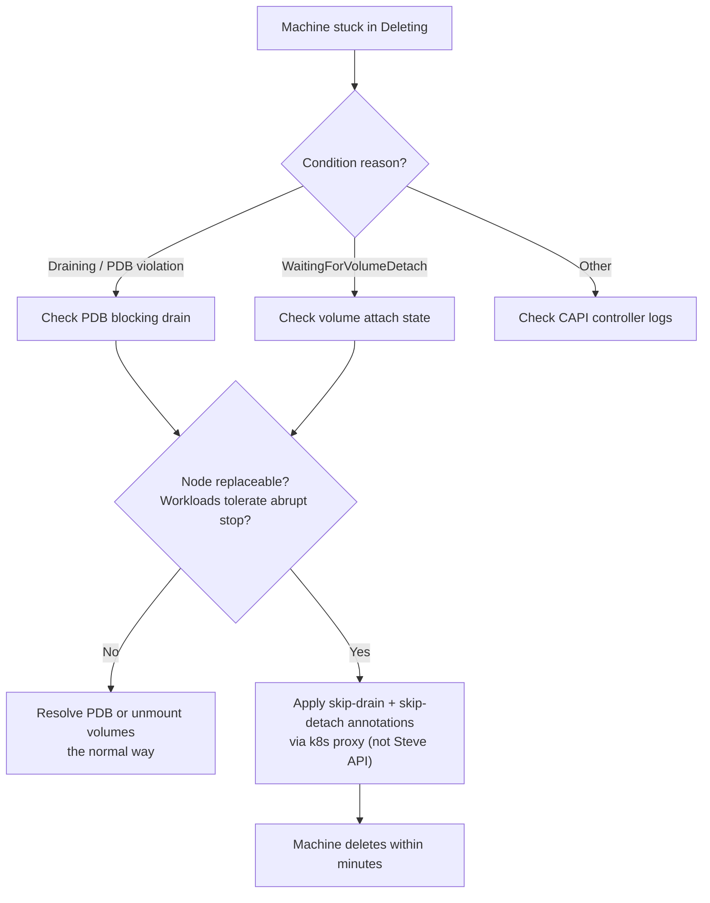
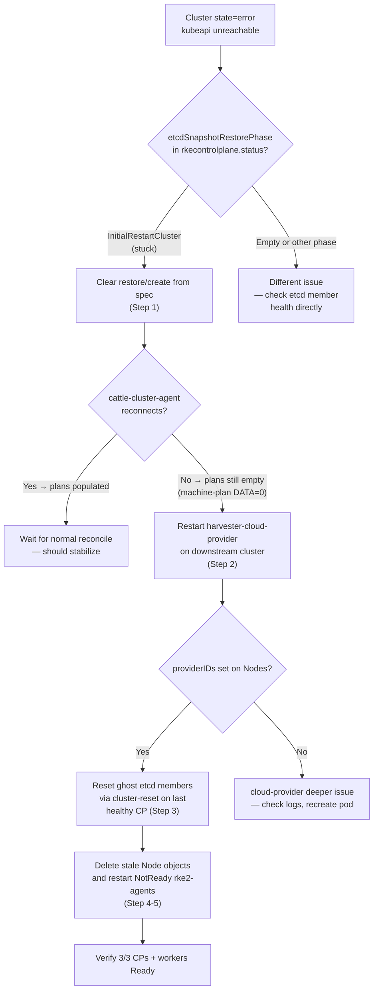

# RKE2 Cluster Deployment — Troubleshooting & Diagnostics Guide

This guide covers common issues encountered during RKE2 cluster deployment on Harvester, diagnostic procedures, and remediation steps. It includes Mermaid decision trees for diagnosis and restoration procedures for failed deploys. Section 7 documents production incident SOPs derived from real recovery events.

## Deployment Tool

The cluster is provisioned and managed via **Terraform** (`deploy-terraform/`), using the `rancher2` provider. Per-cluster configuration lives in `<cluster>.tfvars`; state is held in the `terraform-state` namespace on Harvester's Kubernetes backend, segregated per cluster by `secret_suffix`.

For Terraform plan / apply failures, capture the plan output and consult Section 1 (deployment) and Section 2 (state) below.

## Table of Contents

1. [Deployment Failures](#1-deployment-failures)
2. [Terraform State Issues](#2-terraform-state-issues)
3. [Cluster Health Issues](#3-cluster-health-issues)
4. [Operator Deployment Issues](#4-operator-deployment-issues)
5. [Cleanup & Destroy Procedures](#5-cleanup--destroy-procedures)
6. [Diagnostic Cheat Sheet](#6-diagnostic-cheat-sheet)
7. [Engineering Troubleshooting SOPs](#7-engineering-troubleshooting-sops)
   - [SOP: Wrong cloud-provider-kubeconfig namespace baked into VMs](#sop-wrong-cloud-provider-kubeconfig-namespace-baked-into-vms)
   - [SOP: CAPI Machine stuck in Deleting (PDB blocked or volume detach hung)](#sop-capi-machine-stuck-in-deleting-pdb-blocked-or-volume-detach-hung)
   - [SOP: harvester-csi-driver-controllers serving stale credentials after kubeconfig rotation](#sop-harvester-csi-driver-controllers-serving-stale-credentials-after-kubeconfig-rotation)
   - [SOP: Stale Harvester clusterId in cloud credential](#sop-stale-harvester-clusterid-in-cloud-credential)
   - [SOP: Post-Restore Cluster Recovery (stuck after etcd snapshot restore)](#sop-post-restore-cluster-recovery-stuck-after-etcd-snapshot-restore)
   - [SOP: Diagnose silent SYN drops on LoadBalancer VIPs (Cilium 1.19.x BPF slot drift)](#sop-diagnose-silent-syn-drops-on-loadbalancer-vips-cilium-119x-bpf-slot-drift)

---

## 1. Deployment Failures

### Symptom: Rancher shows "error applying plan" on bootstrap node

**Quick Check**
- [ ] SSH into bootstrap node and check `rancher-system-agent.service` status: `systemctl status rancher-system-agent`
- [ ] Check system agent logs: `journalctl -u rancher-system-agent -n 50`
- [ ] Verify bootstrap node can reach Rancher: `curl -k https://<RANCHER_URL>`
- [ ] Check containerd mirrors are working: `crictl pull <HARBOR_FQDN>/library/alpine:latest`

**Decision Tree**


**Root Causes & Solutions**

1. **Network/DNS issue**
   - Bootstrap node cannot resolve Rancher FQDN or Harbor FQDN
   - Check `/etc/resolv.conf` on bootstrap node
   - Verify DNS records exist and resolve correctly
   - Test: `nslookup <RANCHER_FQDN>` and `nslookup <HARBOR_FQDN>`

2. **containerd mirrors misconfigured**
   - See section 1.2 (Bootstrap registry returns 404)

3. **Stale Rancher token**
   - Rancher API token in cloud credential has expired
   - Solution: Regenerate kubeconfigs via `prepare.sh`, update cloud credential secret in Rancher

4. **Plan secret missing**
   - Rancher plan secret was deleted or not created
   - Check Rancher API: `curl -sk https://<RANCHER_URL>/v3/secrets -H "Authorization: Bearer <TOKEN>"` | jq '.data[] | select(.name | contains("rke2"))'`
   - Solution: Re-run `terraform apply` to recreate the plan secret

**Escalation**
- If system-agent service is failing repeatedly: check kernel logs (`dmesg`), memory/disk pressure on bootstrap node
- If network unreachable: verify Harvester network configuration, VLAN setup, routing

---

### Symptom: "bootstrap registry returns 404" or "connection refused"

**Quick Check**
- [ ] Test registry connectivity: `curl -k https://<BOOTSTRAP_REGISTRY>/v2/`
- [ ] Check if registry is running on Harvester: SSH to airgap VM, run `docker ps | grep registry` or `docker ps | grep harbor`
- [ ] Verify bootstrap_registry FQDN is resolvable: `nslookup <BOOTSTRAP_REGISTRY>`
- [ ] Check firewall: `iptables -L -n | grep <PORT>`

**Root Causes & Solutions**

1. **Registry FQDN misconfigured (bare IP instead of FQDN)**
   - Issue: containerd mirror config uses IP address (e.g., `10.0.0.100`), but nginx virtual hosting requires Host header match
   - Symptom: `curl https://10.0.0.100/v2/` returns 404, but `curl -H "Host: harbor.example.com" https://10.0.0.100/v2/` works
   - Solution: Use FQDN in `terraform.tfvars`: `bootstrap_registry = "harbor.example.com"`
   - Ensure `/etc/hosts` or DNS maps `harbor.example.com` → IP address

2. **Registry TLS cert invalid**
   - Issue: Curl shows "certificate verify failed" or "self signed certificate"
   - Solution: Verify `private_ca_pem` in `terraform.tfvars` contains the correct CA certificate
   - Test: `curl -k --cacert <(echo "$PRIVATE_CA_PEM") https://<BOOTSTRAP_REGISTRY>/v2/`

3. **Registry not running or not reachable**
   - Solution: SSH to airgap VM hosting Harbor, verify it's running
   - Check Harbor container logs: `docker logs -f harbor-core` (or appropriate container)

4. **containerd mirror configuration invalid**
   - Issue: `registries.yaml` on node has wrong endpoint or auth
   - Solution: Check `/etc/rancher/rke2/registries.yaml` on cluster node
   - Verify mirror endpoint matches `bootstrap_registry`

**Resolution Steps**
```bash
# From bootstrap node or any node with containerd:
crictl info | grep -A 20 "config:"
# Or check the registries.yaml directly:
cat /etc/rancher/rke2/registries.yaml

# Test pull from Harbor
crictl pull <BOOTSTRAP_REGISTRY>/library/alpine:latest

# If TLS fails, verify cert:
openssl s_client -connect <BOOTSTRAP_REGISTRY>:443 -showcerts < /dev/null | openssl x509 -noout -text
```

---

### Symptom: "golden_image_name mismatch" — Terraform fails to find image

**Quick Check**
- [ ] List images on Harvester: `kubectl --kubeconfig=kubeconfig-harvester.yaml get images -A`
- [ ] Check what `terraform.tfvars` specifies: `grep golden_image_name terraform.tfvars`
- [ ] Compare against Terraform state: `terraform state show 'data.harvester_image.golden'` or `terraform state list | grep harvester_image`

**Decision Tree**


**Root Causes & Solutions**

1. **Golden image doesn't exist on Harvester**
   - Build the golden image using the builder: see `/golden-image/` directory
   - Verify it exists: `kubectl get images -A | grep <IMAGE_NAME>`

2. **golden_image_name in tfvars doesn't match Harvester**
   - Update `terraform.tfvars` to match the actual image name on Harvester
   - Example: `golden_image_name = "rke2-rocky9-golden-20260227"`

3. **Terraform state is stale**
   - Solution: Run `terraform refresh` to update state against actual infrastructure
   - If state lock prevents this: `terraform force-unlock <LOCK_ID>`

4. **Image is in wrong namespace**
   - Harvester images may be in namespace other than `default`
   - Check: `kubectl get images -A` to see all namespaces
   - Update tfvars if needed to include namespace prefix

**Resolution Steps**
```bash
# List all Harvester images
kubectl --kubeconfig=kubeconfig-harvester.yaml get images -A -o wide

# Describe the image to verify it exists
kubectl --kubeconfig=kubeconfig-harvester.yaml describe image <IMAGE_NAME> -n <NAMESPACE>

# Force Terraform to refresh state
terraform refresh

# Verify data source can find it
terraform console
> data.harvester_image.golden
> data.harvester_image.golden.id
```

---

### Symptom: "409 Conflict — cluster already exists" on terraform apply

**Quick Check**
- [ ] Check Rancher for orphaned cluster: `curl -sk https://<RANCHER_URL>/v3/clusters -H "Authorization: Bearer <TOKEN>" | jq '.data[] | select(.name | contains("<CLUSTER_NAME>"))'`
- [ ] Check CAPI resources: `kubectl --kubeconfig=kubeconfig-harvester.yaml get clusters -A`
- [ ] Check Rancher provisioning cluster: `kubectl --kubeconfig=kubeconfig-harvester.yaml get provisioningclusters -A`

**Root Causes & Solutions**

1. **Orphaned cluster from cancelled terraform apply**
   - Issue: `terraform apply` was cancelled or interrupted, leaving provisioning.cattle.io/clusters object in Rancher
   - Solution: Delete via Rancher API or kubectl
   - Steps:
     ```bash
     # Find orphaned cluster
     kubectl --kubeconfig=kubeconfig-harvester.yaml get clusters -A
     kubectl --kubeconfig=kubeconfig-harvester.yaml get provisioningclusters -A

     # Delete the provisioning cluster (this cascades to CAPI resources)
     kubectl --kubeconfig=kubeconfig-harvester.yaml delete provisioningcluster <CLUSTER_NAME> -n fleet-default

     # If stuck on finalizers, force delete
     kubectl --kubeconfig=kubeconfig-harvester.yaml patch provisioningcluster <CLUSTER_NAME> -n fleet-default -p '{"metadata":{"finalizers":[]}}' --type=merge
     ```

2. **CAPI resources have stale finalizers**
   - Issue: CAPI Machines, RKEControlPlanes, or HarvesterMachines have finalizers preventing deletion
   - Solution: Clear finalizers (use with caution — only after verifying resources are orphaned)
   - Steps:
     ```bash
     # List CAPI resources
     kubectl --kubeconfig=kubeconfig-harvester.yaml get rkecontrolplanes -A
     kubectl --kubeconfig=kubeconfig-harvester.yaml get machines -A
     kubectl --kubeconfig=kubeconfig-harvester.yaml get harvesteremachines -A

     # Clear finalizers (example)
     kubectl --kubeconfig=kubeconfig-harvester.yaml patch machine <MACHINE_NAME> -n <NS> -p '{"metadata":{"finalizers":[]}}' --type=merge
     ```

**Escalation**
- If deletion appears stuck: check Rancher UI for plan status, check system-agent logs on bootstrap node
- If unable to delete via API: use `terraform.sh destroy` which handles cleanup orchestration

---

### Symptom: "500 error — failed to get token: tokens.management.cattle.io not found"

**Quick Check**
- [ ] Check kubeconfig is valid: `kubectl --kubeconfig=kubeconfig-harvester.yaml auth can-i get clusters`
- [ ] Verify Rancher token (from kubeconfig): `cat kubeconfig-harvester.yaml | grep token | head -1`
- [ ] Check if Rancher local cluster API is accessible: `curl -sk https://<RANCHER_URL>/v3/clusters -H "Authorization: Bearer <TOKEN>"`

**Root Causes & Solutions**

1. **Rancher token expired or invalid**
   - Previous `terraform destroy` invalidated tokens in kubeconfig
   - Solution: Regenerate kubeconfigs via `prepare.sh`
   - Steps:
     ```bash
     cd cluster
     ./prepare.sh  # Re-authenticate to Rancher, generate new kubeconfigs
     ./terraform.sh init  # Reinitialize with new credentials
     ```

2. **Cloud credential secret deleted**
   - Issue: Rancher secret for cluster cloud credential was manually deleted
   - Solution: Recreate via Rancher API or let `terraform apply` recreate it
   - Check: `curl -sk https://<RANCHER_URL>/v3/namespaces/fleet-default/secrets -H "Authorization: Bearer <TOKEN>" | jq '.data[] | select(.name | contains("<CLUSTER_NAME>"))'`

**Escalation**
- If `prepare.sh` fails to authenticate: verify Rancher is reachable and credentials are correct
- If token keeps expiring: check Rancher token TTL settings

---

### Symptom: Duplicate MachineDeployments appear, VMs keep restarting

**Quick Check**
- [ ] Check machine deployments: `kubectl --kubeconfig=kubeconfig-harvester.yaml get machinedeployments -A`
- [ ] Check for duplicate pool names in Rancher cluster: `curl -sk https://<RANCHER_URL>/v1/provisioning.cattle.io.clusters/fleet-default/<CLUSTER_NAME> | jq '.spec.rkeConfig.machinePools[] | .name'`
- [ ] Check Terraform state for duplicates: `./terraform.sh state list | grep machine_pools`

**Root Causes & Solutions**

1. **Missing cloud_credential_secret_name on cluster resource**
   - Issue: The `rancher2_cluster_v2.rke2` resource in `cluster.tf` did not have `cloud_credential_secret_name` defined (critical fix in recent versions)
   - Symptom: Terraform creates machine pools, but Rancher cannot associate them with the cloud credential, causing duplicate provisioning attempts
   - Solution: Verify `cluster.tf` line 22 has: `cloud_credential_secret_name = rancher2_cloud_credential.harvester.id`
   - If missing, add it and re-apply: `./terraform.sh apply`
   - This tells Rancher which cloud credential to use for the entire cluster (not just per-pool)

2. **Stale/orphaned machine deployment from failed apply**
   - Issue: A previous `terraform apply` was cancelled, leaving machine deployment CRDs on Rancher
   - Symptom: `terraform plan` shows new pools, but Rancher has old pools still running
   - Solution: Delete orphaned deployments via Rancher API or kubectl, then re-apply
   - Steps:
     ```bash
     # List all machine deployments
     kubectl --kubeconfig=kubeconfig-harvester.yaml get machinedeployments -A

     # Delete orphaned ones (be careful — this will delete nodes)
     kubectl --kubeconfig=kubeconfig-harvester.yaml delete machinedeployment <NAME> -n <NS>

     # Re-apply to recreate with correct spec
     ./terraform.sh apply
     ```

**Escalation**
- If duplicates persist after adding cloud_credential_secret_name: manually force node reconciliation via Rancher UI or clear Terraform state and re-apply
- If VMs are restarting: check Harvester VM events (`kubectl --kubeconfig=kubeconfig-harvester.yaml describe vm <VM_NAME> -n <NS>`)

---

### Symptom: Rancher Steve API phantom objects after destroy

**Quick Check**
- [ ] Check for phantom resources: `curl -sk https://<RANCHER_URL>/v1/provisioning.cattle.io.clusters/fleet-default | jq '.metadata.deletionTimestamp'`
- [ ] Check HarvesterMachines: `curl -sk https://<RANCHER_URL>/v1/rke-machine.cattle.io.harvestermachines | jq '.data[] | select(.metadata.deletionTimestamp != null) | .metadata.name'`
- [ ] List orphaned CAPI Machines: `curl -sk https://<RANCHER_URL>/v1/cluster.x-k8s.io.machines | jq '.data[] | select(.metadata.deletionTimestamp != null) | .metadata.name'`

**Root Causes & Solutions**

1. **Stuck finalizers on HarvesterMachine objects**
   - Issue: HarvesterMachine objects have `deletionTimestamp` but finalizers prevent deletion
   - Symptom: After `destroy`, the Rancher API still reports machines exist (phantom objects)
   - Solution: Use `nuke-cluster.sh` which handles finalizer cleanup, or manually patch:
     ```bash
     curl -sk -X PATCH -H "Authorization: Bearer <TOKEN>" \
       -H "Content-Type: application/merge-patch+json" \
       "https://<RANCHER_URL>/v1/rke-machine.cattle.io.harvestermachines/fleet-default/<NAME>" \
       -d '{"metadata":{"finalizers":[]}}'
     ```

2. **Rancher API async cleanup lag**
   - Issue: Destroy completed but Rancher's object reconciliation hasn't caught up
   - Solution: Wait 1-2 minutes for cleanup propagation, or manually delete via API
   - This is expected behavior — Rancher's Steve API queries eventually return consistent data

3. **Disconnected Harvester cluster**
   - Issue: If Harvester cluster loses connectivity to Rancher, phantom objects can linger
   - Solution: Reconnect Harvester, then use `nuke-cluster.sh` to force cleanup

**Escalation**
- If phantom objects persist: use `nuke-cluster.sh` which bypasses normal deletion and force-deletes all resources
- If Rancher API is unreachable: check Rancher → Harvester network connectivity

---

### Symptom: Stuck finalizers during cluster deletion

**Quick Check**
- [ ] Check cluster deletion status: `curl -sk https://<RANCHER_URL>/v1/provisioning.cattle.io.clusters/fleet-default/<CLUSTER_NAME> -H "Authorization: Bearer <TOKEN>" | jq '.metadata | {name, deletionTimestamp, finalizers}'`
- [ ] Check how long it's been stuck: Look at `deletionTimestamp` and compare to current time

**Root Causes & Solutions**

1. **CAPI controller loops detecting drift**
   - Issue: CAPI's machine controller sees nodes as "unmatched" and keeps trying to reconcile during deletion
   - Symptom: `terraform destroy` hangs while trying to delete the cluster resource (max 5-10 minutes)
   - Solution: `terraform.sh destroy` calls `post_destroy_cleanup()` which patches out finalizers
   - If still stuck, manually clear:
     ```bash
     ./terraform.sh destroy -lock=false
     ```

2. **Harvester cluster provisioning stalled**
   - Issue: Machines cannot be deleted because Harvester API is slow or unavailable
   - Solution: Check Harvester health and retry destroy
     ```bash
     kubectl --kubeconfig=kubeconfig-harvester.yaml cluster-info
     ./terraform.sh destroy -auto-approve
     ```

3. **Network connectivity broken between Rancher and Harvester**
   - Issue: Rancher cannot communicate with Harvester to delete VMs
   - Solution: Restore connectivity, then use `nuke-cluster.sh` to force cleanup

**Escalation**
- If stuck > 10 minutes: use `nuke-cluster.sh -y` for irreversible cleanup
- If Harvester is offline: wait for it to come back online, then use `nuke-cluster.sh`

---

### Symptom: Compute pool not provisioning (0 min_count not triggering scale-from-zero)

**Quick Check**
- [ ] Verify compute pool exists: `./terraform.sh state list | grep compute`
- [ ] Check autoscaler annotations: `kubectl get machinepool compute -o yaml | grep autoscaler`
- [ ] Check if pods are actually requesting compute node affinity: `kubectl get pods -A -o json | jq '.items[] | select(.spec.nodeSelector["workload-type"]=="compute") | .metadata.name'`
- [ ] Check autoscaler logs: `kubectl logs -n cattle-system -l app.kubernetes.io/name=rancher-cluster-autoscaler -f`

**Root Causes & Solutions**

1. **No pods requesting compute affinity**
   - Issue: Compute pool has `compute_min_count = 0` (scale-from-zero), but no workloads are scheduled with `workload-type=compute` affinity
   - Solution: Deploy a pod with `nodeSelector: {"workload-type": "compute"}`:
     ```yaml
     apiVersion: v1
     kind: Pod
     metadata:
       name: compute-test
     spec:
       nodeSelector:
         workload-type: compute
       containers:
       - name: alpine
         image: alpine:latest
         command: ["sleep", "3600"]
     ```

2. **Autoscaler resource annotations missing or incorrect**
   - Issue: `cluster.tf` compute pool missing resource annotations for scale-from-zero
   - Symptom: Autoscaler sees `compute_min_count = 0` but doesn't know node capacity, so it won't scale up
   - Solution: Verify annotations in `cluster.tf` lines 119-122:
     ```hcl
     "cluster.provisioning.cattle.io/autoscaler-resource-cpu"     = var.compute_cpu
     "cluster.provisioning.cattle.io/autoscaler-resource-memory"  = "${var.compute_memory}Gi"
     "cluster.provisioning.cattle.io/autoscaler-resource-storage" = "${var.compute_disk_size}Gi"
     ```
   - If missing, add them and re-apply: `./terraform.sh apply`

3. **Autoscaler controller not running or unhealthy**
   - Issue: Rancher cluster autoscaler pod is in CrashLoopBackOff or not scheduled
   - Solution: Check pod status: `kubectl get pod -n cattle-system -l app.kubernetes.io/name=rancher-cluster-autoscaler`
   - Check logs: `kubectl logs -n cattle-system -l app.kubernetes.io/name=rancher-cluster-autoscaler`

**Escalation**
- If autoscaler is healthy and resource annotations exist, verify pod affinity is set correctly
- If scale-from-zero still doesn't work: manually add a compute node via Terraform (`compute_min_count = 1`), then let autoscaler scale it down when workload completes

---

## 2. Terraform State Issues

### Symptom: "Error locking state" or "lock already held"

**Quick Check**
- [ ] Check for stale Kubernetes lease: `kubectl --kubeconfig=kubeconfig-harvester.yaml get leases -n terraform-state`
- [ ] Identify lock holder: `kubectl --kubeconfig=kubeconfig-harvester.yaml describe lease tfstate-default-rke2-cluster -n terraform-state | grep -A 5 holderIdentity`
- [ ] Check if terraform process is running: `ps aux | grep terraform`

**Decision Tree**


**Root Causes & Solutions**

1. **Stale lock from interrupted terraform**
   - Issue: `terraform apply` or `terraform plan` was killed without cleanup
   - Solution: Use `terraform.sh` which auto-detects and clears stale locks
   - Manual solution:
     ```bash
     # Identify stale lock
     terraform plan -input=false 2>&1 | grep "Lock ID:"

     # Force unlock (replace with actual lock ID)
     terraform force-unlock -force <LOCK_ID>

     # Or delete the Kubernetes lease directly
     kubectl --kubeconfig=kubeconfig-harvester.yaml delete lease tfstate-default-rke2-cluster -n terraform-state
     ```

2. **Concurrent terraform processes**
   - Issue: Multiple `terraform apply` or `terraform plan` running simultaneously
   - Solution: Kill duplicate processes, ensure only one operator at a time
   - Check: `ps aux | grep terraform | grep -v grep`

**Prevention**
- Always use `terraform.sh apply` which handles locking robustly
- Never kill `terraform apply` mid-execution — let it complete or use `terraform.sh` which can recover

---

### Symptom: "errored.tfstate" file appears

**What This Means**
- Terraform creates `.terraform/errored.tfstate` when `terraform apply` fails partway through
- This is a checkpoint for recovery; Terraform can resume from this state

**How terraform.sh Handles It**
The `terraform.sh` script includes automatic recovery:
```bash
# From terraform.sh:
if [[ -f "$SCRIPT_DIR/.terraform/errored.tfstate" ]]; then
  log_warn "Found errored.tfstate from previous failed apply..."
  log_info "Copying to terraform.tfstate for recovery..."
  cp "$SCRIPT_DIR/.terraform/errored.tfstate" "$SCRIPT_DIR/terraform.tfstate"
fi
```

**Manual Recovery (if needed)**
```bash
# 1. Copy errored state to main state
cp .terraform/errored.tfstate terraform.tfstate

# 2. Unlock (if state lock held)
terraform force-unlock <LOCK_ID>

# 3. Plan to see what failed
terraform plan

# 4. Fix the issue (see relevant symptom section above)

# 5. Resume apply
terraform apply
```

---

### Symptom: "The root module does not declare a variable named X"

**Quick Check**
- [ ] Compare `terraform.tfvars` against `variables.tf`: `grep "^[a-z_]*[[:space:]]*=" terraform.tfvars | awk '{print $1}' | sort > /tmp/tfvars.txt && grep "^variable" variables.tf | awk '{print $2}' | tr -d '"' | sort > /tmp/vars.txt && comm -23 /tmp/tfvars.txt /tmp/vars.txt`

**Root Causes & Solutions**

1. **Stale variable in terraform.tfvars**
   - Issue: `terraform.tfvars` has variables that no longer exist in `variables.tf`
   - Example: Old deploy included `dockerhub_username` but it was removed
   - Solution: Remove stale lines from `terraform.tfvars`
   - Use `terraform.tfvars.example` as reference for current valid variables

2. **Variable renamed in variables.tf**
   - Example: `harbor_fqdn` was renamed to `bootstrap_registry_fqdn`
   - Solution: Rename the variable in `terraform.tfvars`

**Prevention**
- After updating `variables.tf`, validate: `terraform validate`
- Keep `terraform.tfvars.example` synchronized with actual variables

---

## 3. Cluster Health Issues

### Symptom: Worker nodes showing "uninitialized" taint

**Quick Check**

- [ ] Check node taints: `kubectl describe node <NODE_NAME> | grep Taints`
- [ ] Look for: `node.cloudprovider.kubernetes.io/uninitialized:NoSchedule`
- [ ] Check Harvester cloud provider: `kubectl get daemonset -n kube-system harvester-cloud-provider`
- [ ] Check cloud provider logs: `kubectl logs -n kube-system -l app.kubernetes.io/name=harvester-cloud-provider --tail=50`

**What This Means**

- RKE2 bootstraps nodes with this taint until cloud provider initializes them
- Harvester cloud provider should remove taint once node is registered
- If taint persists, provider failed to initialize the node

**Root Causes & Solutions**

1. **Harvester cloud provider not deployed**
   - Check: `kubectl get daemonset -n kube-system harvester-cloud-provider`
   - If missing, RKE2 should deploy it automatically during bootstrap
   - Manual deploy: See RKE2 cloud provider documentation

2. **Cloud provider can't communicate with Harvester**
   - Check provider logs: `kubectl logs -n kube-system -l app.kubernetes.io/name=harvester-cloud-provider`
   - Verify kubeconfig in provider: `kubectl get secret -n kube-system harvester-kubeconfig -o yaml`
   - Solution: Ensure cloud credential is correct in Rancher

3. **Taint manually added or not removed**
   - Remove taint if cloud provider will not initialize:
     ```bash
     kubectl taint node <NODE_NAME> \
       node.cloudprovider.kubernetes.io/uninitialized:NoSchedule-
     ```

**Resolution Steps**

```bash
# 1. Check which nodes have uninitialized taint
kubectl get nodes -o jsonpath='{range .items[*]}{.metadata.name}{"\t"}{.spec.taints[*]}{"\n"}{end}' | grep uninitialized

# 2. Check cloud provider status
kubectl get daemonset -n kube-system harvester-cloud-provider

# 3. Check cloud provider logs
kubectl logs -n kube-system -l app.kubernetes.io/name=harvester-cloud-provider -f

# 4. If provider logs show connection errors, verify Harvester kubeconfig
kubectl get secret -n kube-system harvester-kubeconfig -o yaml

# 5. Wait for provider to remove taint (can take 1-2 minutes)
watch 'kubectl describe node <NODE_NAME> | grep Taints'
```

---

### Symptom: cattle-cluster-agent cannot schedule on worker nodes

**Quick Check**

- [ ] Check cattle-cluster-agent pod: `kubectl get pods -n cattle-system -l app=cattle-cluster-agent`
- [ ] Check pod events: `kubectl describe pod -n cattle-system -l app=cattle-cluster-agent`
- [ ] Check node taints: `kubectl describe node <NODE_NAME> | grep Taints`
- [ ] Check node tolerations on pod: `kubectl get pod -n cattle-system -l app=cattle-cluster-agent -o jsonpath='{.items[0].spec.tolerations}'`

**What This Means**

- cattle-cluster-agent is Rancher's cluster controller, must run on at least one node
- If no toleration for control plane taints, agent can't schedule on CP-only cluster
- This causes Rancher to lose connectivity to the cluster

**Root Causes & Solutions**

1. **No worker nodes, control plane has NoSchedule taint**
   - Issue: Control plane nodes have `node-role.kubernetes.io/control-plane:NoSchedule`
   - cattle-cluster-agent has no toleration, can't schedule
   - Solution: Add toleration to cattle-cluster-agent deployment:
     ```bash
     kubectl patch deployment cattle-cluster-agent -n cattle-system --type merge -p \
       '{"spec":{"template":{"spec":{"tolerations":[{"key":"node-role.kubernetes.io/control-plane","operator":"Exists","effect":"NoSchedule"}]}}}}'
     ```

2. **Control plane has uninitialized taint AND no worker nodes**
   - Solution: Remove uninitialized taint from control plane nodes:
     ```bash
     kubectl taint node <CP_NODE> node.cloudprovider.kubernetes.io/uninitialized:NoSchedule-
     ```

3. **cattle-cluster-agent pod in CrashLoopBackOff**
   - Check logs: `kubectl logs -n cattle-system -l app=cattle-cluster-agent`
   - Common causes: RBAC issue, service account missing, image pull error
   - Solution: Check events and logs to diagnose specific cause

**Prevention**

- RKE2 should automatically configure cattle-cluster-agent tolerations
- If deploying via Rancher with custom node pools, ensure at least one worker node OR add control plane toleration

---

### Symptom: Database pool nodes unable to initialize or stay in NotReady state

**Quick Check**

- [ ] Check database pool nodes: `kubectl get nodes -l workload-type=database -o wide`
- [ ] Check for uninitialized taints: `kubectl describe node -l workload-type=database | grep -A 2 Taints`
- [ ] Verify cloud provider removing taint: `kubectl logs -n kube-system -l app.kubernetes.io/name=harvester-cloud-provider | grep -i database`
- [ ] Check node-labeler has labeled them: `kubectl get nodes -l workload-type=database`

**Root Causes & Solutions**

1. **Database nodes stuck with uninitialized taint**
   - Issue: Harvester cloud provider hasn't initialized database nodes
   - Solution: Verify cloud provider is running and check logs for errors
   - Manual workaround (if cloud provider is working correctly):
     ```bash
     kubectl taint node -l workload-type=database \
       node.cloudprovider.kubernetes.io/uninitialized:NoSchedule-
     ```

2. **node-labeler hasn't reached database nodes**
   - Issue: Database nodes weren't labeled during provisioning
   - Solution: Force labeler to reconcile:
     ```bash
     kubectl rollout restart deployment node-labeler -n node-labeler

     # Wait for labels to appear
     watch 'kubectl get nodes -l workload-type=database'
     ```

3. **Database pool nodes not configured in machine_pools**
   - Issue: `cluster.tf` missing database pool configuration
   - Solution: Verify `cluster.tf` has database pool defined:
     ```hcl
     machine_pools {
       name      = "database"
       roles     = ["worker"]
       labels    = { "workload-type" = "database" }
       min_count = 4
       max_count = 10
     }
     ```
   - Re-apply: `terraform apply`

4. **Database nodes failing cloud-init or user data**
   - Issue: VM user-data script failed during boot
   - Solution: Check VM logs on Harvester:
     ```bash
     kubectl --kubeconfig=kubeconfig-harvester.yaml logs vm/<VM_NAME> -n <NAMESPACE>
     ```

**Resolution Steps**

```bash
# 1. Check database node status
kubectl get nodes -l workload-type=database -o wide

# 2. Check cloud provider logs
kubectl logs -n kube-system -l app.kubernetes.io/name=harvester-cloud-provider \
  --tail=100 | grep -i database

# 3. Check for uninitialized taint
kubectl describe nodes -l workload-type=database | grep -A 2 Taints

# 4. If nodes are properly initialized, verify workload can schedule
kubectl get pods -A | grep -i database || echo "No database workloads yet"

# 5. Wait for full reconciliation
watch 'kubectl get nodes -l workload-type=database'
```

**Escalation**

- If database nodes never reach Ready: check HarvesterMachine objects on Harvester
- Verify `cluster.tf` machine_pools defines database correctly
- Check Rancher UI for provisioning status on database pool

---

### Symptom: Worker nodes missing "workload-type" labels

**Quick Check**
- [ ] List nodes and labels: `kubectl get nodes --show-labels | grep workload-type`
- [ ] Check specific node: `kubectl get node <NODE_NAME> -o jsonpath='{.metadata.labels.workload-type}'`
- [ ] Verify node-labeler operator is running: `kubectl get pods -n node-labeler`
- [ ] Check node-labeler logs: `kubectl logs -n node-labeler -l app=node-labeler -f`

**Decision Tree**


**Root Causes & Solutions**

1. **node-labeler operator not deployed**
   - Issue: `deploy_operators = false` in `terraform.tfvars` or operator deployment failed
   - Solution: Set `deploy_operators = true`, ensure `harbor_admin_password` is configured
   - Re-run: `terraform apply -target=null_resource.deploy_node_labeler`

2. **node-labeler image not pushed to Harbor**
   - Issue: `operator_image_push` failed or was skipped
   - Solution: Re-run: `terraform apply -target=null_resource.operator_image_push`
   - Check logs: `terraform show` for error details

3. **Rancher machine config missing labels**
   - Issue: `machine_pools` in `cluster.tf` don't define labels (only general/compute/database pools do)
   - Solution: Verify `cluster.tf` has labels in each pool, e.g.:
     ```hcl
     labels = {
       "workload-type" = "general"
     }
     ```
   - Re-run: `terraform apply`

4. **node-labeler RBAC permissions insufficient**
   - Issue: Operator can't update node labels
   - Solution: Verify RBAC manifests exist: `operators/manifests/node-labeler/rbac.yaml`
   - Check: `kubectl get clusterrole,clusterrolebinding -n node-labeler`

**Resolution Steps**
```bash
# 1. Verify operator is running
kubectl get pods -n node-labeler -o wide

# 2. Check pod logs
kubectl logs -n node-labeler -l app=node-labeler --tail=100

# 3. Check RBAC
kubectl get clusterrolebinding | grep node-labeler

# 4. If RBAC missing, reapply manifests
kubectl apply -f operators/manifests/node-labeler/rbac.yaml

# 5. Check if labels exist in Rancher machineconfigs
kubectl --kubeconfig=kubeconfig-harvester.yaml get machineconfigs -A -o yaml | grep -A 10 "workload-type"

# 6. Wait for node-labeler to reconcile (check logs)
kubectl logs -n node-labeler -l app=node-labeler -f

# 7. Verify labels appear on nodes
kubectl get nodes --show-labels
```

---

### Symptom: Harvester cloud provider log spam — "no matched IPPool with requirement"

**Quick Check**
- [ ] Check Harvester cloud provider logs: `kubectl logs -n kube-system -l app.kubernetes.io/name=harvester-cloud-provider | head -50`
- [ ] Verify Cilium LB IP pool exists: `kubectl get ciliiumloadbalancerippool -A`
- [ ] Check pool range: `kubectl get ciliiumloadbalancerippool -o jsonpath='{.items[0].spec}'`

**What This Means**
- Harvester cloud provider tries to reconcile LoadBalancer service IPs with Cilium
- This is **cosmetic** — Cilium handles LB IP assignment independently
- Error is logged but doesn't prevent service from getting IP

**Root Causes & Solutions**

1. **This is expected behavior**
   - Harvester cloud provider was designed for cloud environments with different LB semantics
   - Cilium L2 advertisement handles LB IPs, Harvester provider sees no matching pool
   - **No action needed** — service will get IP via Cilium

2. **To suppress logs** (optional)
   - Edit Harvester cloud provider deployment: `kubectl edit deployment -n kube-system harvester-cloud-provider`
   - Add `--log-level=warning` to reduce INFO/DEBUG spam
   - Or patch deployment via Rancher UI

**Prevention**
- This is a known non-issue in the current architecture
- Document in deployment notes if using external monitoring

---

### Symptom: Traefik LoadBalancer service stuck in "Pending"

**Quick Check**
- [ ] Check service status: `kubectl get svc -n traefik`
- [ ] Describe service: `kubectl describe svc traefik -n traefik`
- [ ] Check Cilium LB pool: `kubectl get ciliiumloadbalancerippool -A -o yaml`
- [ ] Verify `traefik_lb_ip` is in pool range: Check `cluster.tf` variables

**Decision Tree**


**Root Causes & Solutions**

1. **traefik_lb_ip is outside Cilium LB pool range**
   - Issue: `cluster.tf` has:
     ```hcl
     traefik_lb_ip      = "192.168.48.2"
     cilium_lb_pool_start = "192.168.48.50"   # ← Problem! doesn't include 192.168.48.2
     cilium_lb_pool_stop  = "192.168.48.100"
     ```
   - Solution: Update `cilium_lb_pool_start` to include `traefik_lb_ip`:
     ```hcl
     cilium_lb_pool_start = "192.168.48.2"
     cilium_lb_pool_stop  = "192.168.48.20"
     ```
   - Re-apply: `terraform apply`

2. **CiliumLoadBalancerIPPool patch needed after cluster creation**
   - If pool was initialized with wrong range, patch it:
     ```bash
     kubectl patch ciliiumloadbalancerippool -n kube-system --type merge -p \
       '{"spec":{"cidrs":[{"cidr":"192.168.48.2/32"}]}}'
     ```

3. **Cilium LB feature disabled**
   - Check: `kubectl get daemonset -n kube-system cilium -o jsonpath='{.spec.template.spec.containers[0].args}' | grep -i loadbalancer`
   - If feature is disabled, enable via Rancher cluster config or re-deploy with Cilium enabled

**Resolution Steps**
```bash
# 1. Check current pool
kubectl get ciliiumloadbalancerippool -A -o yaml

# 2. Check service IP assignment
kubectl get svc traefik -n traefik -o wide

# 3. Identify which node has the IP (if assigned)
kubectl get endpoints traefik -n traefik -o wide

# 4. If pool range is wrong, patch it
kubectl patch ciliiumloadbalancerippool <POOL_NAME> --type merge -p \
  '{"spec":{"cidrs":[{"cidr":"192.168.48.2/20"}]}}'

# 5. Verify service gets IP
kubectl get svc traefik -n traefik -w
```

---

### Symptom: CP VMs failing to schedule on Harvester hosts

**Quick Check**
- [ ] Check VMI status across CP pool: `kubectl -n <VM_NAMESPACE> get vmi -o wide`
- [ ] Inspect VM events for anti-affinity violations: `kubectl -n <VM_NAMESPACE> describe vm <VM_NAME>`
- [ ] Count available Harvester hosts: `kubectl get nodes` (on the Harvester cluster)

**Decision Tree**


**Root Causes & Solutions**

1. **Fewer Harvester hosts than CP replicas**
   - The CP pool uses `requiredDuringSchedulingIgnoredDuringExecution` anti-affinity.
     A 3-replica CP requires at least 3 distinct Harvester hosts.
   - Solution: Add a Harvester host, or temporarily reduce `CP_COUNT` / `controlplane_count` to match available hosts.

2. **Harvester version does not emit `harvesterhci.io/machineSetName` label**
   - Requires Harvester >=1.2.2 / 1.3.0. On older versions the label is absent
     and the anti-affinity rule matches nothing, causing VMs to pile on one host.
   - Solution: Upgrade Harvester, then run `scripts/rebalance-cp-vms.sh` to
     live-migrate existing CP VMs onto separate hosts.

3. **All Harvester hosts already occupied by a CP VM from a prior failed provision**
   - Stale VMIs from a cancelled provision occupy topology slots.
   - Solution: Delete stale VMIs: `kubectl -n <VM_NAMESPACE> delete vmi <STALE_NAME>`
     then allow Rancher to re-provision.

**Diagnostic Commands**
```bash
# Check VMI placement (which Harvester host each VM landed on)
kubectl -n <VM_NAMESPACE> get vmi -o wide

# Inspect anti-affinity events on a stuck VM
kubectl -n <VM_NAMESPACE> describe vm <VM_NAME>

# Confirm machineSetName label is present
kubectl -n <VM_NAMESPACE> get vmi -o json \
  | jq '.items[].metadata.labels["harvesterhci.io/machineSetName"]'

# Live-migrate CP VMs to enforce one-per-host spreading (post-provision)
# See docs/operations.md §14 for the full rebalance procedure
bash scripts/rebalance-cp-vms.sh
```

---

## 4. Operator Deployment Issues

### Symptom: "image push fails" — crane or registry errors

**Quick Check**
- [ ] Verify Harbor is running: `curl -k https://<HARBOR_FQDN>/api/v2.0/health`
- [ ] Check operator images exist locally: `ls operators/images/`
- [ ] Verify Harbor credentials: `echo $HARBOR_PASSWORD | docker login -u admin --password-stdin <HARBOR_FQDN>`
- [ ] Check namespace exists in Harbor: Harbor web UI → Projects → Check if `operators` project exists

**Decision Tree**


**Root Causes & Solutions**

1. **Harbor is not running**
   - Solution: SSH to airgap VM, verify Harbor container is running
   - Check: `docker ps | grep harbor`
   - Restart: `cd /opt/harbor && docker-compose up -d`

2. **crane authentication failed**
   - Issue: `crane push` fails with "unauthorized"
   - Solution: Verify `HARBOR_PASSWORD` and `HARBOR_USER` are correct
   - Check: `echo $HARBOR_PASSWORD | crane auth login -u admin --password-stdin <HARBOR_FQDN>`

3. **OCI layout extraction failed**
   - Issue: `crane push` can't read OCI image tarball
   - Solution: Verify tarball exists and is not corrupted
   - Check: `tar -tzf operators/images/node-labeler-v0.2.0.tar.gz | head`

4. **Harbor project doesn't exist**
   - Issue: `crane push` gets 404 on `<HARBOR_FQDN>/operators/node-labeler`
   - Solution: Create project in Harbor:
     ```bash
     # Via API
     curl -sk -u admin:<PASSWORD> -X POST \
       https://<HARBOR_FQDN>/api/v2.0/projects \
       -H "Content-Type: application/json" \
       -d '{"project_name":"operators"}'
     ```

**Resolution Steps**
```bash
# 1. Debug push script with verbose output
bash -x operators/push-images.sh 2>&1 | head -100

# 2. Test Harbor connectivity
curl -k https://<HARBOR_FQDN>/api/v2.0/health | jq .

# 3. Test authentication
echo $HARBOR_PASSWORD | crane auth login -u admin --password-stdin <HARBOR_FQDN>

# 4. Verify images exist
ls -lh operators/images/

# 5. Manually push one image to debug
cd operators/images
crane push node-labeler-v0.2.0.tar.gz <HARBOR_FQDN>/operators/node-labeler:v0.2.0 \
  -u admin -p $HARBOR_PASSWORD

# 6. Check Harbor web UI for pushed image
# Navigate to: https://<HARBOR_FQDN> → Projects → operators
```

---

### Symptom: "Operators in ImagePullBackOff"

**Quick Check**
- [ ] Check pod status: `kubectl get pods -n node-labeler -o wide` (or storage-autoscaler)
- [ ] Describe pod: `kubectl describe pod <POD_NAME> -n node-labeler`
- [ ] Check image availability in Harbor: `curl -k https://<HARBOR_FQDN>/api/v2.0/projects`
- [ ] Verify registry mirror config: `kubectl get nodes -o jsonpath='{.items[0].status.images[*].names}' | tr ' ' '\n' | grep harbor`

**Root Causes & Solutions**

1. **Image not pushed to Harbor**
   - Issue: `operator_image_push` resource didn't execute or failed
   - Solution: Verify push completed, re-run if needed
   - Check: `terraform state show null_resource.operator_image_push | grep -i error`
   - Re-run: `terraform apply -target=null_resource.operator_image_push`

2. **Harbor registry mirror not configured on nodes**
   - Issue: Nodes can't reach Harbor or don't have mirror configured
   - Solution: Verify containerd mirrors are configured
   - Check on cluster node: `cat /etc/rancher/rke2/registries.yaml | grep -A 5 "<HARBOR_FQDN>"`
   - This should be auto-configured by cluster.tf during provisioning

3. **TLS certificate issue**
   - Issue: Node can't verify Harbor TLS certificate
   - Solution: Verify `private_ca_pem` in `terraform.tfvars` is correct
   - Check: `openssl s_client -connect <HARBOR_FQDN>:443 -showcerts < /dev/null | openssl x509 -text -noout`
   - Ensure node has CA cert: `kubectl get secret -n kube-system <CA_SECRET> -o jsonpath='{.data.ca\.crt}' | base64 -d`

4. **Image tag mismatch in deployment**
   - Issue: Deployment specifies wrong tag (e.g., `latest` instead of `v0.2.0`)
   - Solution: Verify `.rendered/node-labeler-deployment.yaml` has correct image tag
   - Check: `kubectl get deployment -n node-labeler -o jsonpath='{.items[0].spec.template.spec.containers[0].image}'`

**Resolution Steps**
```bash
# 1. Check pod status and events
kubectl describe pod -n node-labeler -l app=node-labeler

# 2. Verify image exists in Harbor
curl -k -u admin:<PASSWORD> https://<HARBOR_FQDN>/api/v2.0/repositories/operators

# 3. Check containerd mirror config on a node
kubectl debug node/<NODE_NAME> -it --image=busybox
# Inside debug container:
cat /host/etc/rancher/rke2/registries.yaml

# 4. Test image pull from node
crictl pull <HARBOR_FQDN>/operators/node-labeler:v0.2.0

# 5. If pull fails, check TLS
crictl pull --creds admin:<PASSWORD> <HARBOR_FQDN>/operators/node-labeler:v0.2.0

# 6. Force pod restart to retry
kubectl rollout restart deployment node-labeler -n node-labeler
```

---

## 5. Cleanup & Destroy Procedures

### SOP: Dirty Destroy (Cancelled Terraform)

**Purpose**: Recover from failed `terraform apply` or `terraform destroy` by cleaning up orphaned resources step-by-step.

**Prerequisites**
- Access to Harvester cluster via kubeconfig
- Access to Rancher API
- Terraform state available (even if errored)

**Estimated Time**: 10–15 minutes

**Risk Level**: High — deletes resources

**When to Use This**
- `terraform destroy` was cancelled mid-execution
- `terraform apply` left partial resources
- Cluster is in unusable state and manual cleanup is needed

**Steps**

1. **Assess current state**
   ```bash
   # List RKE2 cluster in Rancher
   kubectl --kubeconfig=kubeconfig-harvester.yaml get clusters -A
   kubectl --kubeconfig=kubeconfig-harvester.yaml get provisioningclusters -A

   # List VMs and PVCs on Harvester
   kubectl --kubeconfig=kubeconfig-harvester.yaml get vms -A
   kubectl --kubeconfig=kubeconfig-harvester.yaml get pvcs -A

   # List CAPI resources
   kubectl --kubeconfig=kubeconfig-harvester.yaml get machines,rkecontrolplanes -A
   ```

2. **Delete provisioning cluster** (cascades to CAPI)
   ```bash
   kubectl --kubeconfig=kubeconfig-harvester.yaml delete provisioningcluster <CLUSTER_NAME> -n fleet-default --wait=true

   # This takes 5–10 minutes. Monitor deletion:
   watch kubectl --kubeconfig=kubeconfig-harvester.yaml get provisioningcluster <CLUSTER_NAME> -n fleet-default
   ```

3. **Force delete if stuck on finalizers**
   ```bash
   # Clear provisioning cluster finalizers
   kubectl --kubeconfig=kubeconfig-harvester.yaml patch provisioningcluster <CLUSTER_NAME> -n fleet-default \
     -p '{"metadata":{"finalizers":[]}}' --type=merge

   # Clear CAPI machine finalizers
   kubectl --kubeconfig=kubeconfig-harvester.yaml get machines -A -o name | while read m; do
     kubectl --kubeconfig=kubeconfig-harvester.yaml patch "$m" -p '{"metadata":{"finalizers":[]}}' --type=merge
   done

   # Clear RKE control plane finalizers
   kubectl --kubeconfig=kubeconfig-harvester.yaml get rkecontrolplanes -A -o name | while read r; do
     kubectl --kubeconfig=kubeconfig-harvester.yaml patch "$r" -p '{"metadata":{"finalizers":[]}}' --type=merge
   done
   ```

4. **Delete orphaned VMs and PVCs**
   ```bash
   # List VMs created for the cluster
   kubectl --kubeconfig=kubeconfig-harvester.yaml get vms -A | grep <CLUSTER_NAME>

   # Delete VMs (this will delete associated PVCs)
   kubectl --kubeconfig=kubeconfig-harvester.yaml delete vm <VM_NAME> -n <NAMESPACE>

   # Wait for PVCs to be reclaimed
   watch kubectl --kubeconfig=kubeconfig-harvester.yaml get pvcs -A | grep <CLUSTER_NAME>
   ```

5. **Clean up Fleet bundles** (if created)
   ```bash
   # List bundles in Rancher local cluster
   kubectl get bundles -A | grep <CLUSTER_NAME>

   # Delete
   kubectl delete bundle <BUNDLE_NAME> -n <NAMESPACE>
   ```

6. **Validate cleanup**
   ```bash
   # Verify no resources remain
   kubectl --kubeconfig=kubeconfig-harvester.yaml get vms,pvcs,machines,rkecontrolplanes -A | grep <CLUSTER_NAME> || echo "All cleaned up"
   ```

**Rollback**: This is a destructive operation. Ensure you have backups if needed.

---

### SOP: Full Clean Destroy (terraform.sh destroy)

**Purpose**: Complete cleanup of RKE2 cluster and all provisioned resources using the terraform.sh orchestration script.

**Prerequisites**
- Terraform state available
- `terraform.sh` script accessible
- Harvester kubeconfig available

**Estimated Time**: 15–20 minutes

**Risk Level**: High — deletes all cluster infrastructure

**Steps**

1. **Verify state before destroy**
   ```bash
   terraform plan -destroy
   # Review resources that will be deleted
   ```

2. **Run terraform destroy via terraform.sh**
   ```bash
   ./terraform.sh destroy
   ```
   The script will:
   - Pull latest secrets from Kubernetes
   - Clear stale state locks
   - Run `terraform destroy -auto-approve`
   - Clean up Kubernetes state backend secret

3. **Monitor deletion**
   ```bash
   # In separate terminal, watch resources disappear
   watch 'kubectl --kubeconfig=kubeconfig-harvester.yaml get vms,pvcs,provisioningclusters -A'
   ```

4. **Verify cleanup**
   ```bash
   # All cluster-related resources should be gone
   kubectl --kubeconfig=kubeconfig-harvester.yaml get vms,pvcs,provisioningclusters -A | grep <CLUSTER_NAME> || echo "Clean"

   # Check Rancher cluster view — should show deletion in progress
   ```

5. **Post-destroy cleanup** (if needed)
   ```bash
   # Remove local files (optional)
   rm -f terraform.tfstate* .terraform/errored.tfstate kubeconfig-rke2*

   # Clear terraform state backend secret (optional)
   kubectl --kubeconfig=kubeconfig-harvester.yaml delete secret tfstate-default-rke2-cluster -n terraform-state
   ```

**Verification Checklist**
- [ ] No VMs remain on Harvester
- [ ] No PVCs remain
- [ ] No provisioning cluster in Rancher
- [ ] No CAPI resources (machines, rkecontrolplanes)
- [ ] terraform state shows no resources

**Rollback**: Destroy is final. Restore from backups if resources were deleted unintentionally.

---

### SOP: Force Unlock Terraform State

**Purpose**: Clear stale Terraform state lock when lock process has died or hung.

**When to Use**
- `terraform plan` or `terraform apply` fails with "Error acquiring the state lock"
- Lock age is > 30 minutes (stale)
- No terraform process is running

**Estimated Time**: 2–3 minutes

**Risk Level**: Medium — modifies lock state, but safe if no process is running

**Steps**

1. **Identify stale lock**
   ```bash
   # Attempt plan to see lock details
   terraform plan -input=false 2>&1 | grep -A 3 "Error acquiring the state lock"
   # Output will show: Lock ID: <UUID>
   ```

2. **Verify no terraform process is running**
   ```bash
   ps aux | grep terraform | grep -v grep
   # Should return empty
   ```

3. **Force unlock**
   ```bash
   # Using terraform command (recommended)
   terraform force-unlock <LOCK_ID>

   # Or, delete the Kubernetes lease directly
   kubectl --kubeconfig=kubeconfig-harvester.yaml delete lease tfstate-default-rke2-cluster -n terraform-state
   ```

4. **Verify lock is cleared**
   ```bash
   terraform plan -input=false -no-color
   # Should succeed (though may show "No changes" or actual changes)
   ```

**Escalation**: If lock persists after force-unlock, check Kubernetes lease directly or restart K8s API server.

---

## 6. Diagnostic Cheat Sheet

This section provides quick commands for diagnosing common issues without full context reading.

### Rancher API Queries

```bash
# Set variables for reuse
RANCHER_URL="https://rancher.example.com"
RANCHER_TOKEN="token-xxxxx:xxxxxxxxxxxx"

# List all clusters
curl -sk \
  -H "Authorization: Bearer $RANCHER_TOKEN" \
  "$RANCHER_URL/v3/clusters" | jq '.data[] | {name, id, state}'

# Get specific cluster status
curl -sk \
  -H "Authorization: Bearer $RANCHER_TOKEN" \
  "$RANCHER_URL/v3/clusters/<CLUSTER_ID>" | jq '.state, .conditions'

# List cloud credentials
curl -sk \
  -H "Authorization: Bearer $RANCHER_TOKEN" \
  "$RANCHER_URL/v3/cloudcredentials" | jq '.data[] | {name, provider}'

# Get machine (node) status
curl -sk \
  -H "Authorization: Bearer $RANCHER_TOKEN" \
  "$RANCHER_URL/v3/machines" | jq '.data[] | {name, state, nodePoolId}'

# List plan secrets for a cluster
curl -sk \
  -H "Authorization: Bearer $RANCHER_TOKEN" \
  "$RANCHER_URL/v3/namespaces/fleet-default/secrets" | \
  jq '.data[] | select(.name | contains("<CLUSTER_NAME>")) | {name, type}'
```

### Harvester Queries

```bash
# Set kubeconfig
export KUBECONFIG="./kubeconfig-harvester.yaml"

# List all images
kubectl get images -A

# Describe specific image
kubectl describe image <IMAGE_NAME> -n <NAMESPACE>

# List all VMs
kubectl get vms -A -o wide

# Describe VM (check creation errors)
kubectl describe vm <VM_NAME> -n <NAMESPACE>

# List all PVCs
kubectl get pvcs -A -o wide

# List provisioning clusters
kubectl get provisioningclusters -A

# Watch provisioning progress
kubectl get provisioningclusters -A -w

# Get cluster events
kubectl get events -n <CLUSTER_NAMESPACE> --sort-by='.lastTimestamp'

# Check cloud credential status
kubectl get secrets -A | grep cloud-credential
```

### RKE2 Cluster Queries

```bash
# Set kubeconfig for RKE2 cluster
export KUBECONFIG="./kubeconfig-rke2.yaml"  # From Rancher

# Get cluster nodes and health
kubectl get nodes -o wide
kubectl get nodes -o jsonpath='{range .items[*]}{.metadata.name}{"\t"}{.status.conditions[?(@.type=="Ready")].status}{"\n"}{end}'

# Check all pod status across cluster
kubectl get pods -A | grep -E "(CrashLoop|ImagePullBackOff|Pending)"

# Get Cilium status
kubectl get pods -n kube-system -l k8s-app=cilium

# Check Cilium agent logs (on specific node)
kubectl logs -n kube-system -l k8s-app=cilium -f --tail=100

# Check Traefik LoadBalancer IP assignment
kubectl get svc -n traefik
kubectl describe svc traefik -n traefik

# Check Cilium LoadBalancer IP pool
kubectl get ciliiumloadbalancerippool -A -o yaml

# Get operator pod status
kubectl get pods -n node-labeler
kubectl get pods -n storage-autoscaler
kubectl logs -n node-labeler -l app=node-labeler -f

# Check node labels
kubectl get nodes --show-labels | grep workload-type
```

### Terraform State Queries

```bash
# List all resources in state
terraform state list

# Show specific resource
terraform state show 'rancher2_cluster_v2.rke2'

# Show data source
terraform state show 'data.harvester_image.golden'

# Get cluster output values
terraform output

# Show state in JSON
terraform show -json | jq '.values.outputs'

# Check for lock
terraform plan -input=false 2>&1 | grep -i "lock\|acquired"
```

### Debug Containers on Nodes

```bash
# Launch ephemeral debug pod on specific node
kubectl debug node/<NODE_NAME> -it --image=busybox

# Inside debug container, access host filesystem at /host
cat /host/etc/rancher/rke2/registries.yaml
cat /host/etc/resolv.conf
ip route show -c  # Check routing

# Check kernel logs
dmesg

# Exit debug container
exit
```

### Troubleshoot Connectivity Issues

```bash
# Test DNS from bootstrap node
nslookup <FQDN>
dig <FQDN>

# Test HTTP/HTTPS to Rancher
curl -v https://<RANCHER_URL>/

# Test HTTP/HTTPS to Harbor
curl -k https://<HARBOR_FQDN>/v2/

# Test containerd pull
crictl pull <IMAGE_URL>

# Check firewall rules
iptables -L -n | grep <PORT>
```

---

## 7. Engineering Troubleshooting SOPs

These SOPs document recovery procedures derived from production incidents. Each SOP is self-contained and written for on-call engineers responding to active failures.

---

### SOP: Wrong cloud-provider-kubeconfig namespace baked into VMs

- **Purpose**: Recover from PVC attachment failures caused by the wrong Harvester VM namespace baked into the CSI cloud-provider-kubeconfig on cluster nodes
- **When**: `harvester-csi-driver` pods log `AttachVolume.Attach failed ... persistentvolumeclaims "<pv>" not found` on new nodes
- **Prerequisites**: Access to `deploy-terraform/<cluster>.tfvars` and the Rancher API; `prepare.sh` with `--env` support (MR !22+)
- **Estimated Time**: 20–40 minutes (apply + rolling replace of affected nodes)
- **Risk Level**: Medium — `terraform apply` rewrites HarvesterConfig userData; existing VMs keep old config until manually rolled
- **Rollback**: Re-run `prepare.sh --env` with the correct kubeconfig file and `terraform apply` again

**Symptom**

New nodes' `harvester-csi-driver` pods log:

```
AttachVolume.Attach failed for volume "<pv>": rpc error: code = Internal
desc = Failed to get PVC <pv>: persistentvolumeclaims "<pv>" not found
```

PVCs exist and are healthy, but the on-disk `cloud-provider-config` on the VM points at a different Harvester namespace (e.g., a test cluster's namespace baked into prod VMs).

**Root Cause**

`rkeConfig.machineSelectorConfig[].config["cloud-provider-config"]` was generated from the wrong `harvester-cloud-provider-kubeconfig` file — typically a copy/paste from another cluster's `.env`. New VMs bootstrap with this on-disk config and the CSI driver cannot find PVCs in the correct namespace.

**Diagnosis**

```bash
# 1. Read Rancher creds from the cluster's tfvars
RANCHER_TOKEN=$(grep '^rancher_token' deploy-terraform/<cluster>.tfvars | cut -d= -f2 | tr -d ' "')
RANCHER_URL=$(grep   '^rancher_url'   deploy-terraform/<cluster>.tfvars | cut -d= -f2 | tr -d ' "')

# 2. Check what namespace the live cluster spec encodes
curl -sk -H "Authorization: Bearer $RANCHER_TOKEN" \
  "$RANCHER_URL/v1/provisioning.cattle.io.clusters/fleet-default/<cluster>" \
  | jq -r '.spec.rkeConfig.machineSelectorConfig[].config["cloud-provider-config"]' \
  | grep -oE "namespace: rke2-[a-z]+"

# 3. Compare to what the local file encodes
KCFG=$(grep '^harvester_cloud_provider_kubeconfig_path' deploy-terraform/<cluster>.tfvars | cut -d= -f2 | tr -d ' "')
grep -oE "namespace: rke2-[a-z]+" "$KCFG" | head -1
```

If step 2 and step 3 return different namespaces, the wrong kubeconfig was baked in.

**Fix**

```bash
# Regenerate per-cluster suffixed kubeconfigs (requires prepare.sh --env, MR !22+)
./prepare.sh --env .env.<cluster> -r

# Push corrected cloud-provider-config to all HarvesterConfigs
cd deploy-terraform
terraform apply -var-file=<cluster>.tfvars
```

`terraform apply` rewrites `userData` (including `cloud-provider-config`) in all HarvesterConfig objects. **Existing running VMs are not affected** — they keep the stale on-disk config until the node is replaced or manually remediated. Roll affected nodes after the apply:

```bash
# Identify nodes bootstrapped before the fix
kubectl --kubeconfig=<cluster-kc> get nodes -o wide
# Cordon and drain affected nodes, then delete their CAPI Machines
# (use SOP: CAPI Machine stuck in Deleting if drain hangs)
```

**Verification**

```bash
# Confirm the live cluster spec now encodes the correct namespace
curl -sk -H "Authorization: Bearer $RANCHER_TOKEN" \
  "$RANCHER_URL/v1/provisioning.cattle.io.clusters/fleet-default/<cluster>" \
  | jq -r '.spec.rkeConfig.machineSelectorConfig[].config["cloud-provider-config"]' \
  | grep "namespace:"

# On a newly provisioned node, confirm the on-disk config
kubectl --kubeconfig=<cluster-kc> debug node/<new-node> -it --image=busybox -- \
  cat /host/var/lib/harvester/cloud-provider-config | grep namespace
```

---

### SOP: CAPI Machine stuck in Deleting (PDB blocked or volume detach hung)

- **Purpose**: Unblock CAPI Machine objects stuck in `Deleting` phase due to PodDisruptionBudget violations or hung volume detach
- **When**: `kubectl get machines -n fleet-default` shows machines in `phase=Deleting` for more than 15 minutes
- **Prerequisites**: Bearer token with cluster-admin on the Rancher local cluster; `kubectl` configured for the provisioned RKE2 cluster
- **Estimated Time**: 5–10 minutes
- **Risk Level**: High — bypasses drain and volume safety checks; use only when the node is being permanently replaced
- **Rollback**: Not applicable — this completes a deletion already in progress. Ensure workloads tolerate abrupt termination before proceeding.

**Symptom**

```bash
kubectl get machines -n fleet-default
# NAME                    PHASE      AGE
# rke2-prod-worker-xxxx   Deleting   3h
```

Machine conditions show one of:
- `DrainingSucceeded` reason `Draining` with PDB violation message
- `VolumeDetachSucceeded` reason `WaitingForVolumeDetach`

**Diagnosis**

```bash
RANCHER_TOKEN=$(grep '^rancher_token' deploy-terraform/<cluster>.tfvars | cut -d= -f2 | tr -d ' "')
RANCHER_URL=$(grep   '^rancher_url'   deploy-terraform/<cluster>.tfvars | cut -d= -f2 | tr -d ' "')
MACHINE=<machine-name>

curl -sk -H "Authorization: Bearer $RANCHER_TOKEN" \
  "$RANCHER_URL/v1/cluster.x-k8s.io.machines/fleet-default/$MACHINE" \
  | jq '{phase: .status.phase, conditions: [.status.conditions[]? | select(.status != "True")]}'
```

**Decision Tree**



**Fix**

Apply CAPI skip-drain and skip-volume-detach annotations. **Use the Rancher k8s proxy endpoint** — the Rancher Steve API (`/v1/`) silently strips custom annotations.

```bash
TOKEN=<rancher-token>
RANCHER_URL=<rancher-url>
MACHINE=<machine-name>

curl -sk -X PATCH \
  -H "Authorization: Bearer $TOKEN" \
  -H "Content-Type: application/merge-patch+json" \
  --data '{
    "metadata": {
      "annotations": {
        "machine.cluster.x-k8s.io/exclude-node-draining": "true",
        "machine.cluster.x-k8s.io/exclude-wait-for-node-volume-detach": "true"
      }
    }
  }' \
  "$RANCHER_URL/k8s/clusters/local/apis/cluster.x-k8s.io/v1beta1/namespaces/fleet-default/machines/$MACHINE"
```

**Safety Conditions** — apply skip-drain ONLY when all of the following are true:

- The node is unhealthy or being permanently replaced (not a routine rolling update)
- Stateful workloads on the node have been verified to reschedule cleanly (StatefulSets, PVCs not pinned to this node)
- For control plane nodes: at least `ceil(N/2)+1` etcd members remain healthy before removing this member

**Verification**

```bash
# Machine should transition out of Deleting within 1-2 minutes
kubectl get machines -n fleet-default -w

# Confirm the node is gone from the cluster
kubectl --kubeconfig=<cluster-kc> get nodes
```

---

### SOP: harvester-csi-driver-controllers serving stale credentials after kubeconfig rotation

- **Purpose**: Restore correct volume attach/detach operations after rotating the Harvester cloud-provider-kubeconfig when some controller pods are still running on nodes with the old on-disk config
- **When**: New nodes work correctly but existing PVC moves are stuck; volume attach/detach calls fail with "PVC not found" or hang indefinitely
- **Prerequisites**: `kubectl` access to the RKE2 cluster; cloud-provider-kubeconfig rotation already applied via `terraform apply` (see SOP above)
- **Estimated Time**: 10–15 minutes
- **Risk Level**: Low — deleting controller pods triggers a controlled reschedule; no data loss
- **Rollback**: If controllers land on another stale node, cordon it too and repeat

**Symptom**

After pushing a corrected `cloud-provider-config` via `terraform apply`, new nodes provision correctly but in-flight PVC operations (attach, detach, migration) on healthy nodes remain stuck. The `harvester-csi-driver-controllers` pods are scheduled on a control plane node that was bootstrapped before the fix and still carry the old kubeconfig on disk.

**Root Cause**

`harvester-csi-driver-controllers` reads `/var/lib/harvester/cloud-provider-config` at startup from whichever node it is scheduled on. If that node predates the kubeconfig fix, the controllers cache the stale SA token for the lifetime of the pod — even after the cluster spec is corrected and new nodes come up clean.

**Diagnosis**

```bash
# Find which nodes the CSI controllers are running on
kubectl --kubeconfig=<cluster-kc> -n kube-system get pod \
  -l app.kubernetes.io/component=controller \
  -o custom-columns=NAME:.metadata.name,NODE:.spec.nodeName \
  | grep csi-driver-controllers

# Check the bootstrap age of those nodes relative to your terraform apply timestamp
kubectl --kubeconfig=<cluster-kc> get node <controller-node> \
  -o jsonpath='{.metadata.creationTimestamp}'
```

If the node's creation timestamp predates the `terraform apply` run, the controllers on it have stale credentials.

**Fix**

```bash
CLUSTER_KC=<path-to-cluster-kubeconfig>
STALE_NODE=<node-name-with-stale-config>

# 1. Cordon the stale node so rescheduled pods avoid it
kubectl --kubeconfig="$CLUSTER_KC" cordon "$STALE_NODE"

# 2. Delete the CSI controller pods — they reschedule onto fresh nodes
kubectl --kubeconfig="$CLUSTER_KC" -n kube-system delete pod \
  $(kubectl --kubeconfig="$CLUSTER_KC" -n kube-system get pod \
    -l app.kubernetes.io/component=controller \
    -o name | grep csi-driver-controllers)

# 3. Verify replacement pods land on nodes with correct on-disk config
kubectl --kubeconfig="$CLUSTER_KC" -n kube-system get pod \
  -l app.kubernetes.io/component=controller \
  -o wide | grep csi-driver-controllers
```

Confirm the replacement pods' `NODE` column shows a node created after the `terraform apply` run.

**Post-fix: replace the stale CP node**

Once the controllers are on healthy nodes, schedule replacement of the stale control plane node to eliminate the bad on-disk config entirely:

```bash
# Cordon is already applied; drain remaining workloads (if any)
kubectl --kubeconfig="$CLUSTER_KC" drain "$STALE_NODE" \
  --ignore-daemonsets --delete-emptydir-data --force

# Delete the CAPI Machine for this node — Rancher provisions a replacement
# Use the skip-drain annotation pattern from the CAPI Machine SOP above
# if drain hangs due to daemonsets or PDBs
```

**Verification**

```bash
# Confirm PVC attach/detach operations resume — check CSI driver logs
kubectl --kubeconfig="$CLUSTER_KC" -n kube-system logs \
  -l app.kubernetes.io/component=controller \
  --tail=50 | grep -i "attach\|detach\|error"

# Confirm no more "PVC not found" errors
kubectl --kubeconfig="$CLUSTER_KC" -n kube-system logs \
  -l app.kubernetes.io/component=controller \
  --tail=50 | grep -i "not found"
```

---

### SOP: Stale Harvester clusterId in cloud credential

- **Purpose**: Fix cloud credential that references a stale Harvester management cluster ID, causing Rancher UI and API errors when editing or reprovisioning clusters
- **When**: Editing a cluster in the Rancher UI errors with `clusters.management.cattle.io "c-<id>" not found`, or `terraform apply` returns a 422 referencing a missing cluster
- **Prerequisites**: Rancher admin token; correct Harvester management cluster ID (obtained from Rancher UI or `v3/clusters` API)
- **Estimated Time**: 5 minutes
- **Risk Level**: Low — updates credential metadata only; does not affect running VMs or cluster state
- **Rollback**: Re-PUT the credential with the old `clusterId` if the new ID turns out to be wrong

**Symptom**

Rancher UI or API operations referencing the cloud credential return:

```
clusters.management.cattle.io "c-<stale-id>" not found
```

Typical after Harvester cluster re-import into Rancher, which assigns a new `c-xxxxx` management ID.

**Diagnosis**

```bash
RANCHER_TOKEN=$(grep '^rancher_token' deploy-terraform/<cluster>.tfvars | cut -d= -f2 | tr -d ' "')
RANCHER_URL=$(grep   '^rancher_url'   deploy-terraform/<cluster>.tfvars | cut -d= -f2 | tr -d ' "')

# Find the credential ID — either look up by name in Terraform state or in tfvars
terraform state show rancher2_cloud_credential.harvester | grep '^id'
# or:
grep harvester_cloud_credential_name deploy-terraform/<cluster>.tfvars

# Inspect the credential's current clusterId
curl -sk -H "Authorization: Bearer $RANCHER_TOKEN" \
  "$RANCHER_URL/v3/cloudcredentials/cattle-global-data:<cred-id>" \
  | jq '.harvestercredentialConfig'

# Get the correct current Harvester management cluster ID
curl -sk -H "Authorization: Bearer $RANCHER_TOKEN" \
  "$RANCHER_URL/v3/clusters" \
  | jq '.data[] | select(.driver=="harvester") | {name, id}'
```

**Fix**

```bash
RANCHER_TOKEN=<token>
RANCHER_URL=<rancher-url>
CRED_ID=<cred-id>          # e.g. cc-xxxxx
CORRECT_CLUSTER_ID=<c-xxxxx>  # from the v3/clusters query above

curl -sk -X PUT \
  -H "Authorization: Bearer $RANCHER_TOKEN" \
  -H "Content-Type: application/json" \
  --data "{\"harvestercredentialConfig\":{\"clusterId\":\"$CORRECT_CLUSTER_ID\",\"clusterType\":\"imported\"}}" \
  "$RANCHER_URL/v3/cloudcredentials/cattle-global-data:$CRED_ID"
```

Update the per-cluster tfvars to reflect the new ID:

```bash
# Edit deploy-terraform/<cluster>.tfvars
# Update the line: harvester_cluster_id = "<correct-c-xxxxx>"
```

**Verification**

```bash
# Confirm the credential now holds the correct ID
curl -sk -H "Authorization: Bearer $RANCHER_TOKEN" \
  "$RANCHER_URL/v3/cloudcredentials/cattle-global-data:$CRED_ID" \
  | jq '.harvestercredentialConfig.clusterId'

# Retry the operation that was failing (cluster edit, terraform apply, etc.)
cd deploy-terraform
terraform apply -var-file=<cluster>.tfvars
```

---

### SOP: Post-Restore Cluster Recovery (stuck after etcd snapshot restore)

- **Purpose**: Recover an RKE2 cluster whose etcd snapshot restore stalled, typically after a rolling update cascade failure during which CP machines were deleted mid-flight.
- **When**: `rkecontrolplane.status.etcdSnapshotRestorePhase` stuck at `InitialRestartCluster`, cluster `state=error` with kubeapi unreachable, bootstrap field empty on `rkecontrolplane.status.bootstrap`, new CP machines have empty `machine-plan` secrets (`DATA=0`).
- **Prerequisites**: SSH access to at least one CP VM as `rocky` (NOPASSWD sudo), Rancher local cluster kubeconfig, Rancher API token, Harvester kubeconfig.
- **Estimated Time**: 30–60 minutes
- **Risk Level**: High — involves `rke2 server --cluster-reset` which rewrites etcd member list. Data since the last snapshot is preserved, but ghost member cleanup is destructive. etcd quorum is briefly broken during reset.
- **Rollback**: Re-run `etcdSnapshotRestore` with a pre-incident snapshot. The `--cluster-reset` path preserves the current on-disk etcd data, so rollback only loses time — not data.

**Symptom chain (how you end up here)**

Today's incident (2026-04-17) followed this exact pattern:

1. A `terraform apply` triggered a rolling replacement of CP pool (e.g. cloud-init change)
2. Rolling update stalled (PDB blocking drain, anti-affinity symmetry between old hard-template CPs and new surge replica, or both)
3. Operator force-deleted stuck CP machines via `kubectl delete` to unblock
4. Force-delete dropped etcd member count below quorum before the new CP joined
5. Rancher launched automatic `etcdSnapshotRestore` to recover
6. Operator (unaware of step 5) continued deleting/scaling to clean up orphan MSes
7. One of the deleted CPs was the **restore target node**, which halts the Rancher state machine in `InitialRestartCluster`
8. Cluster is now: kubeapi down, etcd holding ghost member entries, no designated bootstrap, new CPs have empty plan secrets

**Decision Tree**



**Step 1 — Remove stuck restore directive from cluster spec**

Rancher's restore controller stays in `InitialRestartCluster` forever if the target node is gone. The restore operation itself already completed on disk (data is in etcd on surviving CPs); we just need to exit the state machine.

```bash
RANCHER_TOKEN=$(grep '^rancher_token' deploy-terraform/<cluster>.tfvars | cut -d= -f2 | tr -d ' "')
RANCHER_URL=$(grep   '^rancher_url'   deploy-terraform/<cluster>.tfvars | cut -d= -f2 | tr -d ' "')

# Use JSON-patch on the direct k8s API, NOT the /v1/ Steve API which strips fields
curl -sk -X PATCH \
  -H "Authorization: Bearer $RANCHER_TOKEN" \
  -H "Content-Type: application/json-patch+json" \
  -d '[
    {"op":"remove","path":"/spec/rkeConfig/etcdSnapshotRestore"},
    {"op":"remove","path":"/spec/rkeConfig/etcdSnapshotCreate"}
  ]' \
  "$RANCHER_URL/apis/provisioning.cattle.io/v1/namespaces/fleet-default/clusters/<cluster-name>"
```

Wait 2–3 minutes. Cluster state message should change from `"waiting for etcd restore"` to `"configuring etcd node(s)"` or similar active reconcile messages.

**Step 2 — Restart harvester-cloud-provider on the downstream cluster**

After a restore, the cloud-provider pod often gets stuck serving stale state, so new CP Node objects have empty `spec.providerID`. CAPI can't link Machine → Node without providerID, so Machines stay `Provisioning` forever.

```bash
# Via Rancher cluster proxy (since kubeapi may be partially up)
V3_ID=$(curl -sk -H "Authorization: Bearer $RANCHER_TOKEN" \
  "$RANCHER_URL/v3/clusters?name=<cluster-name>" \
  | jq -r '.data[0].id')

POD=$(curl -sk -H "Authorization: Bearer $RANCHER_TOKEN" \
  "$RANCHER_URL/k8s/clusters/$V3_ID/api/v1/namespaces/kube-system/pods?labelSelector=app.kubernetes.io/name=harvester-cloud-provider" \
  | jq -r '.items[0].metadata.name')

curl -sk -X DELETE -H "Authorization: Bearer $RANCHER_TOKEN" \
  "$RANCHER_URL/k8s/clusters/$V3_ID/api/v1/namespaces/kube-system/pods/$POD"
```

Within ~30s the replacement pod should set `providerID` on all Node objects.

**Step 3 — Reset etcd ghost members on a surviving CP**

The restored etcd data remembers the old CP members (those that existed at snapshot time). If those VMs are now gone, etcd has ghost members and can't form quorum. `rke2 server --cluster-reset` rewrites the member list to treat the current node as the sole member.

```bash
# From operator workstation — pick a CP that is currently Running on Harvester
CP_IP=<ip-of-surviving-cp>       # e.g., 172.16.3.66

ssh -i ~/.ssh/hvst-mgmt rocky@$CP_IP <<'CMD'
set -e
sudo systemctl stop rke2-server
sleep 3
# Kill any lingering etcd processes — rke2 sometimes leaves a second one
sudo pkill -9 etcd 2>&1 || true
sleep 2
# Run cluster-reset — this rewrites etcd member list, keeps data
sudo /usr/local/bin/rke2 server --cluster-reset
# CRITICAL: remove the reset-flag, otherwise the next start refuses to proceed
sudo rm -f /var/lib/rancher/rke2/server/db/reset-flag
# Clean start
sudo systemctl start rke2-server
sleep 30
sudo systemctl is-active rke2-server
# Confirm kubeapi is listening on 6443
sudo ss -lntp | grep -E ":6443|:2379|:9345"
CMD
```

Within 2–3 minutes:
- etcd responds on `127.0.0.1:2379`
- kube-apiserver listens on `:6443`
- Other CP VMs automatically fetch the new bootstrap from `:9345`

**Step 4 — Delete stale Node objects**

The restored etcd includes Node objects for the pre-incident CPs. They'll show `NotReady` forever because their VMs are gone. Remove them so Rancher's reconcile settles:

```bash
ssh -i ~/.ssh/hvst-mgmt rocky@$CP_IP sudo KUBECONFIG=/etc/rancher/rke2/rke2.yaml \
  /var/lib/rancher/rke2/data/v*/bin/kubectl delete node \
    <old-cp-1> <old-cp-2> <old-cp-3>
```

**Step 5 — Restart rke2-agent on NotReady workers**

Workers that were running during the outage often lose kubelet auth state and need their rke2-agent restarted to re-establish trust with the new kubeapi.

```bash
for worker_ip in <ip-worker-1> <ip-worker-2>; do
  ssh -i ~/.ssh/hvst-mgmt rocky@$worker_ip \
    'sudo systemctl restart rke2-agent'
done
```

**Verification**

```bash
# All nodes Ready
ssh -i ~/.ssh/hvst-mgmt rocky@$CP_IP sudo KUBECONFIG=/etc/rancher/rke2/rke2.yaml \
  /var/lib/rancher/rke2/data/v*/bin/kubectl get nodes

# Rancher cluster state
curl -sk -H "Authorization: Bearer $RANCHER_TOKEN" \
  "$RANCHER_URL/v1/provisioning.cattle.io.clusters/fleet-default/<cluster-name>" \
  | jq '.metadata.state'
# Expect: {"name": "active", "message": "Resource is Ready", "error": false}
```

**Prevention**

- For CP rotations, prefer the CAPI rolling replacement path (bump `rotation_marker` in tfvars, or `terraform taint rancher2_machine_config_v2.controlplane`) instead of `kubectl delete machine` — CAPI enforces etcd quorum and one-at-a-time replacement. See `docs/operations.md` §17.
- Avoid running `terraform apply` against an actively-reconciling cluster; let it settle to `active` before applying further changes. Layering applies on an in-flight reconcile is what caused the 2026-04-17 cascade.
- Keep off-node etcd snapshots (S3 backend) so a snapshot survives CP deletion. Today we were lucky that `7sx4l` still had the 06:00 file — with a pool-wide delete we would have lost it.

**Common pitfalls**

- **Forgetting to remove `/var/lib/rancher/rke2/server/db/reset-flag`**: rke2-server starts but both the reset-flag and the fresh-start path race, producing two etcd processes that corrupt each other. Always `rm` the flag before `systemctl start`.
- **Running `--cluster-reset` on a CP whose data is not the one you want**: reset preserves on-disk data. If the node you reset has a stale etcd copy, that's what the cluster reverts to. Pick the CP that most recently had `Ready=True`.
- **Using Rancher's Steve API (`/v1/`) for JSON-patch**: the Steve wrapper strips fields that match immutability rules. Always use `/apis/provisioning.cattle.io/v1/` for schema-level patches.
- **Deleting the restore target mid-restore**: always check `rkecontrolplane.status.etcdSnapshotRestorePhase` before force-deleting any CP. If the phase is `InitialRestartCluster`, the target is actively being used; deleting it triggers this SOP.

---

### SOP: Diagnose silent SYN drops on LoadBalancer VIPs (Cilium 1.19.x BPF slot drift)

**Symptom**: External clients reaching a Kubernetes LoadBalancer VIP experience deterministic, per-5-tuple TCP SYN drops at a rate roughly proportional to the number of missing backend slots. Cluster-internal probes to the same VIP succeed at 100%. Direct VM eth0 probes succeed at 100%.

**Root cause**: Cilium ≤ v1.19.1 has an upstream bug where the service load-balancer BPF map develops gaps (missing slot entries) when backends churn (Traefik DS rolling restart, autoscaler-born pod, node reboot). Userspace continues to see all backends as active, but the kernel BPF datapath has `nil` slots — connections that hash to those slots are silently dropped.

**Fixed in**: Cilium v1.19.2 (release note: *"Fixed a bug in service load balancing where backend slot assignments could have gaps when maintenance backends exist, potentially causing traffic misrouting."*). This repo pins to v1.19.3 via the rke2-cilium chart_values override in `deploy-terraform/cluster.tf`.

**Diagnose** (canary check):

```bash
# Find the L2-announce node lease holder
L2=$(kubectl get lease -n kube-system cilium-l2announce-kube-system-rke2-traefik -o jsonpath='{.spec.holderIdentity}')
CILIUM=$(kubectl get pods -n kube-system -l k8s-app=cilium -o wide --no-headers | grep "$L2" | awk '{print $1}')

# Inspect BPF slots for the VIP — look for missing slot numbers
kubectl exec -n kube-system "$CILIUM" -c cilium-agent -- \
  cilium-dbg bpf lb list | grep -E "<VIP>:<port>/TCP \([0-9]+\)" | sort -t'(' -k3 -n
# Expect: 1 LoadBalancer header (slot 0) + N backend slots, contiguous

# Cross-check userspace
kubectl exec -n kube-system "$CILIUM" -c cilium-agent -- cilium-dbg service list | grep -A<N> "<VIP>:<port>/TCP"
# Userspace should show all N backends as "active"

# If userspace shows N slots but BPF shows fewer — drift confirmed
```

**Reproduce the drift**: trigger backend churn and re-inspect:

```bash
kubectl rollout restart -n kube-system ds/<dn-with-backends>
kubectl rollout status -n kube-system ds/<ds-with-backends> --timeout=10m
# Then re-run the BPF inspection — gaps should NOT reappear on Cilium 1.19.2+
```

**Workaround on 1.19.1 (do not use as long-term fix)**: delete the cilium agent pod on the L2-announce node. Forces full BPF map rebuild from userspace state. **Gaps return on next backend churn.** Use only for incident relief.

**Permanent fix (already applied 2026-04-26)**: chart_values override in `deploy-terraform/cluster.tf` `rke2-cilium` block pins all Cilium component images to v1.19.3 via Harbor's quay.io proxy-cache:

```hcl
"rke2-cilium" = {
  ...
  image    = { repository = "harbor.example.com/quay.io/cilium/cilium",         tag = "v1.19.3", useDigest = false }
  operator = { image = { repository = "harbor.example.com/quay.io/cilium/operator", tag = "v1.19.3", useDigest = false } }
  hubble   = {
    relay = { image = { repository = "harbor.example.com/quay.io/cilium/hubble-relay", tag = "v1.19.3", useDigest = false } }
    ui    = {
      backend  = { image = { repository = "harbor.example.com/quay.io/cilium/hubble-ui-backend", tag = "v0.13.3", useDigest = false } }
      frontend = { image = { repository = "harbor.example.com/quay.io/cilium/hubble-ui",         tag = "v0.13.3", useDigest = false } }
    }
  }
}
```

**Important quirks**:

- **Operator image rendering**: the chart appends `-generic` to the operator repo automatically (`<repo>-generic<suffix>` template). Use `repository: .../operator` (NOT `.../operator-generic`); leave `suffix` at chart default. Setting `repo: operator-generic` produces the broken `operator-generic-generic` image.
- **Hubble UI tags differ from cilium tags**: hubble-ui backend and frontend track their own version (v0.13.3 with cilium 1.19.3), not the cilium version. Verify with `helm show values cilium/cilium --version <version>`.
- **chart_values is NOT in `lifecycle.ignore_changes`** on `rancher2_cluster_v2.rke2`, so TF applies cleanly. Rancher creates the in-cluster `HelmChartConfig` and RKE2's helm-controller re-renders. Apply via `terraform apply -var-file=<cluster>.tfvars`.

**Drop the override** when RKE2 ships a release bundling Cilium ≥ 1.19.2 natively. Track at https://github.com/rancher/rke2/releases.

**Reference**: `docs/plans/2026-04-26-cilium-1.19-bpf-lb-slot-drift-fix.md`.

---

## Additional Resources

- **RKE2 Documentation**: https://docs.rke2.io
- **Rancher Documentation**: https://rancher.com/docs
- **Harvester Documentation**: https://docs.harvesterhci.io
- **Terraform Rancher Provider**: https://registry.terraform.io/providers/rancher/rancher2
- **Kubernetes Troubleshooting**: https://kubernetes.io/docs/tasks/debug-application-cluster/

---

## Document Info

- **Last Updated**: 2026-04-26
- **Applicable To**: RKE2 cluster deployment on Harvester via Terraform
- **Scope**: Cluster provisioning, networking, operators, state management, cleanup, Rancher API issues
